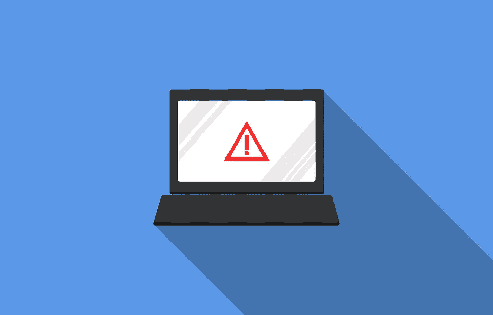

# 真的有可能私自使用互联网吗？

> 原文：<https://medium.com/swlh/is-it-really-possible-to-use-the-internet-privately-af6a697deef1>

互联网太牛逼了。它极大地提高了全球的信息访问水平。我只关心一件事:隐私。

据《今日美国》报道，世界上 75%最受欢迎的网站的页面上都有追踪代码。

我并不是唯一一个担心维护某种在线隐私的人。我不是偏执狂…