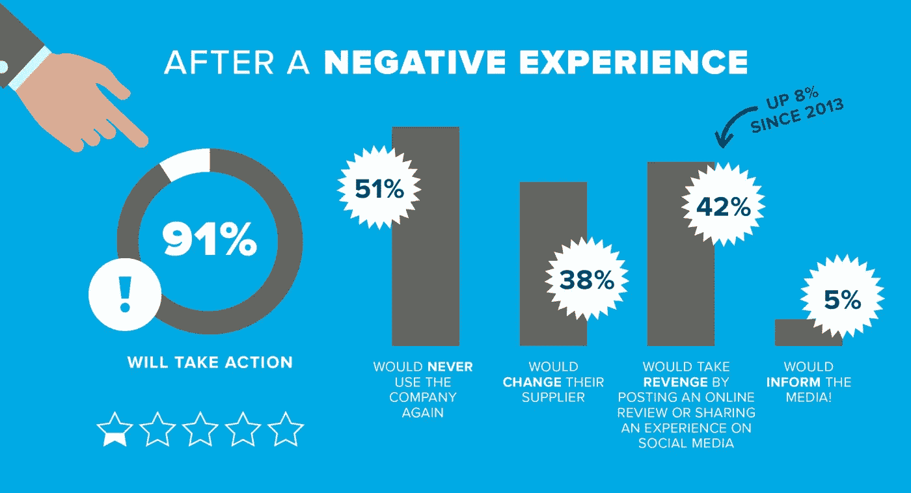
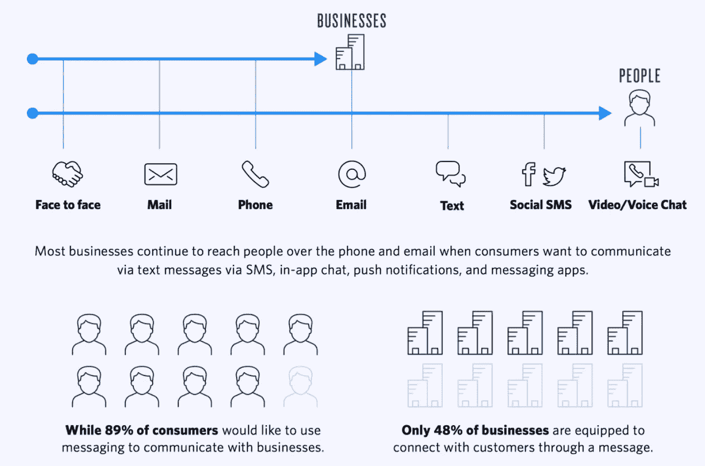
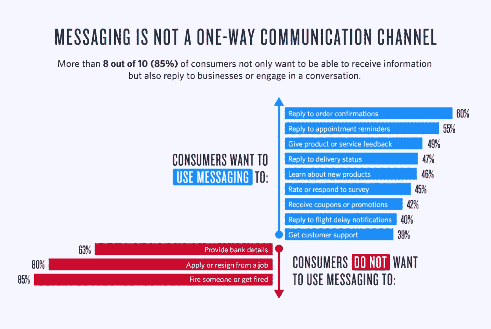
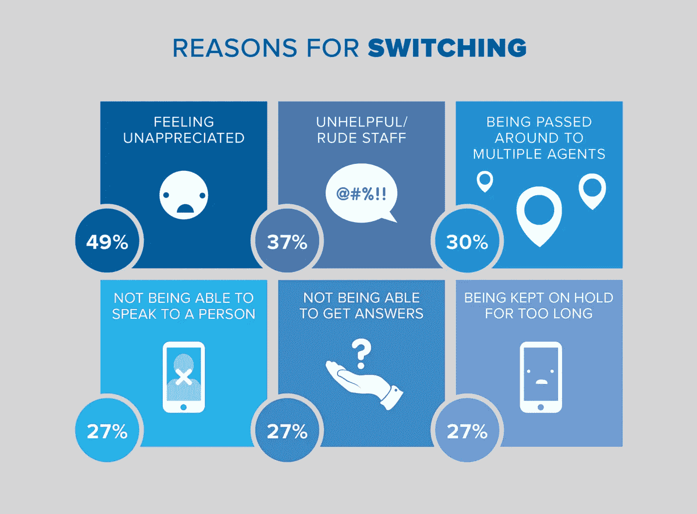
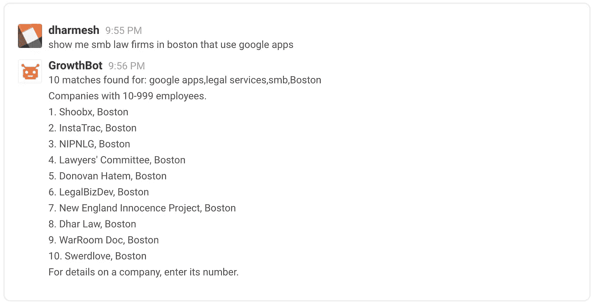

# 是时候更换你的整个客服团队了吗？

> 原文：<https://medium.com/swlh/is-it-time-to-replace-your-entire-customer-service-team-458f264c8f39>

他们可以在三秒钟内找到一个客户服务电子邮件地址。

如果他们在你的网站上找不到他们想要的东西，他们会反弹得比你的饼干还快。

当他们发现一个阻止他们按照承诺使用你的应用程序的错误时，他们会给你发一个截图。

不，它们不是某种爬行软件或自动化程序。

他们是今天的消费者。

你最好习惯这些，除非你想成为昨日黄花。

我们试图转化的消费者已经不存在几个世纪了。那么，我们为什么要用那么久以前的顶级营销策略来吸引他们呢？

我们的观众不再被俘虏。他们不必在六点钟收听新闻或围在收音机旁娱乐。

尽管有时他们可能希望事情能这么简单。

现在，消费者无论走到哪里，都会受到营销的狂轰滥炸。我相信你一定熟悉这样一个广为流传的轶事，即一个普通人每天会看到数百条广告。对我们大多数人来说，这可能比小说更接近现实。

时代在变。买“合适”的品牌，开“合适”的车，搬进“合适”的社区与邻居攀比已经过时了。

即使是最响亮的顶级营销扩音器也无法超越退订、广告拦截和隐私保护软件，这些软件是当今消费者用来武装自己的。

## 仍然掀起波澜的是一种恒星体验。

不幸的是，对消费者来说，这太罕见了。

但对我们来说幸运的是，在提供卓越的客户服务方面，改进我们和我们的竞争对手正在做的事情应该很容易。

# 忠诚的经济学

> 根据 Lee Resources 的调查，80%的公司声称提供卓越的客户服务。
> 
> 只有 8%的人同意。

那很痛。这还没有结束。

> NewVoiceMedia 发现，91%的消费者在糟糕的客户服务体验后会采取行动。
> 
> 对超过一半的人来说，这意味着永远离开公司。
> 
> 几乎同样多的人表示，他们会毫不犹豫地在社交媒体上分享负面观点和经历。

畏缩了吗？

消费者愿意花 500 多美元离开一家客户服务糟糕的公司。

你能想象他们愿意为**优质服务**做些什么吗？

[source](https://www.newvoicemedia.com/blog/the-62-billion-customer-service-scared-away-infographic)

85%的消费者表示，如果仅仅是为了获得更好的客户服务，他们愿意支付高于标准要价的价格。有些甚至高出 25%。

所有这些都很好，但是一旦我们的竞争对手把他们的客户吸引到我们这里来，我们怎么能确定提高我们的客户服务水平真的会有回报呢？

# 一个词:保留

白宫消费者事务办公室[报道](https://www.helpscout.net/75-customer-service-facts-quotes-statistics/)获得一个新客户的成本是留住一个客户的 7 倍。

> [Frederick reichhold](http://www.bain.com/Images/BB_Prescription_cutting_costs.pdf)(他提出了[净推介值](https://www.netpromoter.com/know/))发现，仅仅提高 5%的客户保持率就有能力将利润提高 25%到 95%。

当客户保留等于回报，并且流失的主要原因是待遇差和未能快速解决问题时；提供优质的客户服务实际上就像是在印钞。

虽然解决方案没那么简单，但它肯定更合法。

我们 **工作在一个竞争对手突然出现的世界**感谢 WiFi 连接和 Kickstarter 的资助。这意味着增加客户数量，而不是服务，当我们试图阻止狼群时，通常是优先考虑的。

与大多数客户服务代理不同，卓越的客户服务会在需要的时间和地点出现。

卓越的客户服务感觉像是为满足您的确切需求而定制的——即使是最好的代理也需要花费大量时间。

优秀的客户服务不会因为日夜不停地回答大量非常相似的请求而疲惫不堪。祝你好运，能找到一个人，更不用说一个擅长客户服务的人，来报名参加那份工作。

卓越的客户服务无法高效或经济地扩展。

除非，像我一样，你相信有一种方法可以补充人工代理来提供全天候的模范客户服务。

[source](https://www.rollingstone.com/culture/news/steve-jobs-in-1994-the-rolling-stone-interview-20110117)

# 不要换掉你的整个客服团队；用聊天机器人赋予他们力量

现在，[一群聊天机器人](https://blog.growthbot.org/why-chatbots-will-change-marketing-as-we-know-it)不会在一夜之间解决你的客户服务和客户维系问题。

甚至我也承认[聊天机器人无法提供让客户体验从一般到惊人的服务水平](https://blog.growthbot.org/chatbots-were-the-next-big-thing-what-happened)。但是一个有能力的客服人员和一个数码助手呢？那是另一个故事了。

## 自动化耗时的请求

你能想到比每小时几次回答同样的问题更有趣的事情吗？

是啊。字面上的*任何东西*。

这也是你的(人类)客服人员的感受。但是机器人呢？如果他们能爱什么，这将是它。

对于那些关于发货更新和运营时间的简单、重复的查询，可以考虑使用机器人来提供自动响应。

[机器人解放了你的客户服务代理](https://blog.growthbot.org/the-samantha-effect-a-closer-look-into-the-future-of-bots)，这样他们就可以花更多的时间去了解重要挑战的真相。

## 让断裂的消息平台为您服务

2016 年， [Twilio 发现](https://www.twilio.com/learn/commerce-communications/how-consumers-use-messaging)近 90%的消费者希望使用数字信息与企业沟通。然而，只有一半的企业有能力满足这一需求。

普通消费者使用智能手机作为他们的主要消息设备，在他们的主屏幕上有三个消息应用程序，并且每周使用三个不同的消息应用程序。

这对你意味着什么？您的客户正在发送信息，他们是移动的，当寻求您的产品或服务问题的解决方案时，他们可能从任何地方开始*而不是*您的网站。

另一方面，这也意味着他们愿意在工作时间接收关于赠品的信息和销售提醒。

[即时通讯应用受到欢迎，就像](https://blog.growthbot.org/why-chat-should-be-part-of-your-b2b-or-b2c-marketing-strategy)电话营销曾经遭到唾骂一样。

如果你没有抓住机会，在客户关注的时间和地点为他们提供优质的服务和及时的更新；你可以打赌有一个竞争者会。

[source](https://www.twilio.com/learn/commerce-communications/how-consumers-use-messaging)

## 利用疯狂的订婚要求

> [85%的消费者](https://www.twilio.com/learn/commerce-communications/how-consumers-use-messaging)不仅仅想从品牌那里获得大量信息，他们还想通过信息与品牌互动。
> 
> 当标准登陆页面转换率为 2.35%时，平均电子邮件打开率为 20%，这是一个巨大的数字。

尽管[的客户实际上*希望*与你联系](https://blog.growthbot.org/the-beginners-guide-to-conversational-commerce)是令人高兴的，但人们期待的即时消息应用程序的即时响应给客户服务团队带来了一个问题。但对聊天机器人来说不是。

下午 4 点，当客户无法访问网上研讨会时，他们并不关心您的客户服务代理在哪个时区。他们需要一个解决方案。

当您的客户正在计划他们的一天，他们的包裹是否会在当天下午的生日派对上及时到达时，他们希望能够在周日早上 8 点检查包裹的状态。

[能够在标准工作时间之外处理“网上研讨会”和“送货”查询的聊天机器人](https://www.hubspot.com/stories/chatbot-marketing-future)可能会促使某人成为你忠实的品牌大使。

即使消费者只是填写表格或提交功能请求，聊天机器人提供的确认或帮助也是承认他们努力的一种很好的方式——甚至可能收集到一些额外的信息，可以促进你的市场细分。

[source](https://www.twilio.com/learn/commerce-communications/how-consumers-use-messaging)

## 每次都提供强大的客户服务

到目前为止，我们已经讨论了聊天机器人如何巧妙地分发简单的更新和解决简单的问题。

但是那些复杂的挑战是你首先培养你的熟练客户服务代理团队的全部原因吗？

[聊天机器人在帮助您的代理人](https://blog.growthbot.org/how-we-are-getting-105k-people-to-use-our-chatbot)在最重要的时候提供强大的客户服务方面发挥着辅助作用。

虽然今天的大多数聊天机器人不能远离脚本，但它们比静态音乐更能吸引顾客。

一旦自然语言处理在聊天、论坛或社交媒体页面中识别出指示应该将问题升级到人工代理的语言；聊天机器人可以开始建立无缝切换。

没有理由机器人不能收集基本信息，如消费者请求的要点以及订单号、客户 ID 或其他可用于在数据库中定位他们的识别信息。

虽然看起来没什么大不了的，但这一资格确认步骤可以防止客户在等待代理可用时浪费时间，存储他们的信息以便他们不必重复这些信息，并有助于确保最有资格的代理在第一次尝试时就做出响应。

考虑到从一个代理到另一个代理以及无法与人交谈是客户更换公司的一些主要原因，机器人在促进客户服务体验的这一胜利中发挥了重要作用。

[source](https://www.newvoicemedia.com/blog/the-62-billion-customer-service-scared-away-infographic)

如果你的机器人有人工智能能力，你能让它访问深层数据，它也许能够从这些交易中学习足够的知识，最终在没有人类帮助的情况下响应复杂的请求。

事实上，我们正在用我们的聊天机器人 [GrowthBot](https://www.growthbot.org/) 测试这个假设。我们向它提供大量的[销售和营销数据](https://blog.growthbot.org/will-we-use-big-data-to-solve-big-problems-why-emerging-technology-is-at-a-crossroads)，同时训练它越来越熟练地识别专业人员完成工作所需的信息增长。

[source](https://www.growthbot.org/)

像苹果、脸书、亚马逊和谷歌这样的大玩家正在数字助理上投资数十亿美元。这一次，聊天机器人成功了，这样你就不必和同样的本杰明竞争了。

Accenture Interactive 已经看到，有效的设计和实施使公司能够使用聊天机器人解决 80%的会话，这些会话通常由人工客户服务代理处理。

当你的客户服务代理人被科技赋予能力去追求改变商业的巨大挑战时；随着客户推荐你的服务并不断回来购买，你会看到客户保持率飙升。

当然，你有大约 20%的机会向新的潜在客户销售产品。

但是当涉及到一个现有的顾客时，你至少可以把你的销售机会增加两倍。

感谢阅读。

> 如果你喜欢这篇文章，请随意点击那个按钮👏帮助其他人找到它。

*最初发表于*[*【blog.growthbot.org】*](https://blog.growthbot.org/is-it-time-to-replace-your-entire-customer-service-team)*。*