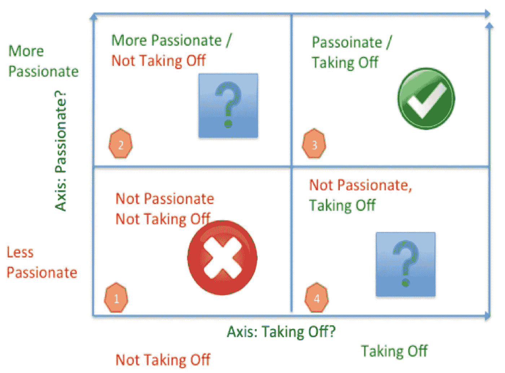

# 是时候关闭(或离开)你的创业公司了吗？

> 原文：<https://medium.com/swlh/is-it-time-to-shut-down-or-leave-your-startup-9f740078987b>

*为什么惊爆银河系法则(“永不放弃！绝不投降！”)多半是扯淡*

最近，我接到一位企业家的电话，她在过去的一年半时间里一直在创业，她正处于十字路口。在过去的几个月里，她与她的联合创始人分手了，虽然她在产品上取得了一些进展，但公司还没有真正起飞。

她问我的问题是:我是应该继续创业，还是应该关闭它，去做别的事情，比如找一份有稳定收入的工作？

这不是一个简单的问题。创业领域(包括但不限于硅谷)的任何人都会意识到这个问题。*常作*。令我惊讶的是，在众多关于创业的在线博客中，这一点并没有被更多地讨论。

True Believers from Galaxy Quest

## 这不是很明显吗？

那么，什么时候是离开(或关闭)创业公司的合适时机呢？

答案似乎很明显:当你没钱的时候。

当然，对于有员工的受资助创业公司来说，这是事实。假设你的工资单上有 10 名员工，你的月支出是 100，000 美元，而你这个月在银行里没有 100，000 美元(更不用说下个月的工资了！)，这是一个很好的迹象，表明是时候关闭公司并继续做其他事情了，对吗？

嗯，也许吧。你的投资者会乐意关闭公司吗？或者他们会愿意投入一些钱让你再坚持几个月？你的员工愿意无薪工作几个月吗？你是为了“保持梦想”吗？你是一个真正的信徒吗？

## 为什么创业公司的惊爆银河系法则(大部分)是胡扯

如果你有机会筹集(或借入)20 万美元，让公司再运营几个月，会怎么样？你应该接受吗？

在创业神话的“rah rah 世界”中，我称之为创业公司的惊爆银河系法则(“永不放弃，永不投降！”)，当然，你应该使用*任何必要的手段*来延长跑道。

The Galaxy Quest Rule of Startups: Never Give Up, Never Surrender!

当你成为下一个脸书时，这将成为一个伟大的故事:还记得我们发不出工资，不得不借 20 万美元或用股票支付员工的时候吗？

这种方法的问题在于，对于每一个脸书，都有成百上千的其他创业公司永远无法成功。事实上，大多数风投支持的企业都会失败，风投会告诉你，他们只投资了 50 家公司中的 1 家，这意味着 90%以上的初创公司都会失败。

## 压力和创业决策

这个决定包含了你个人的财务和精神健康。一方面，你需要照顾好自己和家人。另一方面，你说服投资者向你的公司投资，并说服员工加入你的公司。

我在其他地方写过创业压力有多大——为什么创业比麻省理工学院的压力和企业家更难——以及如果你处于这种位置，你可能不会睡得太多。有时候你别无选择，只能关闭你的创业公司。也许你有抵押贷款。也许你一周工作 80 多个小时，却看不到希望的尽头。

更难的决定是当你*可能*能够继续一段时间，但你开始怀疑你*是否应该*继续。你会在一个失败的创业公司里投入好的年头和钱吗？

## ***激情的四象限:你在哪里？***

在我即将出版的新书*创业神话和模型*中，我加入了一个名为激情四象限的模型，这是一个有用的工具，可以帮助你做出类似这样的艰难决定。想象两个轴构成了四个象限:

*   第一个轴是关于“激情”——你对你正在做的事情有激情吗？量表从“没有激情”到“有激情”。你可能很清楚自己在这个轴上的位置。如果你精疲力尽，你很可能处于轴心的“不热情”部分，即使你真的喜欢你的产品或市场。
*   第二个轴是“起飞”——你的创业公司起飞了吗？任何一个加入过正在腾飞的初创企业的人都明白我的意思。投资者争相进入你的公司。客户在订购(或预购或注册)你的产品，新员工吵着要加入你的公司，你最大的挑战是“跟上”。当一家公司“没有起飞”——这是非常明显的——你没有获得新客户(或潜在客户)，投资者犹豫不决，员工和联合创始人不确定你拥有的东西是否能起作用。

Figure 1: The Four Quadrants of Passion

在图 1 中，您可以看到由这些轴形成的四个象限。与大多数四象限模型一样，其中两个象限很容易理解:

*   ***象限#3:*** *(激情与腾飞)。这是每个人都想去的地方。你的公司做得很好，你只想做你正在做的事情。这种情况确实会发生，但比你想象的要少。如果你在这个象限:坚持到底！*
*   ***象限#1:*** ( *不激情不起飞*)。从某些方面来说，这是创业公司最难进入的象限，但作为创始人，这是最容易做出决定的象限。创业公司可能无法起飞有许多不同的原因(市场时机——太早或太晚，产品无差别，市场成熟/竞争激烈，产品不能满足需求，管理不善，等等)。这里要采取的行动也很清楚:这可能是离开公司的好时机。

这就把我们带到了两个更模糊的象限，它们通常更有趣:

*   **象限#4:** ( *不激情，起飞*)。这是一个有趣的象限，因为作为一名企业家，你发现自己处于一个炙手可热的市场，并发现，正如许多企业家发现的那样，你是硅谷的大红人，至少在一段时间内是如此——很容易筹集资金，很容易雇用员工，Techcrunch 和其他硅谷博客想采访你，而业务正在起飞。

在这个象限里，尽管缺乏激情，事情还是会进展顺利。在我自己的职业生涯中，Tapjoy 就是处于这个象限的一个例子。很有可能其中一个创始人会因为缺乏兴趣而离开公司。gnip 的创始人 Jud Valeski 就是这种情况。他的联合创始人 Eric 决定，当他们的新产品(一个用于访问 sociuasl 网络的 b2b API)刚刚起步时，他不想呆在一个企业 b2b 类型的公司。他的联合创始人决定离开，但 Jud 留下来，并带着公司取得了巨大的成果(以 1.75 亿美元的价格卖给了 Twitter)。

*   **象限#2:** ( *激情，不脱*)。这可能是最难进入的象限。如果你发现自己处于这个象限，你的业务没有起飞，或者市场不是很热，但你对你正在做的事情充满热情，你需要做出一些困难的决定。

应该继续吗？答案当然是，这取决于你是否有能力在经济上和/或情感上继续下去(你是否已经筋疲力尽)。

我喜欢用 Midverse 工作室的例子，这是我的一家制作手机游戏的初创公司。我们制作了一些我并不特别感兴趣的广告技术和游戏，事情进展得并不顺利。我们已经筹集了一些风险投资资金。我的联合创始人决定继续前进，并“做一些其他事情——一些会起飞的事情”，然后去做一家虚拟现实创业公司。

我必须做出决定——我应该继续经营这家公司还是关闭它？

我决定，只有当我从事我真正热爱的游戏时，我才会继续下去。我们最终转向为我个人喜欢的电视节目制作纸牌游戏——即《可怕的便士》和《格林》。我能够从我们的投资者那里筹集更多的资金来维持公司的生存，仅仅是因为这种激情。

这让我们走出了象限#4(没有激情；没有起飞)，这是一件好事。我们最终又活了一年；我和剩下的团队真的很喜欢开发这种新的纸牌游戏。然而，现阶段很难在移动游戏市场上产生影响，我们从未从我们的游戏中获得足够的用户或收入来说服我们的投资者继续前进，所以一年后我不得不做出另一个决定。

## ***那么你有什么选择？***

那么假设你知道自己处于哪个象限，必须做出一个艰难的决定，继续创业，有哪些选择呢？

1.*继续走*。这可能不是一个很好的选择，尤其是如果你处在公司还没有起飞的象限之一。如果你对你正在做的事情充满热情，并且有能力继续下去，那么继续下去是有意义的，如果你相信机会仍然存在。

2.转向你更感兴趣的事情。这种方法可以奏效一次，或者最多两次，并且需要说服你的投资者(如果有的话)和员工和你一起朝着一个新的方向前进。旋转本身就是一个复杂的话题，值得一提。如果事情仍然不顺利，你可能会发现自己处于另一个选择中。

3.*离职*。如果公司没有你也能生存，你可能会做出艰难的决定，干脆离开公司，不再担任首席执行官/首席技术官。这听起来容易做起来难，尤其是如果公司只剩下很少一部分人，而你是剩下的关键人物。没有你，一个公司可能就所剩无几了。

4.*卖掉公司，换来你能得到的一切。*这是一个值得考虑的选择，因为它有助于你为公司带来一个结论(尽管不是你最初设想的销售或结论)。其他公司可能会看重你的技术、团队成员、专业知识、客户和声誉，但因为你的初创公司做得不好，他们不愿意为公司支付太多。

通常情况下，这最终会成为一种雇佣关系，但它给了你的员工一个可以工作并继续有收入的地方。对于许多创始人来说，你的员工发生了什么是最重要的考虑因素之一。如果你简单地关闭公司，他们不得不出去寻找新的工作。收购或拍卖让你至少可以称你的创业公司为“成功”,因为你卖掉了它，即使你的投资者(和你作为创始人)可能不会从这笔交易中赚很多(或任何)钱。

5.*关闭公司，分配资产。*最后，这是一些风险投资者更喜欢的一种选择，因为如果你的公司没有成功，他们希望注销你的投资。一些企业家想知道这是否等同于破产，或第 11 章。事实上，这将填补所谓的第 7 章，关闭。然后，你将把剩余的资产首先分配给债权人，然后是优先股股东，最后是普通股股东。大多数不成功的创业公司都是这样。

*这是一个艰难的决定，但总的来说我发现，投资者会比你想象的更通情达理，而客户会比你想象的更不通情达理。*这就是为什么只有“合格投资者”才被允许投资初创公司——如果初创公司不成功，他们应该会损失投资。我记得在一个董事会里，一位风险投资人向一家没有成功的公司投资了数百万美元。这家初创公司已经没有钱了，而首席执行官仍在兼职做这件事。这位风险投资人说:“也许他应该关闭它，做一些更有成效的事情，比如创办另一家公司。”

***结论***

无论你选择哪一个选项，毫无疑问，决定是否关闭你已经投入多年的创业公司是很困难的。

在这种困难的情况下，你应该坦诚、公开地与你的顾问、联合创始人和投资者交谈。你还需要让你的员工知道，他们可能会受到关闭或决定离开的最大影响，因为他们可能会发现自己没有薪水来支持他们的家庭或健康保险。

你可能最终会关闭你的创业。它发生了。很多。尽管如此，初创公司是有风险的，那些以任何身份参与其中的人可能需要明白，大多数初创公司都无法成功。这就是游戏的本质。

最终，你需要照顾好自己和家人，保持理智。你可能最终会意识到，关闭一家不景气的初创公司可能是你为自己的健康做出的最佳决定——无论是精神上的、身体上的还是财务上的。

## 这篇文章发表在 [The Startup](https://medium.com/swlh) 上，这是 Medium 最大的创业刊物，有+ 373，685 人关注。

## 在这里订阅接收[我们的头条新闻](http://growthsupply.com/the-startup-newsletter/)。

