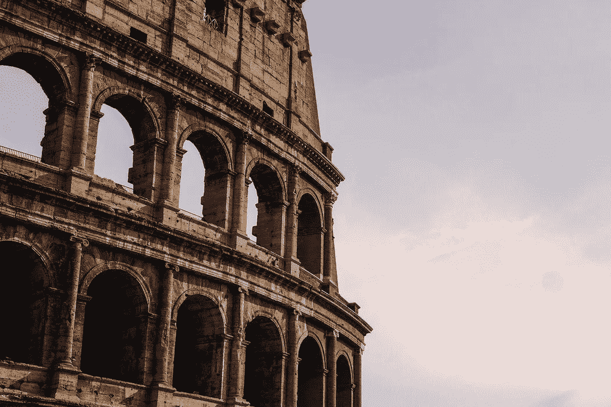

# 笔记。

> 原文：<https://medium.com/swlh/is-old-really-gold-e7e7a3e1d681>

老是金；我常常在想，这句话是什么意思？是字面意思吗？旧时代真的会盖过现代吗？难道不是吗，过去永远不会离我们而去？记忆永远不会完全消失，是吗？我的意思是以葡萄酒为例，越老越好。即使是树，它们越老，对我们来说就越神秘，它们有更多的宁静，而宁静是我们所渴望的，不是吗？