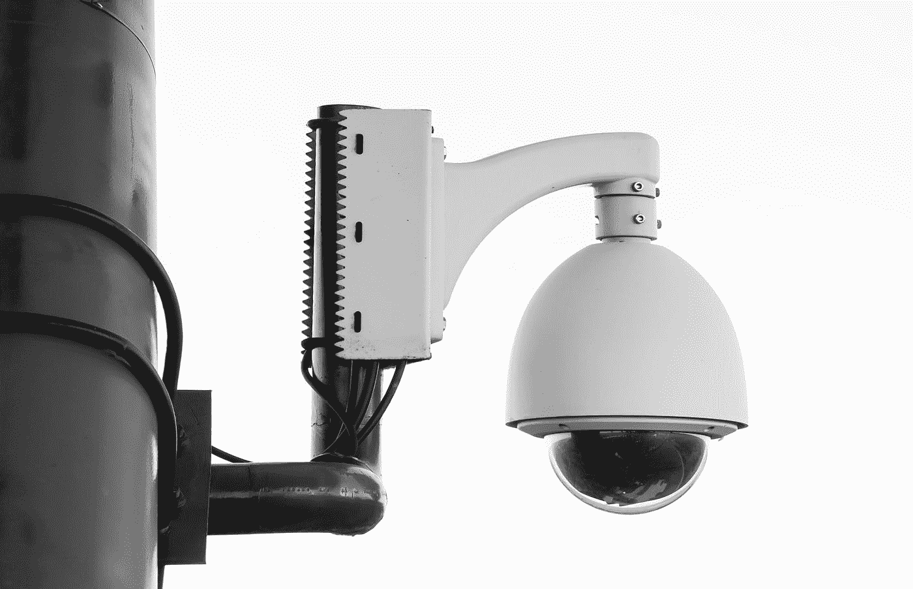
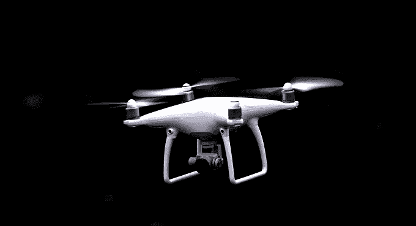

# 隐私是否被高估？

> 原文：<https://medium.com/swlh/is-privacy-over-rated-2e1461885b79>

“Guy Fawkes mask” by [Samuel Zeller](https://unsplash.com/@samuelzeller?utm_source=medium&utm_medium=referral) on [Unsplash](https://unsplash.com?utm_source=medium&utm_medium=referral)

隐私应该被视为我们这个时代的货币吗？还是它已经过时，不再适用于我们充满技术和互联的生活？人们不需要看得太远就能看到技术正在越来越多地塑造我们所做的事情和我们做事的方式。我们越来越多地通过越来越多的互联设备和互联社会，在彼此之间以及与机器之间分享更多关于我们自己、我们的行为、我们的喜好和厌恶的信息，有时是有意的，有时是无意的。有些人认为这种分享有助于简化我们的生活。例如，在我们的屏幕上弹出的定制广告和选项有助于完善我们的选择，并最终促进更容易的决策过程，特别是考虑到我们现在有大量的选项可用，并且我们无需太多努力。但是，通过将我们的一些决策交给匿名算法，我们是不是在用我们的隐私、个人信息和决策权来换取一个充满风险和更大脆弱性的“理想”？或者，让技术为我们做决定会给我们带来:更多的时间去做我们想做的事情；一旦平凡而重复的生活从等式中消失，生活会变得“更容易”;还是由于屏幕上出现的建议，为我们提供了更多的联系和朋友？然而，通过我们的在线互动、选择和行为来贬低隐私的价值，我们正在导致我们自己的垮台吗？如果有的话，我们是越来越只把它当作事后的想法，还是完全不考虑它，有意识地决定在当今世界隐私不值得考虑？

“white security camera on post” by [Paweł Czerwiński](https://unsplash.com/@pawel_czerwinski?utm_source=medium&utm_medium=referral) on [Unsplash](https://unsplash.com?utm_source=medium&utm_medium=referral)

不需要太多的搜索就可以找到一篇关于一个数据库被黑客攻击并导致人们的个人信息被泄露的新闻文章。但是，在这曾经会引起愤怒和呼吁采取行动和问责的地方，越来越多的反应变得相当冷漠。当一个人听到或了解到侵犯隐私的行为时，他几乎会平静地辞职。我们对个人或团体的隐私被侵犯的事件变得有些麻木了吗？也许这是因为我们不再清楚保护个人隐私的价值、需要或目的。也许有些人认为互联技术和社会的最终好处值得冒这个风险。虽然有些人仍然认为隐私是无价的商品，不应该买卖，但其他人采取了更自由的方式，非常愿意用他们的隐私权来换取特定平台、应用程序或在线服务的访问权。我们当中有多少人在下载新应用程序或访问新平台时会花时间阅读条款和条件？虽然我们中的一些人可能会感到一丝犹豫，但最终如果你想要这个应用程序，那么你需要同意交出对你设备上许多元素的访问权，包括但不限于个人详细信息、联系人和图片库。我很好奇，我们是否害怕错过最新的趋势、新闻、应用和游戏等。，助长了全社会对隐私的漠视？

我已经和隐私的概念斗争了一段时间。有几个原因可以解释为什么我认为在当前时代，隐私是一个很难理解的概念，也许从根本上来说，虽然我知道隐私是至关重要的，但我不再那么清楚为什么了。如果我的隐私被侵犯，对我来说意味着什么？难道只是换个密码然后继续前进？随着围绕许多技术创新的大肆宣传，我们是否已经聪明地、无意地习惯于预期我们的隐私会有一定程度的风险，特别是如果我们想要享受技术的全部负担？

这种对待隐私的态度是基于冷漠还是信任？我们相信在线服务、应用程序等的提供商/所有者。，会处理我们的个人资料、联系人等。尊重并尽职尽责地安全访问和存储我们的信息。然而，他们值得我们信任吗？我们应该如此轻易的信任他们吗？还是应该要求他们主动去赢得我们的信任？

Photo by [Joshua Fuller](https://unsplash.com/photos/u1EGfuB4llU?utm_source=unsplash&utm_medium=referral&utm_content=creditCopyText) on [Unsplash](https://unsplash.com/search/photos/privacy?utm_source=unsplash&utm_medium=referral&utm_content=creditCopyText)

在我看来，隐私和信任之间有着密切的互惠关系，但随着监控和跟踪的增加以及我们对分享的痴迷，我们是否正在试图改造一种限制而不是解放隐私的概念？没有直截了当的答案，但随着如此多的技术进步以及互联和集成系统以及个性化定制数字应用的潜在好处，现在是时候考虑保护我们隐私的重要性和相关性了。花一些时间来思考我们对隐私权的个人立场，以及如何在网上和越来越多的互联社区中实现这一点是必要的，就隐私的构成以及它对我们今天和未来的社会意味着什么进行相互对话也是必要的。

## 这篇文章发表在 [The Startup](https://medium.com/swlh) 上，这是 Medium 最大的创业刊物，有+383，719 人关注。

## 订阅接收[我们的头条](http://growthsupply.com/the-startup-newsletter/)。

