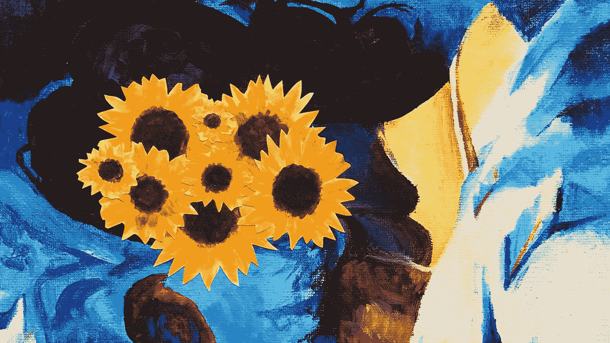

# 自我意识是一件坏事吗？

> 原文：<https://medium.com/swlh/is-self-consciousness-a-bad-thing-51e93c5e8198>

在我写完我之前的一个关于完美主义的故事“ [*如果我是完美的，我就不会是*](https://ye-chen.com/if-i-was-perfect-i-wouldnt-be/) ”之后，我和一位密友进行了一次引人入胜的谈话，讲述了她自觉完美主义的经历。

当她做模特时，她想成为完美的模特。她把标准提高到如此之高，以至于她强迫自己意识到每一个微小的身体动作，但这仍然让她觉得自己不够好。这让她精神疲惫，直到她注意到当她完全没有意识时，她表现得更好。这时候她问了这个问题: ***你是如何变得不那么自我的？***

# **否定暗示**

我首先想到的是: ***“为什么你会想要不那么自我意识？”***

我从她的问题中意识到，也许，仅仅是也许，“自我意识”这个词在我们今天的社会中有负面含义。消极的暗示，我指的是缺乏自信，自我怀疑和自说自话让自己陷入焦虑。我们为自己创造聚光灯效果，我们相信自己是关注的焦点。我们太在意别人在想什么，或者可能会怎么想我们的行为，从而引发了自我破坏的行为。

不知何故，在采取行动之前，这会让我们产生一种尴尬和不确定感，并迫使我们停止行动。这将注意力从我们的陈述、谈话或行为中转移出来，并将我们的注意力引向他人对我们的看法。

在我们意识到这一点之前，自我怀疑就产生了，它来自于向他人寻求认可，而不是向内看。然后，我们衡量自身价值的标准变成了基于他人的认可——这让我们非常害怕被拒绝和不被认可。这以地位、失败、外表甚至成功的形式出现。每当我们用他人的观点来衡量自己的价值时，我们就交出了一定程度的自制力。 这时我们变得被他人的观点和看法所控制。

> 人们生活的最大监狱是害怕别人的想法—大卫·艾克

如果你对此有不同的看法，请告诉我。我希望有更多的洞察力。

# 自我意识意味着成长

我相信自我意识是一件好事。为什么？因为我不认为意识到你是谁有什么错。我知道这可能感觉不好，或者你可能不喜欢你看到的或感觉到的自己，但这是一个成长的机会。一个审视你生活中可能已经忽略了一段时间的领域的机会。

> *“成长的关键是将更高维度的意识引入我们的意识中。”—老子*

我认为自我意识是真理，它让人们开始对自己和他人更加诚实。这会带来更好的关系和个人健康。太多时候，我们选择隐藏，不说话，不分享真相。仅仅因为我们害怕我们可能听到的，所以我们选择生活在持续的焦虑中。

就我个人而言，如果有人让我注意到一些事情，让我更加意识到我是谁，我会真诚地感谢。这并不意味着我需要改变什么来适应他们的正常标准； ***我还是可以选择做原来的我*** 。正如玛娅·安杰洛曾经说过的:

> “如果你总是试图成为普通人，你永远不会知道自己有多了不起。”—玛娅·安杰洛

# **你可以选择**

我知道有些人把自我意识当成不好的东西。我在同一个地方生活了十年。我用过去的眼光来判断现在，看到了一个完全扭曲的自我和他人对我的看法。

这与其说是别人造成的，不如说是自己造成的。这种消极变成了某种形式的情感不接受的结果。而我对你的问题是: ***你是宁愿逃避，成为别人告诉你成为的那个人，还是愿意与之共存，接受现在的自己？***

*原载于 2018 年 3 月 2 日 ye-chen.com**的* [*。*](https://ye-chen.com/is-self-consciousness-a-bad-thing/)

## 这个故事发表在 [The Startup](https://medium.com/swlh) 上，这是 Medium 最大的企业家出版物，拥有 302，074+人。

## 在这里订阅接收[我们的头条新闻](http://growthsupply.com/the-startup-newsletter/)。

