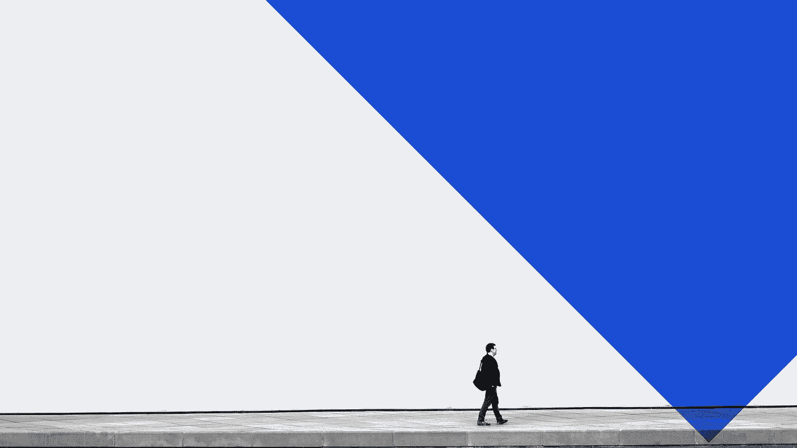
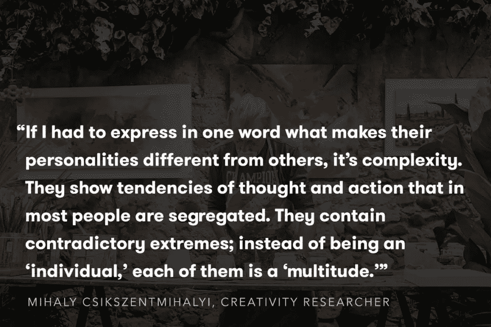
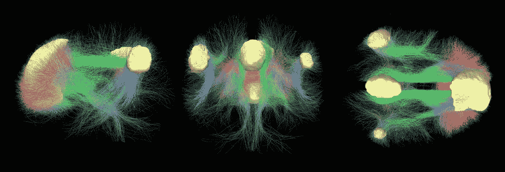

# 独处是开启我们创造力的秘密吗？

> 原文：<https://medium.com/swlh/is-solitude-the-secret-to-unlocking-our-creativity-4cd72e5094fc>

## 为什么我们最好的想法是在淋浴时、长途散步时以及迷失在白日梦中时产生的？

Original image by Sophia Baboolal — [https://unsplash.com/@sophiababoolal](https://unsplash.com/@sophiababoolal)

哈莱斯·狄更斯不仅有伟大的头脑，他还有很棒的小腿。在任何一天，狄更斯平均走 12+英里，穿过郁郁葱葱的肯特郡乡村或维多利亚时代伦敦熙熙攘攘的街道。

1857 年 10 月的一个特别沉闷的夜晚，狄更斯开始逃离他越来越不和谐的婚姻，从他在伦敦市中心的家步行到他在肯特的家——30 英里的旅程最终将由他在*远大前程*中的角色匹普重复(反向)。事实上，狄更斯独自散步时的许多瞬间后来都成了他作品的素材。

“在狄更斯的描述中有一些细节——一扇窗户，或者一个栏杆，或者一扇门的钥匙孔——他赋予了它们恶魔般的生命。事情看起来比实际情况更真实，”评论家 G.K .切斯特顿在《T4》中解释道。

> “的确，那种程度的现实主义在现实中是不存在的:那是梦里无法忍受的现实主义。而这种真实感只有在一个地方梦游才能获得；它不能通过观察行走获得。”

像狄更斯的散步一样，研究和轶事也描述了独处和思考的创造性优点:[独自工作](http://www.theatlantic.com/entertainment/archive/2014/02/what-great-artists-need-solitude/283585/)，[融入自然](http://journals.plos.org/plosone/article?id=10.1371/journal.pone.0051474)，[白日做梦](http://www.fastcompany.com/3046172/the-hidden-benefits-of-daydreaming)。

但是当我们允许我们的思想深入我们的潜意识时，会发生什么呢？它是如何帮助我们突破创意障碍的？

独处是创造力的关键吗？

*想要一种比步行数英里更好的激发灵感的方式吗？* [*点击此处*](http://eepurl.com/bINIcT) *加入成千上万收到 Crew 每周简讯的创客、创作者、思想者的行列。*

# 到底是什么让我们“有创造力”？

为了理解创造力是如何工作的，我们需要首先理解有创造力的人是如何工作的。

早在 20 世纪 60 年代，心理学家和创造性研究先驱弗兰克·x·巴伦(Frank X. Barron)召集了一批那个时代最知名的创作者，包括作家杜鲁门·卡波特、威廉·卡洛斯·威廉姆斯和弗兰克·奥康纳，以及领先的建筑师、科学家、企业家和数学家，看看他是否能确定创造性个人的共同特征，无论他们的专业如何。

巴伦发现，最具创造力的思想家都表现出某些共同的特征:对自己的内心生活持开放态度；对模糊和复杂的偏好；对混乱和无序异常高的容忍度(如果我们说的是卡波特，还有伏特加和橙汁)；以及从混乱中获取秩序的能力。

在描述他观察到的一系列特征时，巴伦提出，创造性天才“比普通人更原始，更有教养，更具破坏性，也更具建设性，有时更疯狂，但绝对更理智。”

80 年后，领先的创造力研究者和“心流”之父米哈里·契克森米哈会以类似的方式总结有创造力的个体:

虽然巴伦的研究是第一批从行为角度展示创造性思维的复杂性的研究之一，但现在几乎可以肯定的是，没有一个关键特征可以定义创造力。

# 在你创造性的头脑中

在巴伦的研究几年后，技术和研究将进一步支持他的观察。

远离“右脑/左脑”的神话，这些天来，[大多数神经科学家同意](http://blogs.scientificamerican.com/beautiful-minds/the-real-neuroscience-of-creativity/)激活我们的“创造模式”涉及不同的相互作用的认知过程(有意识和无意识)以及我们的情绪。

事实上，虽然我们仍然不知道创造力和大脑是如何协同工作的，但我们知道，每当我们面临一个创造性的问题时，我们大脑的各个部分都会被激活。

更具体地说，我们知道有三个主要的大脑功能“网络”用于创造性任务:

1.  **当我们需要激光束聚焦时，执行注意力网络**就会被激活，比如当我们试图理解一个复杂的讲座或解决一个需要大量使用我们工作记忆的问题时。
2.  **想象网络**(或默认网络)负责创建过去经历的动态心理模拟，想象替代场景和社会认知(即当我们试图想象别人在想什么时)。
3.  突显网络持续监控外部事件和我们内心的对话——将接力棒传递给解决手头任务所需的任何信息。

*The imagination network’s connectivity visualized*

看到这些网络的运行，我们可以了解在创作过程的不同部分，哪些网络使用得更多。虽然我们还不知道它们是如何协同工作的，但我们已经越来越接近了。

在最近发表在*人类神经科学前沿*的一篇文章中，[研究员 Rex Jung 和他的同事得出结论](http://journal.frontiersin.org/article/10.3389/fnhum.2013.00330/abstract)当你想放松联想，让你的思维自由漫游，想象新的可能性，并让内心的批评者安静下来(也就是说，变得有创造力，想出有趣和新颖的想法)，减少执行注意力网络的激活，增加想象力和显著性网络是很好的。

换句话说，你想封闭外部世界，向内退缩。

甚至最近对[爵士乐手](http://www.plosone.org/article/info%3Adoi%2F10.1371%2Fjournal.pone.0001679)和[说唱歌手](http://www.nature.com/srep/2012/121115/srep00834/full/srep00834.html?WT.ec_id=SREP-20121120)的研究表明，这正是即兴创作时发生的事情。我们的创造力源于精神隔离。

# 隔离如何与创意孵化联系在一起

从社会、文化和科学的角度来看，当我们能够利用大脑中与现实联系较少、在自然中更自由流动的部分时，创造力似乎会更自由。

我相信这是我们都同意的。当我们的大脑走神时，我们都感受到了突然开悟的震撼。但是这是如何在整个创作过程中发挥作用的呢？

早在 1926 年，英国社会心理学家、伦敦经济学院的联合创始人格雷厄姆·沃拉斯出版了《思维的艺术》，这是首次尝试定义创造过程是如何进行的。

Wallas 的流程包括四个步骤:

*   **准备:**这是创意问题‘全方位考察’的地方。这是资源的积累，不管是有意识的还是无意识的，你最终都会用到
*   **潜伏期:**在这里，我们进行一段时间的无意识处理，没有直接的努力施加在问题上
*   **光照:**尤里卡！意外之喜，或者你想怎么称呼它都行——这是‘突然顿悟’的时刻，我们找到了解决问题的新的创造性方法
*   **验证:**现在，是真正工作的时候了。这个过程的最后阶段是你独特的洞察力被他人验证的阶段。

自 Wallas 以来，研究者、心理学家和各种各样的思想家都提出了他们自己的关于创造力的概念。然而，在每一部作品中，都非常强调“潜伏期”——独处的时间，让你的思绪游走，随机的想法融合在一起。

60 年前，精神分析学家提出理论，认为创造力的标志之一是“回归无意识的能力，同时仍然保持有意识的自我控制。”早在 20 世纪 70 年代，Csikszentmihalyi 就提出，有创造力的个人“往往在某些特质上很强，比如内向和自立，而在其他特质上很弱，比如从众和道德确定性”。

T.S .艾略特称赞了 T2 创意孵化的“近乎神秘”的品质。亚历山大·格雷厄姆·贝尔谈到了“无意识思考”的力量。而刘易斯·卡罗尔则主张精神“咀嚼”(咀嚼一个想法)的重要性。

几乎在每一个创造性的“系统”中，这个过程中最重要的部分涉及到释放你的意识，让你头脑中更深层的部分进入并建立联系。

没有孵化——远离直接思想的空间——就没有尤里卡！

# 培养和控制你潜意识的 4 种方法

因此，我们已经看到了创造性的洞察力是如何依赖于大量自由流动的想法和情绪，所有这些都是通过我们的无意识思维汇集而成的。但是这是一种我们可以训练的技能吗？

在我们忙碌的日常生活中，我们的注意力不断地被推向和拉向各个方向，就像我们的思维被拉向和拉向四分五裂一样，然而，有一些方法你可以用来屏蔽这个世界，并滑入这种深层的精神漫游。

# 1.练习正念训练

[目前正念训练的趋势](http://blog.crew.co/sit-and-do-nothing/)和冥想的兴起不仅仅是为了平静我们的内心。

电影制作人大卫·林奇是冥想的创造性益处的最大倡导者之一，他已经练习超然冥想多年。

正如林奇所描述的，目的不是“变得”更有创造力。相反，创造性思维的增加是冥想期间和之后内心平静的副作用。而不是被他的思想和情绪所控制(就像有意识的大脑经常做的那样)，冥想后，这些变成了他可以随心所欲地捡起和操纵的原材料。

但是超然冥想只是你可以练习的众多冥想形式中的一种。如果你有兴趣开始，这里有一篇来自 Zen Habit 的 Leo Babauta 的关于[建立每日冥想练习](http://zenhabits.net/meditation-guide/)的好文章。

# 2.安排打乱你的一天

休息并不是什么新鲜事。早在 20 世纪 20 年代，Wallas 提出了一种优化创造力孵化阶段的技术——这是我们现代生产力心理学所证实的。

他的方法包括在我们的工作流程中建立集中精力的中断。有些人故意这样做，在一天中安排强制性的休息，而另一些人采取更自然的方法——喝足够的水，以便自然的呼唤迫使他们进行“微休息”。

[正如 Wallas 建议的](https://www.brainpickings.org/2013/08/28/the-art-of-thought-graham-wallas-stages/):

> “通过连续开始几个问题，并在转向其他问题时自愿留下它们，我们通常可以以同样的方式获得更多的结果，而不是一次就找到每个问题的工作。”

这就是为什么像设计师丹恩·佩蒂和杰夫·谢尔登[这样的人同时开始多个项目](http://blog.crew.co/dann-petty-interview/)。多任务处理可能会杀死你的大脑，但同时孵化多件事情会有真正的好处。

# 3.…以及你的生活方式

有创造力的人或学者经常被描绘成不合群、不擅长社交的人，这是有原因的。当研究创造性思维和社会排斥时，研究人员发现[一种被同龄人排斥或孤立的感觉可能会激发更多的创造性思维](http://digitalcommons.ilr.cornell.edu/cgi/viewcontent.cgi?article=1622&context=articles)。

我们这个时代许多最伟大的思想家在某些方面都是局外人。

想想爱因斯坦从德国搬到瑞士、意大利，然后是美国。甘地在南非长大。斯特拉文斯基离开俄罗斯。艾略特定居英国。玛莎·葛莱姆小时候从南方搬到了加州，在那里她接触到了亚洲艺术并受到了亚洲艺术的影响。或者毕加索离开西班牙去法国。

正如米哈里·契克森米哈[对](http://www.sagepub.com/sites/default/files/upm-binaries/11443_01_Henry_Ch01.pdf)的总结:

> “一个舒适地生活在社会怀抱中的人似乎没有多少改变现状的动力。”

局外人——面临个人排斥感或与众不同感的人，或者实际上处于社会孤立的人——不仅能够体验新的和新奇的体验，而且更有可能花更多的时间在自己的头脑中思考这些想法，并看看它们如何被应用。

# 4.让你的思想经历不受约束的白日梦

巴伦在他的创造力研究中发现的一个特点是，有创造力的人更内省。但不仅仅是因为他们的自我意识水平提高了，而且他们也熟悉自己心灵中更黑暗和更不舒服的部分。

你可能已经读过关于[白日做梦的创造性好处](http://www.fastcompany.com/3046172/the-hidden-benefits-of-daydreaming)，但是在这些文章中很少提到的一件事是不受约束的白日做梦的重要性——不要让你的大脑过滤进入你头脑的想法。

在随后对有创造力的作家的研究中，Barron 和研究员 Donald MacKinnon 发现[普通作家在所有精神病理学指标上都是普通人的前 15%。](https://books.google.ca/books?id=cpc7CJH1-s8C&pg=PA174&lpg=PA174&dq=Barron+and+McKinnon+writers+and+psychopaths&source=bl&ots=nL7mDNFj7G&sig=AgyLNIy_E5lRXi2bF9PC9X8b8nY&hl=en&sa=X&ved=0ahUKEwiU1qDnyLbLAhWmtIMKHQcQCToQ6AEIGzAA#v=onepage&q=Barron%20and%20McKinnon%20writers%20and%20psychopaths&f=false)

但是，奇怪的是，这些作家在心理健康的所有指标上都得分极高——这意味着他们能够更好地处理这些想法和感受。

对我们大多数人来说，那些阴暗的想法被过滤掉，藏了起来。他们没有把我们作为守法的道德高尚的好公民来服务。

但是，巴伦认为，正是这种对光明和黑暗的完整体验，即使只是在我们的头脑中，激发了创造性思维。我们经历这些想法越多，我们就越能控制它们。

实际上，创造性思维不仅能够通过外部世界塑造我们的体验，还能够通过我们想象力的深度合成来塑造我们的体验。这就是为什么经常听到有创造力的人说灵感来自内部，而不是外部。

济慈把他的孤独生活描述为他的“妻子和孩子”——既给予他关注又需要他关注的东西。

梭罗感叹道:“我从未发现有比孤独更好的伴侣了。”

在我们的生活中，我们面临如此多的干扰、通知和对我们注意力的持续要求，以至于很难找到时间让你的想法进入内心。

然而，当我们审视自己的内心时，我们对生活的模糊性变得更加开放。

那里，坐落在混沌之中，是创造力的发源地。

# 创意是孤立的，[但是创造需要团队](https://crew.co/?utm_source=Medium&utm_medium=CTA&utm_campaign=MediumCTAs)。

## 看看 Crew 吧，这是一个人才市场，在这里你可以见到最好的设计师和开发人员，并与他们一起工作。超过 1000 万人使用过剧组生产的[产品。超过 300 万人阅读了](http://crew.co/?utm_source=Medium&utm_medium=CTA&utm_campaign=MediumCTAs)[我们的博客](http://blog.crew.co/?utm_source=Medium&utm_medium=CTA&utm_campaign=MediumCTAs)。在这里加入他们。