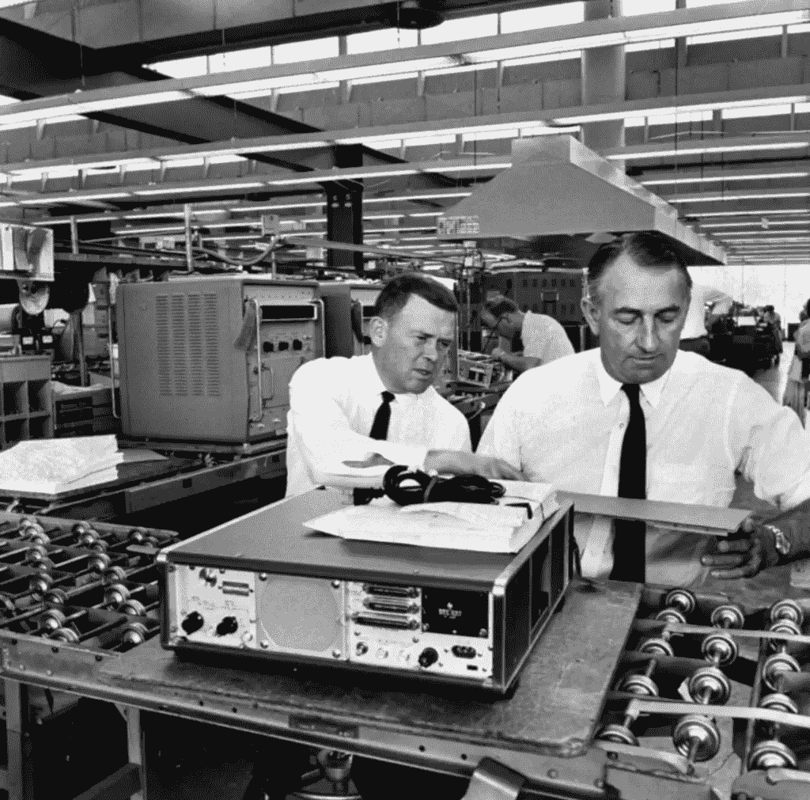

# 惠普的方式今天仍然适用吗？

> 原文：<https://medium.com/swlh/is-the-hp-way-still-relevant-today-3603432563b8>

## 比尔和戴夫创造了新公司可以围绕的东西吗？

Bill Hewlett and Dave Packard at work.

# 林挺电码

当许多工程师为同一个应用程序编写代码时，需要就如何编写代码达成一致。理想情况下，当阅读代码库时，风格和逻辑布局应该感觉像是由一个…