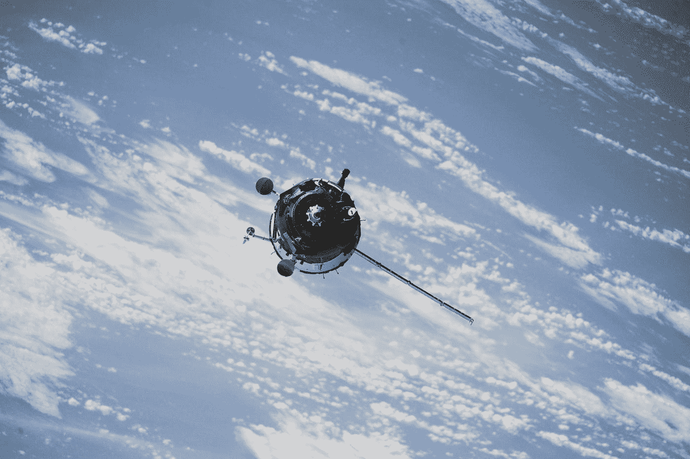

# 我的生活有 GPS 吗？

> 原文：<https://medium.com/swlh/is-there-a-gps-to-navigate-us-through-life-5dc7e67619f7>

Image by [NASA](https://unsplash.com/@nasa?utm_source=medium&utm_medium=referral)/[Unsplash](https://unsplash.com?utm_source=medium&utm_medium=referral)

## 它能帮助我做出正确的决定——向左还是向右？

探险者冒险登上他们的船，穿过飓风和冰层，寻找新的可航行的路径。成功来之不易。许多航行都是徒劳的，许多人丧生，但我们没有停下来。值得吗？