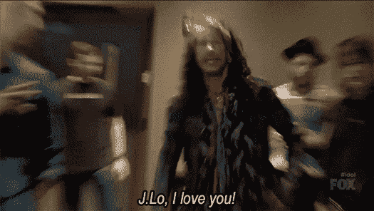

# 这是埃隆·马斯克、大卫·奥格威、加里·维纳查克、米克·贾格尔和史蒂芬·泰勒使用的秘密策略吗？

> 原文：<https://medium.com/swlh/is-this-the-secret-strategy-used-by-elon-musk-david-ogilvy-gary-vaynerchuk-mick-jagger-and-4bcc8556befb>

## 这个被忽视的解决方案——隐藏在众目睽睽之下——如此惊人地为日常公司提供了世界上最具标志性品牌的最严密的秘密之一

每个品牌都想知道另一个品牌*突然像火箭一样起飞时*必须使用的秘密策略。

嗯，这是我最近研究的一个因素:

> 埃隆·马斯克、史蒂夫·乔布斯、史蒂芬·泰勒、米克·贾格尔、大卫·奥格威、加里·维纳查克、格兰特·卡尔多内、拉塞尔·布伦森、霍华德·舒尔茨、戴蒙德·约翰、杰夫·贝索斯、大卫·阿斯普雷和洛里·格雷内尔有什么共同点？

*这是你可以用来在世界上扩大你的价值和效力的东西吗？*

这是本周周三一分钟视频第 19 集的主题。

# 秘密战略，揭开了

我们都知道这些公司:

*   苹果
*   特斯拉
*   史密斯飞船
*   滚石乐队
*   奥美广告公司
*   Vaynermedia
*   卡尔多内企业
*   点击漏斗
*   星巴克
*   防弹咖啡
*   FUBU
*   亚马孙
*   QVC

> *为什么这些公司脱颖而出，拥有大批忠实的追随者和顾客？*

是的。他们管理他们的品牌，他们的形象，他们的言行，他们的品牌声音，他们的渠道等等。

但是有没有另一种东西——某种秘密策略——我们可以借鉴？

我们发现的是:

*   他们是我们熟悉的面孔。
*   *我们听的声音。*
*   *我们遵循的逻辑。*
*   *我们尊重(或至少认同)的价值观。*

它们都做着另外一件事:*它们带我们去某个地方。*

而不是其他不知名的品牌、乐队、公司和运动。

试想一个没有令人难忘的主唱或女主唱的乐队:比有一些我们都有联系的主唱的品牌更难记住。

# 完美的品牌战略？

我们在谈论没有个性的公司和那些与品牌有联系的人的公司之间的区别，不是赞助商，而是创造者。

星巴克几十年前就有了霍华德·舒尔茨。戴森有英国工程师詹姆斯·戴森。亚马逊有贝佐斯，福特汽车有亨利·福特，甚至沃尔玛(爱他们或恨他们)有萨姆·沃尔顿。

本质上，我们谈论的是一个将人的因素与公司实体联系起来的傀儡。

> 人有志向，有梦想。公司的存在就是为了让这些成为现实。太多品牌忽略了一个至关重要的细节。

*原载于*[【www.risingabovethenoise.com】T21](https://www.risingabovethenoise.com/the-secret-strategy-used-steve-jobs-elon-musk-david-ogilvy-mick-jagger/)

## 这篇文章发表在 [The Startup](https://medium.com/swlh) 上，这是 Medium 最大的创业刊物，有 323，238+人关注。

## 在这里订阅接收[我们的头条新闻](http://growthsupply.com/the-startup-newsletter/)。

