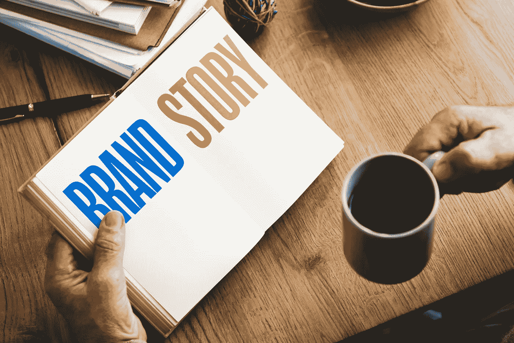
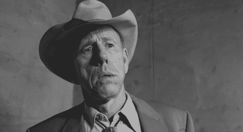

# 这是你创造一个顾客最终会在乎的品牌故事所需要的工具吗？(60 秒后)

> 原文：<https://medium.com/swlh/is-this-the-tool-you-need-to-create-a-brand-story-customers-finally-give-a-shit-about-e42ae54ae056>

为什么有那么多人告诉我们(如果我们想在这个世界上留下印记，让顾客注意到我们，或者驱使其他人采取行动)，我们需要创造一个品牌故事？

不管你是谁，不管你的职业是什么——不管你是企业家、销售人员、设计师还是开发者——不管你做什么，你的工作就是讲述一个故事。

*“这是永远不会改变的。你建立业务的方式和你让*真正*产生影响的方式是通过精彩的故事讲述。”* ***加里·维纳查克***

营销不再是关于你制造的东西，而是关于你讲述的故事。 ***塞斯·戈丁***

*“世界上最厉害的人是讲故事的人。讲故事的人设定了未来整整一代人的愿景、价值观和议程。”*

**

*品牌讲故事。*

*辉煌的品牌讲述辉煌的故事。*

*糟糕的品牌要么 1)讲述糟糕的故事，要么 2)(更常见的是)没有故事。*

*精彩的故事吸引着听众，将他们从当前的存在转移到另一个充满你的品牌和服务的“产品植入”的存在。这是品牌塑造不可或缺的一部分。和领导力。*

*见鬼，我甚至不得不为《周三一分钟》的最新一集写一个故事，讲的是如果你想让你的品牌真正生存下去，写一个品牌故事是多么重要。*

# *这是你创造顾客真正关心的品牌故事所需要的吗？*

*毕竟，一个伟大的故事会激发灵感。点燃客户心中的想象力。并促使他们采取行动。*

*我重塑的一个客户的故事已经随着文化的变化过时了 25 年。那么[这个需要让运动员停下脚步的](http://www.risingabovethenoise.com/capturing-your-customers-attention-with-david-ogilv/)呢？或者[这个](http://www.risingabovethenoise.com/go-big-or-go-home-my-product-launch-formula/)需要让 2200 名销售代表对新产品感到兴奋？*

*总的来说，我们每个人都有责任创造顾客真正关心的品牌故事。*

*部分原因是理解*单纯的事实*和*引人入胜的故事之间的区别。**

# *为什么你必须创造一个顾客真正关心的品牌故事(在 60 秒内)*

*不多说了，现在是第 11 集:*

*现在，继续前进，创造一个与众不同的品牌故事。*

*而如果你想要*的全部剧情，就抢一份 [*的品牌介入*](http://a.co/7TGSs0E) 给自己**你的团队。****

***最初发表于*[*www.risingabovethenoise.com*](http://www.risingabovethenoise.com/need-create-brand-story-customers-actually-care-60-seconds/)**

****

## **这篇文章发表在 [The Startup](https://medium.com/swlh) 上，这是 Medium 最大的创业刊物，有 306072+人关注。**

## **在这里订阅接收[我们的头条新闻](http://growthsupply.com/the-startup-newsletter/)。**

****