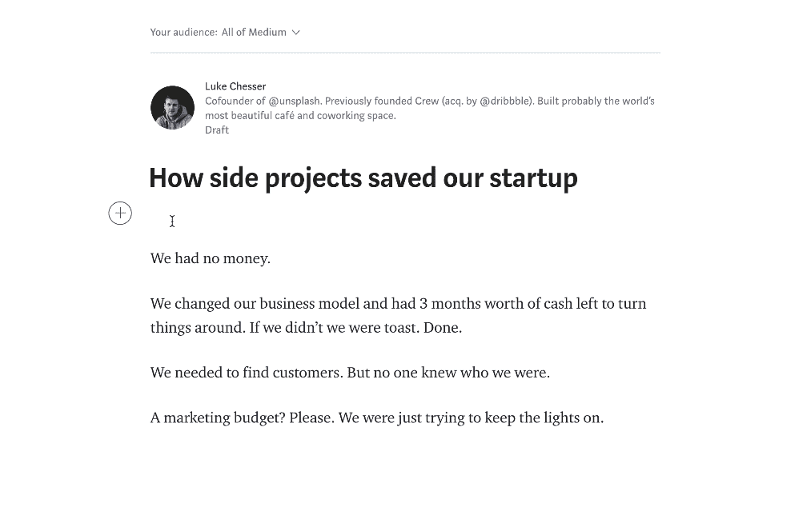
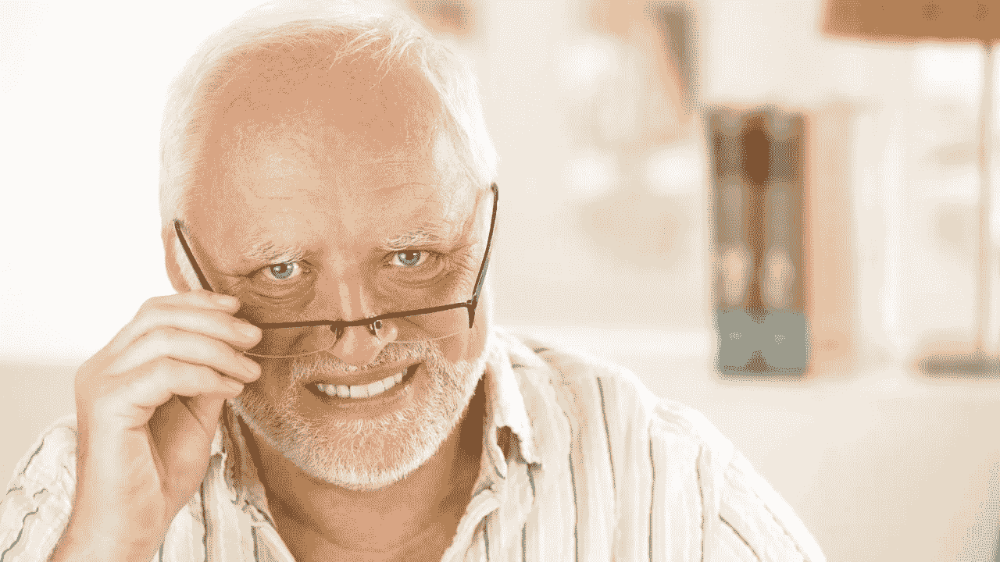
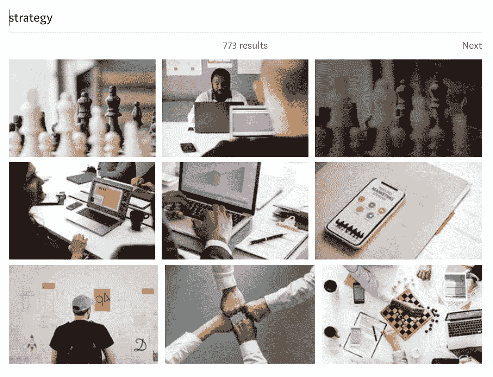
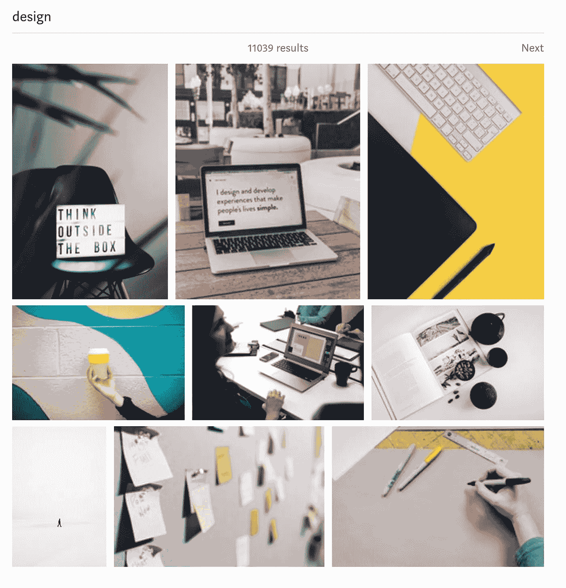
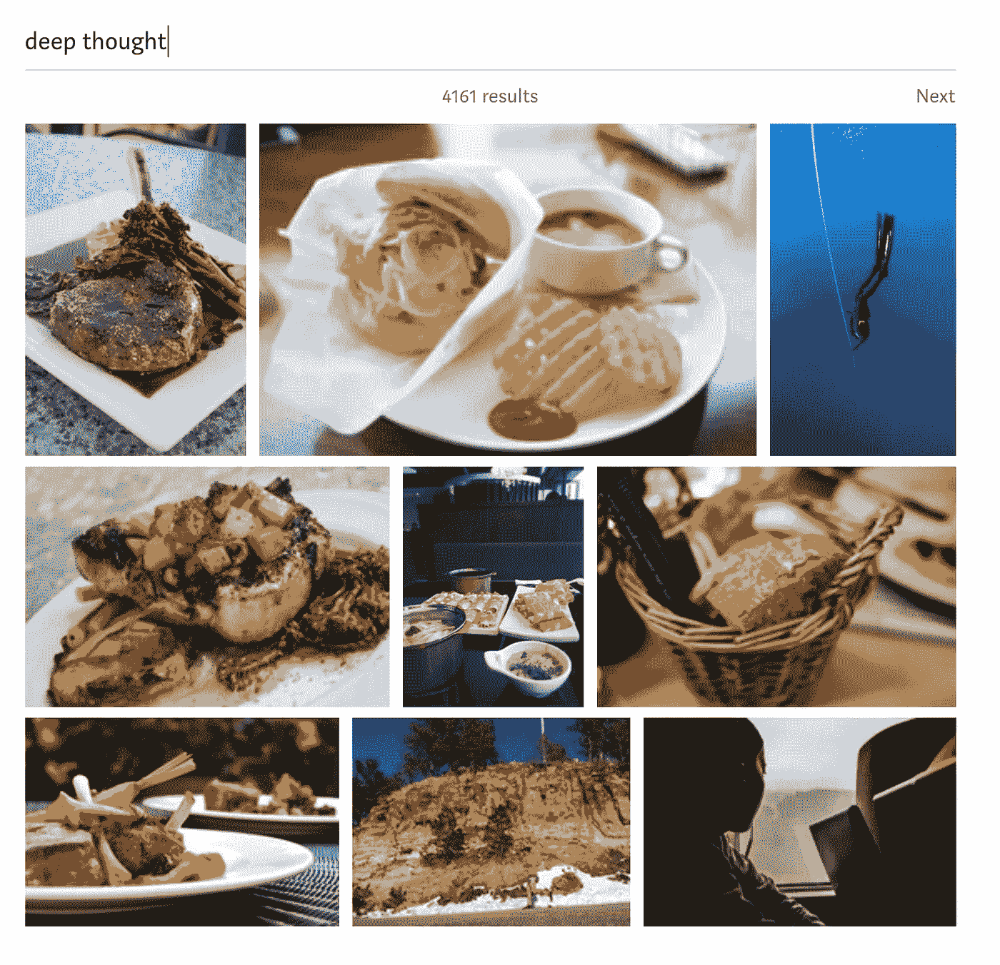
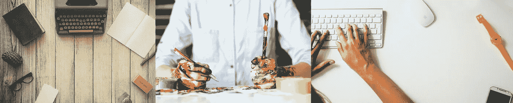

# Unsplash 是未来的廉价图片平台吗？

> 原文：<https://medium.com/swlh/is-unsplash-the-cheesy-stock-photo-platform-of-the-future-73f73db13a48>

## 质量和商品并不相互排斥

Photo by [Raw Pixel](https://unsplash.com/@rawpixel)

从前有一个叫比利的男孩。

比利一直喜欢互联网。他在 90 年代成长的许多形成性经历都发生在 AIM 和微软 Encarta 上。

随着比利的成长，他开始在互联网上制作东西。他开了一个博客，把手指放在键盘上，开始告诉世界他对事物的看法。比利是先驱。

互联网开始变得更加可视化，比利需要图像。他不是一个出色的摄影师，所以他需要一些东西。他想过买股票照片，但是没有钱。他开始从谷歌图片搜索中偷窃，但对此感到不妥。

比利很难从人群中脱颖而出。

然后一场互联网图像革命发生了。

2013 年，迈克尔·乔、[卢克·切瑟](https://medium.com/u/99f08313b279?source=post_page-----73f73db13a48--------------------------------)、[斯蒂芬妮·利维拉尼](https://medium.com/u/58e7e108a566?source=post_page-----73f73db13a48--------------------------------)和[安格斯·伍德曼](https://medium.com/u/43d34295401?source=post_page-----73f73db13a48--------------------------------)创立了 [Unsplash](https://medium.com/u/2053395ac335?source=post_page-----73f73db13a48--------------------------------) 。一个简单的想法变成了惊人的资源，尤其是对内容创作者而言。

下面是 Mikael 去年的总结。

> Unsplash 是一个社区，任何人都可以分享高分辨率照片供任何人免费使用…与其让我们的照片死在某个地方的硬盘上，我们认为如果它们被用于推动其他创意项目会更好…
> 
> 我们相信，如果我们要求付款或赊账的话，放弃我们的图像所带来的好处将远远超过我们所能获得的。

这是米凯尔的文章，以防你想读更多。

 [## 摄影和无刷的未来

### 我们启动 Unsplash 不是为了重新发明一个行业。我们开始 Unsplash 是因为我们认为它可能有用。

medium.com](/unsplash/the-future-of-photography-and-unsplash-811f114aab7a) 

400，000+高清专业照片触手可及。它们不需要任何费用，不需要署名(*尽管来吧，这是我们最起码能做的*)，是世界各地专业人士拍摄的令人难以置信的照片。

我对 Unsplash 只有赞美。他们的成长和新的整合令人兴奋。他们的使命鼓舞人心。

然后米凯尔[宣布了他们与](/unsplash/medium-unsplash-2fee8d662dd1)[媒体](https://medium.com/u/504c7870fdb6?source=post_page-----73f73db13a48--------------------------------)的整合。任何媒体作家现在都可以像画馅饼一样容易地画出不清晰的图像。

A gif from Mikael’s [announcement post](/unsplash/medium-unsplash-2fee8d662dd1)

激动人心的消息！任何作家都会说这是一件好事。任何设计师或有产品意识的人都会同意这非常有意义。

但是我从另一个角度看待它。

不是作为一个作家。不是作为产品设计师。不是作为一个摄影师(我不是一个)。不是作为一个好的摄影爱好者。

作为读者。

## 新奶酪上市了

我们看着俗气的库存照片大笑。它们变成了非常有趣的迷因。这是一种奇特的幽默。它们本身并不好笑。它们之所以有趣，是因为互联网，人们是如何使用它们的，以及它们现在代表了什么。

This is only funny because of the internets, and what poor Harold has come to represent.

自从新的 Medium + Unsplash 工具出来后，我就有一种感觉。一种新的廉价品正在出现的感觉。它仍然很微妙，但它就在那里。而且越来越强。

让我们来看看。

## 场景 1:战略

我想写一篇关于战略的文章。我搜索“策略”。以下是我的最佳结果。

棋子，拳头碰撞，人们看着笔记本电脑上的东西，一个技术兄弟看着墙上的东西。老实说，我很惊讶森林里没有风的路。或者最好是一条岔路，中间有一个讽刺的路标。

我不确定我能否用语言解释为什么所有这些结果都有明显的劣质，但它们确实如此。你感觉到了吗？再看看他们，我知道你能感觉到。

让我们试试另一个。

## 场景 2:设计

我是一名设计师。我写设计。我经常需要有设计感的图片。

嘿，看，那个战略小姐又在看她的笔记本电脑了。还有一台笔记本电脑，上面有一个完美的作品集主页句子(偷那个)。便利贴，我很惊讶只有一张。哦，还有一本打开的杂志，还有一个茶壶，我想还有咖啡豆。

好吧，也许现在是一个模糊的问题。

## 场景三:深思

好吧，这个很有趣。让我想知道使用食物图片会如何影响文章的观点。🤔

## 这不是重点

首先让我澄清一下*不是*的重点:

*   无刷图像搜索结果
*   Unsplash 上照片的质量
*   Unsplash 作为一个整体的前提或价值
*   还有什么不是重点的吗(下)

所有这些事情，还有更多，都不是重点。我有没有提到这些年来我有多爱 Unsplash？很多。

## 点

重点更多的是一个问题。作为读者、作家或互联网人，我想问你一个问题。这也是我希望迈克尔和 Unsplash 的团队正在思考的事情。

看起来我们很快就会嘲笑那些使用明显不整洁照片的作家。人们可能会发展出一种天生的能力，从一系列照片中识别出没有污点的照片。

另一个设计师用了一张便利贴。另一个创业公司的创始人，他有一张站在山顶上的照片。另一篇关于在咖啡杯旁用一支孤独的笔写作的文章，从上方拍摄。

我们以前使用的照片将开始到处出现。我的网站的早期版本使用了这些照片，从那以后我已经数不清看过多少次了。

Photos by [Dustin Lee](https://unsplash.com/@dustinlee), [Alice Achterhof](https://unsplash.com/@alicegrace), and [Damian Zaleski](https://unsplash.com/@zal3wa)

这让我不禁要问，

> 有什么能阻止不漂亮的照片成为未来俗气的库存照片吗？
> 
> 如果不是，我们对这些照片的看法——尽管它们质量高、价值高——会受到它们商品化的影响。

对专业摄影价值的影响绝对是 Unsplash 正在思考的事情。但对于内容创作者来说，Unsplash 的成功和增长会影响我们对其产品的评价吗？

当 Unsplash 还不太出名的时候，拥有他们令人难以置信的摄影技术是一个优势。比利的读者重新对他的作品产生了兴趣。

现在这是必然的。

比利和我们所有人的差异化循环又开始了。

> 感谢阅读！我很想知道你对此的看法。它是否引起了你的共鸣，或者你完全不同意。
> 
> 如果你觉得有趣，帮我用 [Unsplash](https://medium.com/u/2053395ac335?source=post_page-----73f73db13a48--------------------------------) 开始召集。分享这篇文章，并给它们贴上标签。也许[迈克尔](https://medium.com/u/300c728e7d24?source=post_page-----73f73db13a48--------------------------------)和机组人员会让我们知道他们在想什么。那不是很酷吗？

## [让我们也成为朋友吧。](/@craig5446)

## 这篇文章发表在 [The Startup](https://medium.com/swlh) 上，这是 Medium 最大的创业刊物，有 305，398+人关注。

## 订阅接收[我们的头条新闻](http://growthsupply.com/the-startup-newsletter/)。

