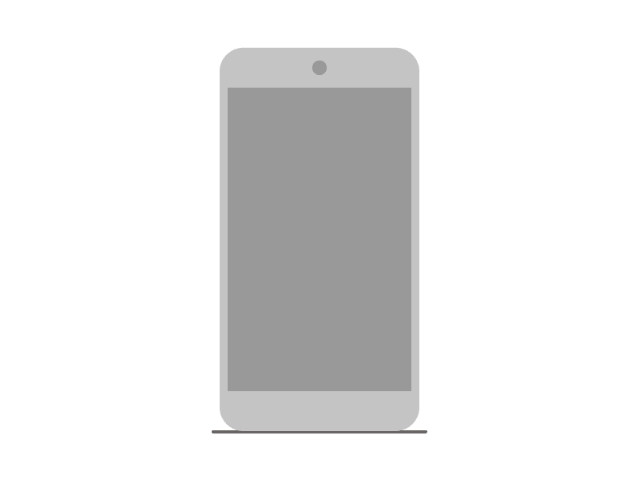

# 这就是为什么你忽略了虚拟现实的重要性

> 原文：<https://medium.com/swlh/is-vr-actually-going-to-change-anything-2225c979d97c>

## 为什么我们正在达到虚拟空间创业的临界点(为什么没有足够多的人关注)

如果虚拟现实似乎进展缓慢，那可能只是因为我们大多数人都有一种可怕的能力，可以预见一项新技术将给世界带来的巨大变化。

当卧室评论家是人之常情。

当莱特兄弟在 1903 年进行第一次飞行时，媒体和大多数公众的反应是耸耸肩。[五年后，公众才反应过来，地球上卑微的人类现在真的能飞了。](http://time.com/money/3940273/innovation-isnt-dead/)

回到 80 年代，[《纽约时报》从来不相信我们会不想使用笔记本电脑](http://www.nytimes.com/1985/12/08/business/the-executive-computer.html)(更不用说总是连接到电脑上了)。

> “人们不想带着电脑去海滩或乘火车消磨时间，他们宁愿看报纸的体育或商业版。不知何故，微型计算机行业认为每个人都希望有一个键盘作为手指的延伸。”——埃里克·桑德伯格·迪蒙特/纽约时报

关键是新的平台和技术从来都不容易流行。人类反对改变。我们懒惰的大脑想要最容易的，而且在大多数情况下，这是我们已经知道的。

摩根·豪斯尔在《时代》杂志上写道，他概括了人们对改变生活的发明的典型反应:

1.  我从来没听说过。
2.  听说过但不了解。
3.  我明白，但我看不出它有什么用。
4.  我知道有钱人会觉得有趣，但我不会。
5.  我用它，但它只是一个玩具。
6.  它对我越来越有用了。
7.  我一直在用它。
8.  我无法想象没有它的生活。
9.  说真的，人们生活中没有它？

就虚拟现实而言，我们几乎正处于第五阶段——临界点。

在很大程度上，虚拟现实只是真正入侵了游戏世界，在那里用户熟悉以一种更全知的方式与视点分离。

然而，随着这项技术变得更加普遍和被接受，正如我们所说的那样，消费耳机达到了大多数人都能承受的价格，对于那些愿意在世界认识到他们无法想象只有这种现实的生活之前先潜水的人来说，这是一个真正的机会。

# 那么机会在哪里呢？

在过去的一年里，虚拟现实头戴设备终于进入了普通大众的视野，人们期望它能被广泛采用。但是最大的机会在哪里呢？不同于其他专门适用于特定应用、内容或用途的平台和媒介，VR 是一个真正的革命性平台。

导演兼虚拟现实倡导者克里斯·米尔克(Chris Milk)，[将虚拟现实称为“最后的媒介”](https://story.californiasunday.com/virtual-reality-hollywood)，因为从戏剧到电影到游戏到应用程序，所有其他媒介都可以在虚拟环境中复制和增强。

> “虚拟现实的前景一直是巨大的。戴上这些护目镜，无处可去，被传送到任何地方。这与毒品、酒精、性和艺术兜售的逃避现实是一样的——通过形而上学的运输，摆脱世俗的枷锁，进入一种改变的状态。”——马修·施尼珀/ The Verge

但除了游戏和逃避现实。顶级投资者正在寻找专注于做出真正改变的虚拟现实创业公司。从早期采用者和爱好者那里获得新兴的平台，并创造能带给大众的内容。

Boost VC 的首席执行官亚当·德雷珀(Adam Draper)认为，我们正处于虚拟现实革命的风口浪尖。Boost VC 是一家已经资助了 30 多家虚拟现实初创公司的基金。我们只需要想出如何处理它:

> “我们已经到了这一步，我们拥有这个有很多机会的工具，接下来的两年就是要弄清楚人们用它做什么。真正给他们的生活增加价值的是什么？”

具体来说，亚当认为虚拟现实最有机会创造真正的价值:

# 创建内容的工具

"现实是由摧毁它的力量塑造的."作家 d .哈伦.威尔逊写道。然而，在虚拟现实的情况下，如果我们说现实是由*创造*它的力量塑造的，这可能会更好。

如果内容在任何平台上都是王道，那么 VR 要想成功，我们需要工具来让内容更容易制作。目前只有像 Unity 和 Unreal 这样的游戏引擎，这意味着你需要既是开发者又是艺术家才能创建虚拟环境。

在虚拟现实中，这意味着工具可以以不同的方式帮助捕捉和创建内容。这意味着在以下方面的进步:

*   360°视频:在那里你可以移动你的头，可以看到整个空间，但实际上不能移动。
*   3D 体积扫描:你有更多的视角
*   摄影测量:在建筑物或城堡等大型物体周围拍摄高分辨率 2D 照片，并通过算法在虚拟现实中将它们放在一起。

# 旅行

在他的帖子 [*中，旅游将被虚拟现实破坏的 5 种方式*](/boost-vc/5-ways-that-travel-will-be-disrupted-by-vr-6fc9e629c1d7#.o58hob621) *，*亚当分析了尽管有批评者的反对，虚拟现实和旅游业仍有巨大的合作机会。

*   会降低体验世界的成本。
*   “面对面”会议和“Skype”会议之间有一个级别。
*   距离和地理不会对你了解一个人负责
*   旅行的定义将从物理的转变为数字的
*   它将降低语言沉浸的障碍

# 零售

如果说电子商务触发了传统购物，那么虚拟现实可能就是葬礼上棺材上的钉子。

当你在家就能获得完整体验和更多体验时，为什么还要去体验商店呢？Adam 认为，一旦我们有机会虚拟浏览商店，就不再需要物理位置。

# 教育

> “如果你认为互联网是一个更容易索引所有信息并更快消费它们的地方，那么虚拟现实就是一个索引体验并让你更快消费它们的地方。”

在所有准备被虚拟现实颠覆的行业中，教育似乎是最有可能也是最强大的。虚拟现实体验可以教会我们实用的技能，让我们不仅沉浸在课程中，还沉浸在任务本身中。

想学习如何修理你的马桶？带着你的精确模型进入虚拟现实管道教程，看看它是如何完成的。

想学摄影？用你的相机模型加载一个 VR 体验，练习场景，学习完美的设置。

# 这不仅仅是巨大的机遇

像 VR 这样一个巨大的平台转变最有趣的是它成为一切的一部分的潜力。不仅仅是大体验。

Andreessen Horowitz 的普通合伙人 Chris Dixon 在 Medium 上写道，专注于相对“简单”体验的初创公司有巨大的机会:

> “这对将在虚拟现实中取得成功的软件种类有一定的影响。风险不在于无聊，而在于太过激烈。例如，像《使命召唤》这样的流行视频游戏移植到 VR 上，对大多数人来说会令人恐惧和迷失方向。”
> 
> "相反，有可能成功的是相对简单的经历."
> 
> “时光倒流，逛古罗马；通过爬摩天大楼来克服自己的恐高症；在训练飞机安全着陆时执行精确动作；回到你上次度假时“3D 拍摄”的地方；在一个阳光明媚的下午，和一个久违的朋友去野餐；以一种如今你只能亲自去做的方式，与虚拟工作的同事建立信任。”

# 原创将最终获胜

虽然迄今为止，许多体验和虚拟现实初创公司都专注于将现有内容或想法融入虚拟空间，但那些为虚拟现实设计的原创内容将脱颖而出。

正如 Greycroft Ventures 的风险合伙人、Foundation 9 Entertainment 的前创始人、董事长兼首席执行官 Jon Goldman 在最近的一次专题讨论会上解释的那样:

> "现在，是成为原创者、原创声音的绝佳时机."
> 
> “这些早期采用这些平台的人想要新鲜、原创的东西。他们比未来几年有望到来的更成熟的用户更具探索性。”

但这需要时间，就像任何平台一样，Chris Dixon 解释道:

> “我们正在定义虚拟现实的语法，就像电影制作人和导演通过几十年的实验创造了电视和电影的语法一样。”

# 但是有什么阻碍呢？

当然，在早期处理任何新技术不仅意味着处理大量问题，还意味着不断发现新问题。在某个领域率先行动并不总是有优势。

以下是目前阻碍虚拟现实在商业领域真正起飞的少数几件事情:

# 你如何付款？

任何虚拟现实创作者最不希望的事情就是在虚拟环境中重建同样的以广告为中心的互联网商业模式。

我想不出比突然出现在我面前的弹出式广告更令人讨厌的事情了。或者“现在就订阅！”屏幕实际上阻止我离开虚拟房间。

但虚拟现实中的支付仍然是创作者面临的问题，也是该平台真正起飞需要掌握的问题。

# 用户需要一个投资硬件的好理由

对于购买耳机的人来说，他们需要一个非常好的理由。目前，VR 硬件与 iPhone 问世前后的智能手机处于相同的阶段。人们购买它不仅仅是为了功能，也是为了获取内容。

> “从历史上看，如果你是一个内容开发者，那么在平台的开始阶段就有一把双刃剑。有很少的安装基础，但如果你做的真的很好，你可以得到很高的附加率。当有大量用户和更多内容时，你很难获得认可。”— [乔恩·戈德曼，格雷克罗夫特风险投资公司](http://venturebeat.com/2016/08/15/how-vcs-are-looking-at-investing-in-vr-content/)

虚拟现实制作人和设计师有很大的机会在早期获得认可并留下印记。现在好的东西都会被使用它的人消费掉。

# 它很贵

像任何新技术一样，在工具可用和平台被广泛采用之前，早期构建将是资本密集型的。然而，有人愿意为内容付费，也有投资者希望进入这个领域。所以如果你能[把你的想法变成现实](https://app.crew.co/submit_new_project)，人们会感兴趣的。

任何做出预测的人都是在为某种失败做准备，而且虚拟现实永远有可能无法站稳脚跟。

但是，随着投资者向这个领域投入数十亿美元，更好的技术变得越来越容易为公众所接受，很难想象虚拟现实的未来会不光明。

# 准备好将您的业务[转移到虚拟世界了吗？](https://crew.co/?utm_source=Medium&utm_medium=CTA&utm_campaign=MediumCTAs)

## 看看 Crew 吧，这是一个人才市场，在这里你可以见到最好的设计师和开发人员，并与他们一起工作。超过 1000 万人使用过[剧组](http://crew.co/?utm_source=Medium&utm_medium=CTA&utm_campaign=MediumCTAs)生产的产品。超过 300 万人阅读了[我们的博客](http://blog.crew.co/?utm_source=Medium&utm_medium=CTA&utm_campaign=MediumCTAs)。在这里加入他们。