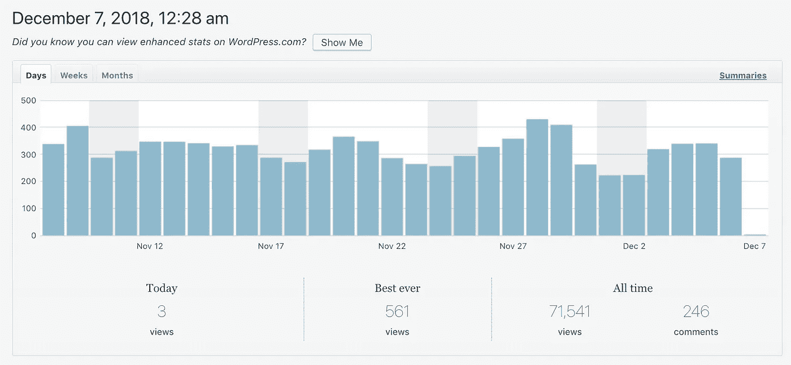
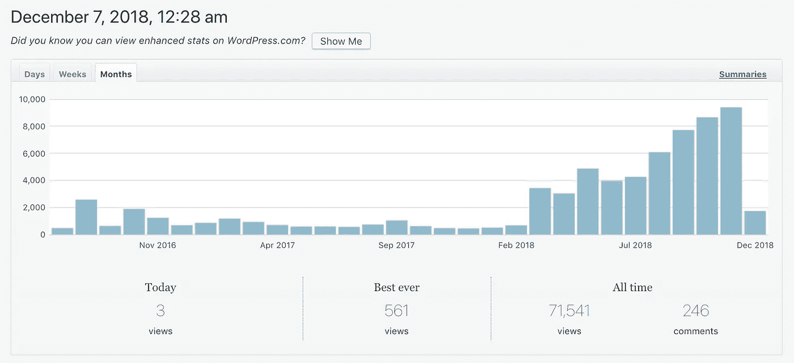
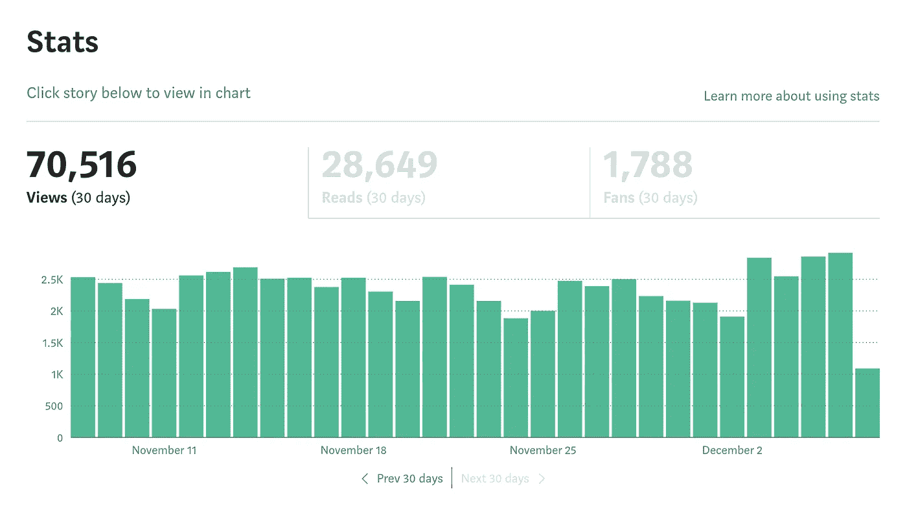
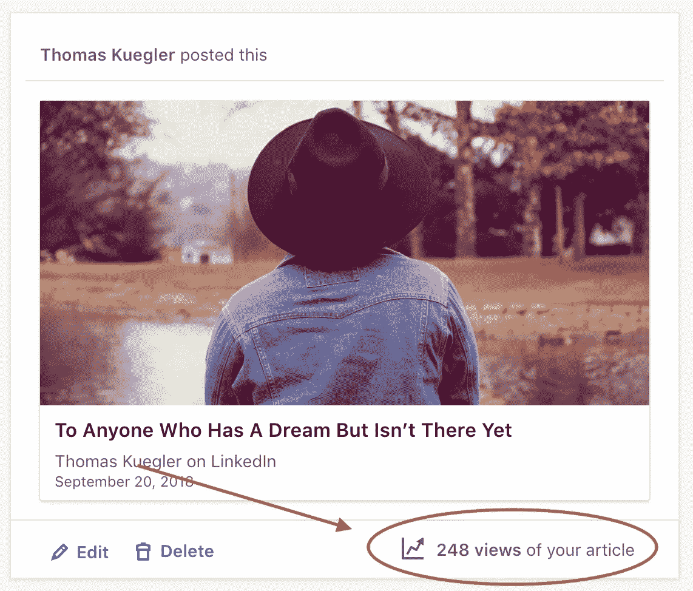

# 在介质上写作还值得吗？

> 原文：<https://medium.com/swlh/is-writing-on-medium-still-worth-it-af3aca68226e>

Photo by [Elijah O'Donnell](https://unsplash.com/@elijahsad?utm_source=medium&utm_medium=referral) on [Unsplash](https://unsplash.com?utm_source=medium&utm_medium=referral)

> 新汤姆库格勒“中等”材料！耶！

现在是 2018 年 12 月 7 日，我再次写关于媒体的文章。

我的朋友们，我将向你们提供幕后的一瞥…这是我的 WORDPRESS 网站的月度统计。

不错吧？**平均每天约 275–350 次浏览**。这相当于…

**月浏览量 9000 左右**。如今，这些观点大多来自谷歌，因为我已经找到了自己的搜索引擎优化公式。

这就是 Wordpress。

这是我在 Medium 上得到的统计数据..

实际上，这甚至不是一个比较，甚至在我曾经转载文章的 LinkedIn 上，我也能得到可观的数字..

我的观点？

在万维网上成为一名作家是很难的，而在去年 7 月的变革之前，在媒体上成为一名作家是非常容易的。

现在更难了，但这并不意味着 Medium 是一个没有价值的地方。

# 我看到很多人跳到 Wordpress…这是如何解决的

> 我看到我最激烈的对手之一每周写 1-2 篇关于 sh*tty 媒体的文章，然后跳到 Wordpress 博客上。

当他这样做的时候，我不禁想知道他会坚持多久直到放弃——因为我知道等待他的是什么。

嗯，我几天前刚看了那个网站，它已经有 6 周没有发表了。

> 他学得很快，不是吗？

值得称赞的是，他也不再在这里出版了。看在旧日时光的份上，他时不时会出现，再次抨击 Medium，但我认为他现在已经不再发布内容了。

# “中等”就像住在贝弗利山…听我说完

*这是给你的一个比喻..*

Medium 曾经就像住在贝弗利山一样。我以前在这里发表的任何博客文章都能轻易获得 2000 到 3000 次浏览。

> 如果我见过的话，那是作家的天堂。

我知道这一点——因为我在 Wordpress 上发表了几个月却没有任何进展——然后我找到了 Medium，这就像吸毒一样。

**即时观点。直接追随者。即时的积极反馈。**

然后每个人都涌向媒体，开始享受同样的东西..

> 然后我们开始认为这很正常。

Photo by [Thought Catalog](https://unsplash.com/@thoughtcatalog?utm_source=medium&utm_medium=referral) on [Unsplash](https://unsplash.com?utm_source=medium&utm_medium=referral)

想象一下在贝弗利山或任何超级富人区长大。你可能会期待这种生活方式带来的所有好处…

> 然后想象一下搬出贝弗利山，搬进比如说贫民窟。这将是一个重大的冲击，对不对？

问题是，贝弗利山的生活不会好到哪里去。你已经在顶端了。因此，当媒体在 7 月份发生变化时，我们都开始看到牵引力变小，我们看到许多人在抱怨。

> 最好的权利。

然后我们开始看到人们跳槽。许多人去了 Wordpress，但是去 Wordpress 有点像从贝弗利山搬到贫民窟。

根本没法比。

所以人们放弃了一切。中等，Wordpress——一切。

> 在那一刻，他们可能明白在砍掉他们的博客生涯之前，他们有多幸福。

我们在这里收拾残局。

# 现在只有“真正的博客”还在

恭喜..如果你还在这里，那意味着你有成为成功的博客写手的欲望。

> 以前总是这么难。过去，认为你的第一篇博客文章就能获得 30 次浏览的想法总是很疯狂。

对许多人来说，媒介就像是生命的支持——通过让我们变得更容易来人为地维持我们的生命。

但是生命支持系统已经被拔掉了，因此我们看到了一次大规模的灭绝事件。

所以，问题仍然是，媒介仍然值得吗？

> 当然他妈的是。

如果有 5 个人在这里发表，那就值得了。如果你在这里甚至赚不到钱，那也是值得的。如果 Medium 把 95%的流量给了委托作品，只给了我们 5%，那还是值得的。

你知道为什么吗？

因为互联网的其余部分就像在鲨鱼出没的水域游泳。

真他妈的难。

> 我认为这是很多人在媒介改变后学到的一课。他们看到了更绿的牧场，但发现草只是喷漆。或者他们是色盲。

很多人攻击我支持媒体..现在他们已经从网上消失了。

我选择媒体是因为我已经在网上写了一段时间了。我尝试了所有的方法。我知道比赛场地，它看起来像一百个 8 英尺 9 英寸的人跑向你试图拦截你。

> 但是当你看到像这样的事情发生时——一个大的灭绝级别的事件，使得寻找成功变得更加困难，你会看到很多人放弃..

这反过来又增加了机会，使人们更容易成功。

这是一个循环。媒体让它变得如此简单，以至于很多人突然想“成为一名作家”

但是现在机会减少了，只有真正的作家留下来了。

如果你正在读这篇文章，你可能是他们中的一员。

这就是我现在对媒体机会的感觉。你呢？

> 想在媒体上赚点外快吗？本周我将主持一些免费培训，名为“**如何在 Medium 上每月额外挣 900 美元**”[在此获得免费座位](https://events.genndi.com/register/169105139238473045/da2e6c5a01)！

## 这篇文章发表在[的《创业](https://medium.com/swlh)，这是 Medium 最大的创业刊物，拥有+396，714 人关注。

## 在这里订阅接收[我们的头条新闻](http://growthsupply.com/the-startup-newsletter/)。

