# 你的反弹率让你偏离了轨道吗？

> 原文：<https://medium.com/swlh/is-your-bounce-rate-throwing-you-off-track-c0719ac14451>

在我作为转换优化专家的工作中，有一些事情非常突出。其中之一是我的客户都对他们的跳出率感到恐惧，并强烈希望降低跳出率。它似乎比许多其他指标更重要，跳出率必须下降。

当然，你希望尽可能多的用户留在你的网站上是完全可以理解的，尤其是如果你为流量付费的话。

在此之前，他们中的许多人没有理解跳出率的实际含义和计算方法——影响跳出率的因素和相互作用是什么。

根据 Google 的定义，反弹是一个单页会话，它触发对 Google 服务器的单个请求。任何页面的跳出率计算如下

退回率=单个请求的会话数(退回的会话数)/总会话数 X 100

看看我们下面例子中的主页有 47.34%的跳出率。这意味着，在登陆主页的 101，629 个会话中，有 48，111 个被弹回或有一个与页面零交互的单页面会话。

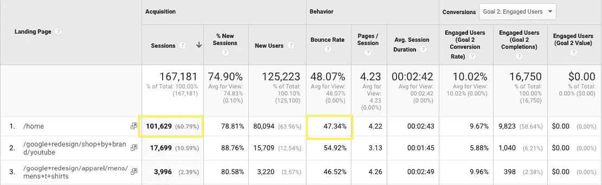

现在，一个高跳出率可以多次表明，你的登陆页面是不相关的访客。然而，高跳出率并不总是一件坏事。这取决于你的网站的目标——如果你的目标是让用户通过一个漏斗，在那里他们需要看到多个页面等等，那么这是一件坏事！如果你的目标是让用户阅读你的内容、博客文章、新闻稿等。—简而言之，当目标是单页会话时，跳出率比预期的要高。

让我们快速浏览一下分析跳出率的方法，看看如何确定何时应该报警。

# 你网站的平均跳出率

首先，你会看到你的网站在观众中的跳出率→你的分析中的概览报告。它看起来像这样:

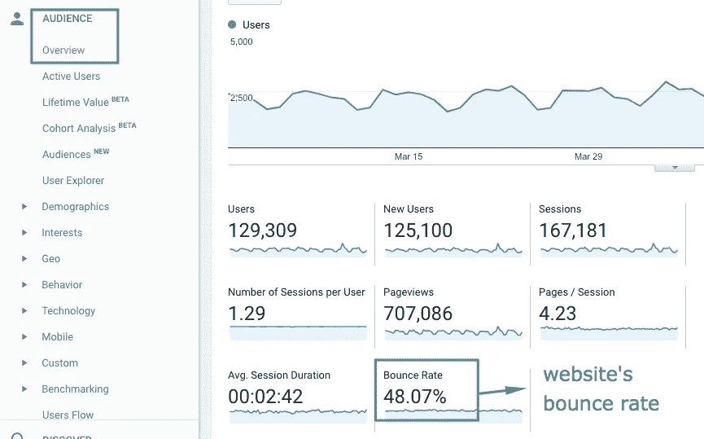

像大多数平均值一样，这可能有点欺骗性。你想做的是看看你的主要流量来源，登陆页面，关键词，设备，甚至网络的跳出率。

# 你的跳出率由你的来源/媒体。

这个报告在采集→所有流量→来源/媒介中很容易找到。首先，这份报告将向您展示的是来自您的主要流量来源的流量质量。

对于这个网站，你可以清楚地看到付费流量的跳出率非常高，而有机流量的跳出率很低。这可能意味着付费流量活动没有很好的针对性，或者登录页面与广告创造的预期不符。

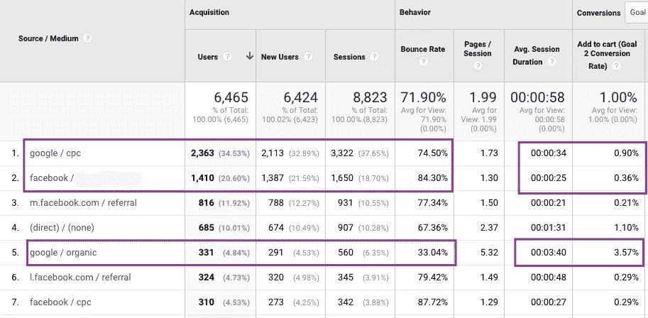

我们可以在该报告中看到的另一个非常有趣的方面是，有机用户平均每次会话花费 3:40 分钟，购物车添加率为 3.57%，而来自 PPC 活动的用户每次会话花费不到半分钟，转化率不到 1%。

> 当查看你的分析报告时，一个重要的事情是深入你的流量和内容，避免只看网站的平均值。

# 每个登录页面的跳出率

在行为→网站内容→登录页面中找到此报告。

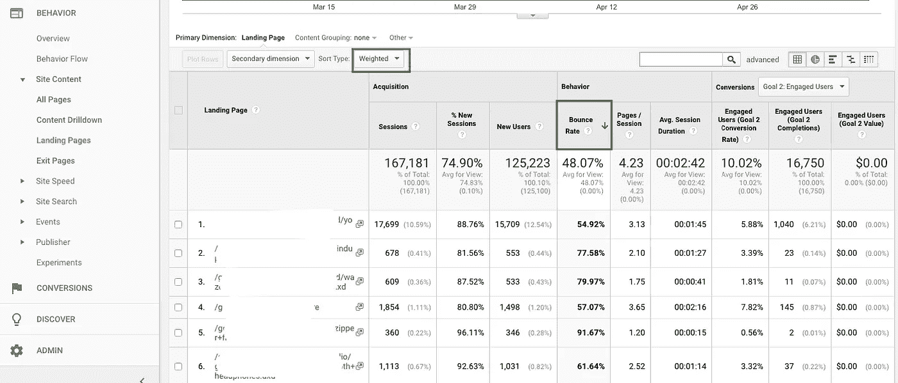

> 专业提示:根据你的跳出率对你的登陆页面进行排序，然后选择排序类型:加权。这样做是为了向你展示跳出率最高但流量也很大的页面。

你的跳出率由设备。您可以在受众→移动设备→概述下找到此报告。快速浏览一遍，确保没有什么特别突出的地方。如果你在一个设备上看到一个更高的跳出率，看看在那个设备上的体验和加载时间。很多时候，如果加载时间太长，你会在移动设备上有很高的反弹——用户在加载网站时并没有那么大的耐心。

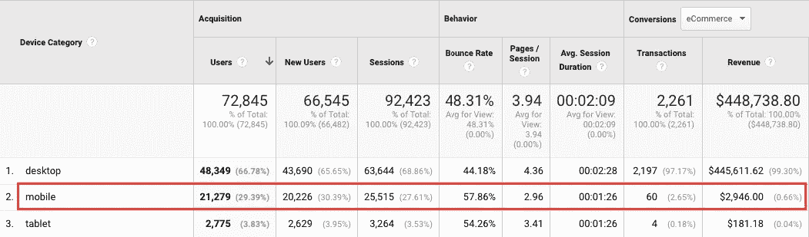

在本例中，我们可以看到移动设备的跳出率比桌面设备的跳出率高出近 25%,这可能是移动体验出现问题的第一个迹象。当然，你可以看到 30%的移动流量只带来了 0.66%的总收入，所以有几个迹象。

现在你知道如何看待自己的跳出率并正确分析，我也应该告诉你如何调整自己的跳出率，尤其是如果你有博客或内容网站的话。

# 调整你的跳出率

你调整跳出率的目的是什么？简单地说，就是要了解你的用户是否真的在使用你的内容。你的用户可能会登陆你的页面，阅读那里的信息，写下一个电话号码或地址，然后关闭页面。当你有一个真正的用户时，你通常会认为这是一个反弹。

做到这一点的简单方法是将事件发送到您的 Google Analytics，告诉您用户在页面上花费了一定的时间，在页面上滚动了一定的百分比，或者在页面上看到了特定的元素。

有两种方法可以做到这一点:

*   通过调整你的 GA 代码(了解如何做到这一点:[https://analytics . Google blog . com/2012/07/tracking-adjusted-bounce-rate-in-Google . html](https://analytics.googleblog.com/2012/07/tracking-adjusted-bounce-rate-in-google.html)
*   通过从谷歌标签管理器发送一个事件(见下面我的逐步说明)

# 通过滚动%事件调整您的跳出率

最近，谷歌标签管理器已经实现了一个“滚动深度”触发器，所以你可以很容易地为每个用户创建基于滚动深度的自定义事件。

这就是如何在 GTM 中设置滚动深度事件。首先，创建一个新标签。

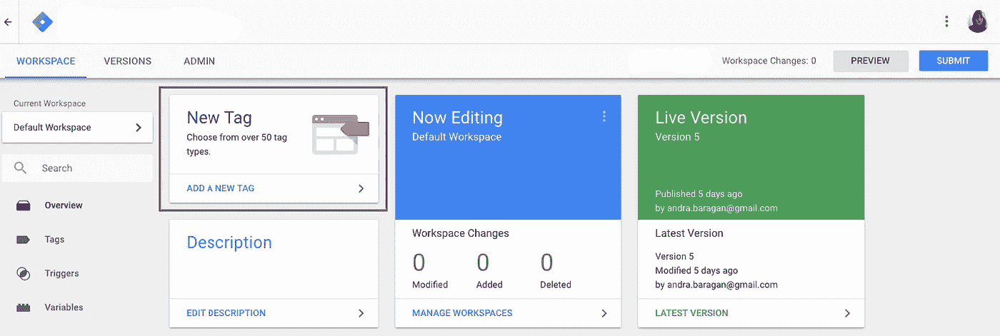

在标签设置屏幕中，命名您的标签(GA —滚动跟踪 75 ),然后在跟踪类型下拉列表中选择“通用分析”作为标签类型和“事件”。

然后，您将获得自定义事件的三个输入。输入事件类别——我保持简单，将其命名为调整后的跳出率。

然后，对于事件操作，单击变量的小加号并选择页面路径。对于事件标签，查找名为“滚动深度阈值”的数据层变量。

如果您没有看到此数据层变量，那么您需要转到“变量”屏幕并启用滚动内置变量:

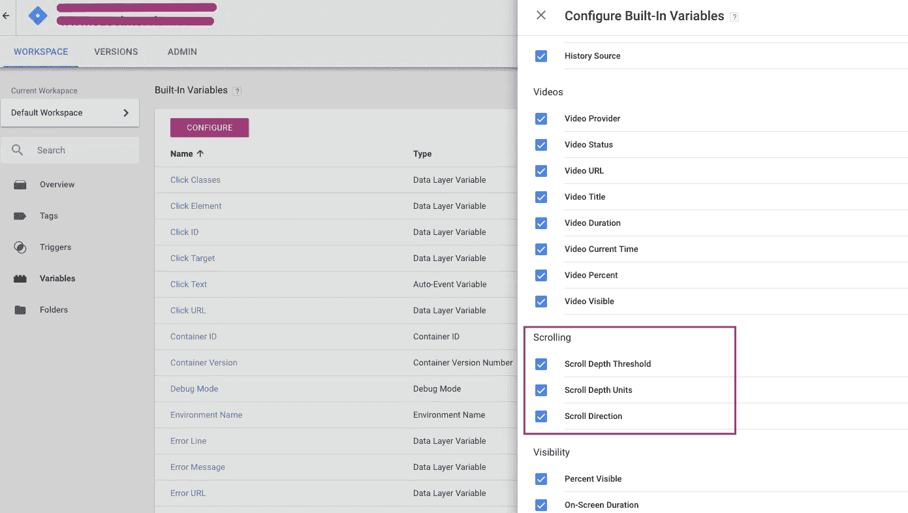

选择“非互动事件”为“假”,并添加您的 UA 跟踪 ID-我们这样做是因为我们希望滚动到页面的 75%被视为互动。

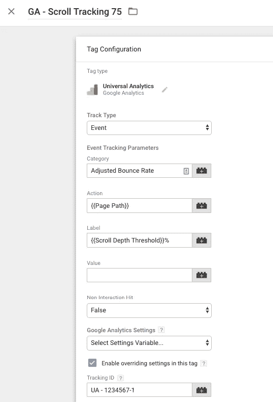

现在，您需要为 75%滚动创建一个触发器(您可以为您感兴趣的每个阈值创建事件，但是我建议将低于 50%滚动的任何内容设置为非交互式的，以便不会扭曲您的数据，尤其是对于较短的页面)。

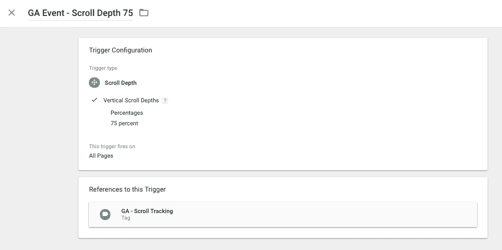

相应地命名您的事件，选择“滚动深度”作为触发类型，然后以百分比的形式，输入 75。选择是在所有页面上触发还是仅在特定页面上触发。保存、预览、调试和发布。

关于滚动深度跟踪的更多信息，我强烈推荐在这里阅读 Simo Ahava 的博客文章:[https://www . Simo Ahava . com/analytics/Scroll-Depth-trigger-Google-tag-manager/](https://www.simoahava.com/analytics/scroll-depth-trigger-google-tag-manager/)

# **通过定时器功能调整你的跳出率**

另一种调整跳出率的方法是计算你在网页上花费的时间。你可能认为你已经这样做了，因为你可以看到平均花费在页面上的时间，但这实际上是计算交互之间的时间，所以反弹不在这一类别中。

下面是如何创建由计时器触发的自定义事件:

创建一个新的标签，命名为“UA-调整跳出率-定时器”等。只要坚持你的命名惯例，并确保你在 GTM 中命名事物的方式是一致的，因为一旦你开始添加几十个标签，要找到一些东西会变得非常复杂。

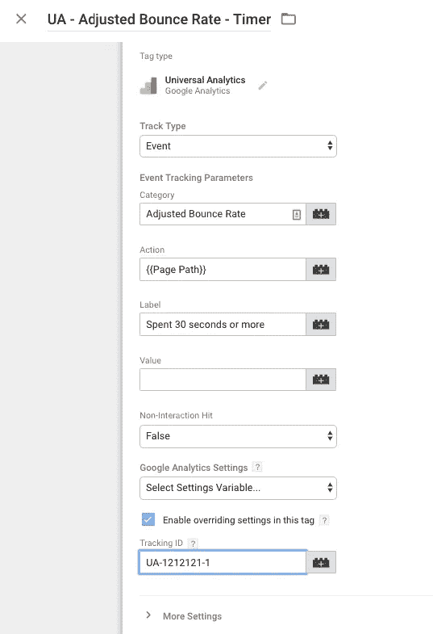

现在，创建你的 30 秒触发器。添加一个新的触发器，命名为“定时器— 30 秒”。

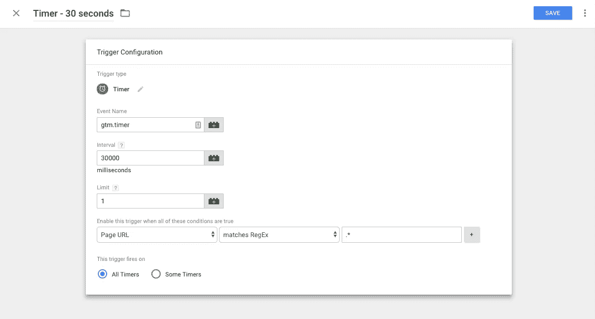

在间隔中填入 30000(这些是毫秒，在这里调整你认为适合你的站点的时间)，然后设置限制为 1(你不想发送一个以上的事件)。然后，在条件中，选择“页面 URL”匹配 RegEx”。* "因为这将包括所有页面。

**确保在 GTM 调试面板**中调试所有这些标签和触发器是绝对重要的 **。一旦活动开始，就可以通过位于报告列表顶部的实时事件报告来验证活动是否被正确发送到您的 Google Analytics 帐户。**

我希望这能让你分析网站表现的方式更加清晰，也许你还会有一两个关于如何进一步深入洞察的想法。

> 您也可以联系我进行免费的无义务页面评估，以了解我如何帮助您实现业务目标。只需发送电子邮件至 andra@ontrack.agency 或在此留下评论，我会确保在不到一天的时间内给您回复。

现在轮到您了:您还使用了哪些其他方法来微调您的分析实施和分析？

## 这个故事发表在 [The Startup](https://medium.com/swlh) 上，这是 Medium 最大的企业家出版物，拥有 298，432+人。

## 订阅接收[我们的头条](http://growthsupply.com/the-startup-newsletter/)。

