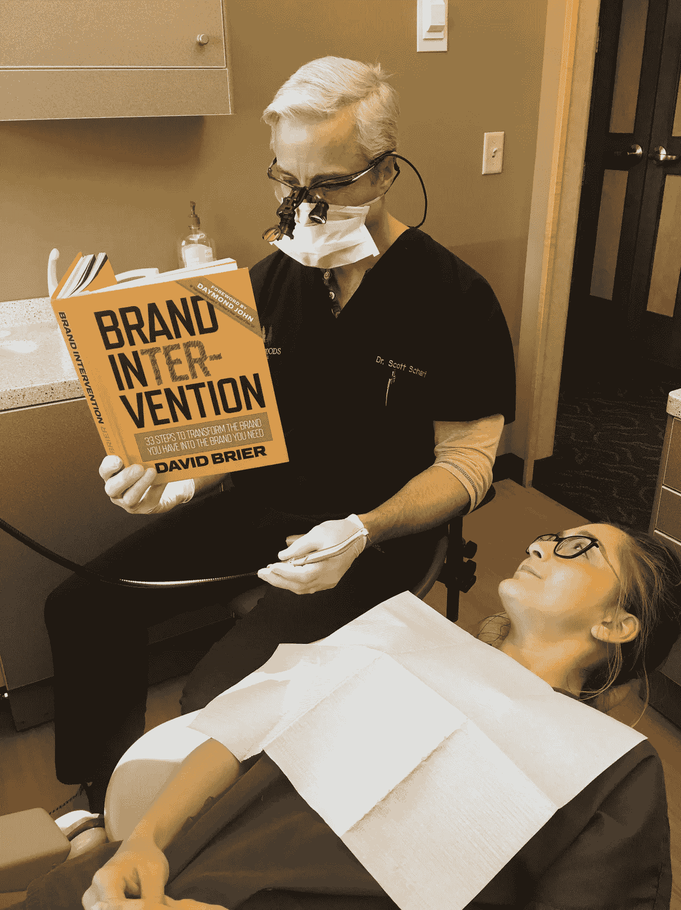

# 你的品牌可有可无吗？(以及如何应对)

> 原文：<https://medium.com/swlh/is-your-brand-dispensable-and-what-to-do-about-it-966e28129842>

> 你的品牌是否从来没有得到它应该得到的最受关注的关注，尤其是当顾客和客户准备购买的时候？

或者更糟的是，这只是作为最后的选择吗？

这部分归结于我所说的品牌三连胜*，由三个因素组成。*

*这些因素影响:*

*   *一个品牌(及其员工)看起来有多真实*
*   *品牌的原创性如何，以及*
*   *一个公司有多创新。*

*没有这些，你可以停止四处寻找“为什么你的品牌是可有可无的？”这个问题的答案*

# *那么，我们来确定一下，你的品牌是可有可无的吗？*

*归结起来有三个至关重要的因素。*

***真实性**简单来说就是“真实”和可及。*

***原创性**表现在公司及其品牌大使(主要是员工)的行动中，具体来说就是 ***主动行动*** 与事后应对灾难的行动。*

***创新**是你如何巧妙管理你已经拥有的*资源的问题(与史蒂夫·乔布斯或埃隆·马斯克的创新类型不同)。换句话说，创新是“凡人”日常使用(不仅仅是特殊突破)的日常事物。*(想知道“什么是创新？”* [*观看此视频。*](https://www.risingabovethenoise.com/what-is-innovation/) *)***

> **那么， ***你关注这些中的哪一个呢？*****
> 
> **或者在它们之间做出选择真的是正确的方法吗？**

**我在本周的*一分钟周三*回答这个。**

**想要更多这样的知识炸弹？**

**拿一本被称为“品牌圣经”的亚马逊畅销书说真的。[抢你的精装版](http://a.co/6F30LKx)拥有未来。**

**毕竟，正如你在下面看到的，所有类型的专业人士都放弃了他们正在做的事情来吸收这本书里才有的洞察力，零废话工具。**

********

## **从这篇文章中获得了价值？
然后鼓掌，分享，关注我，订阅我的 [YouTube 频道](https://www.youtube.com/user/headmusik)每周有新视频。需要一个品牌重塑或一个难忘的主题演讲人？在这里找到我。**

****

## **这篇文章发表在 [The Startup](https://medium.com/swlh) 上，这是 Medium 最大的创业刊物，拥有 358，974+人关注。**

## **在这里订阅接收[我们的头条新闻](http://growthsupply.com/the-startup-newsletter/)。**

****