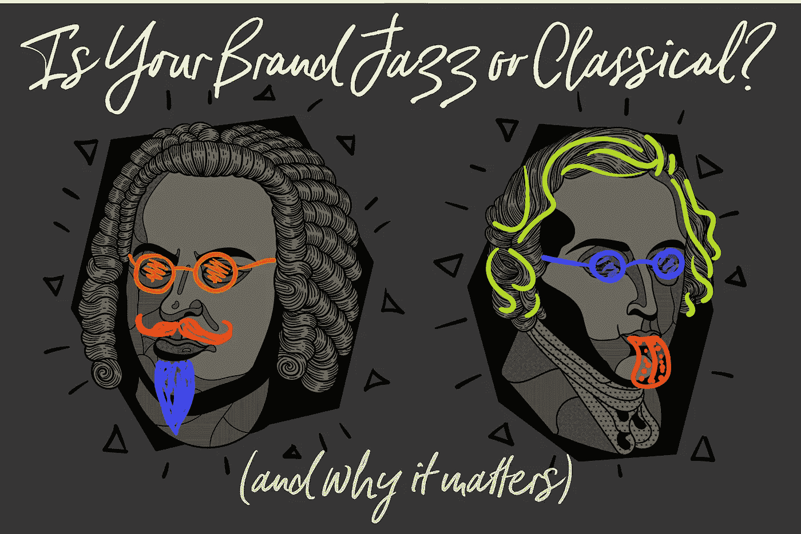

# 你的品牌是否发挥了你的优势？(60 秒后)

> 原文：<https://medium.com/swlh/is-your-brand-playing-to-your-strengths-in-60-seconds-db33c23569a1>

## 在这一集的《一分钟星期三》中，我将品牌和组织分为两类。一个灵活，另一个精确。在他们的区域，他们粉碎它。在优势之外，他们挣扎和失败。你可以在 60 秒内学会这些。

《一分钟星期三》第 13 集与取得真正可衡量的成绩、明智地发挥你的优势、最大限度地利用你的时间以及拥有一个超越噪音的品牌息息相关。

> 伟大的爵士乐传奇人物米勒·戴维斯说过:“不要弹那里有的，弹那里没有的。”

用“做”或“发展”来代替上面引述中的“玩”这个词，这就定义了我们在商界所知的*反叛者、颠覆者和创新者。*这是[文字的力量](http://www.risingabovethenoise.com/14-ways-geniuses-use-the-power-of-words/)在发挥作用。

这与古典音乐有很大的不同，在古典音乐中，你的角色是演奏那里的音乐:你不偏离主题，你完全按照写好的来演奏。甚至独奏曲都是一个音符一个音符地写出来的。不要误解我的意思:古典音乐*可以在天才的水平上完成，但它通常不包含爵士乐的自燃。*

> *了解这种差异与了解销售和品牌的区别一样重要。*

*对于公司和文化来说是如此，对于品牌来说也是如此。这就是几周前这个视频的灵感来源:*

# *不知道自己是谁不是一个选项*

*品牌在设计、声音和文化方面要么是爵士乐，要么是古典音乐。*

*爵士很灵活，接受错误，知道如何随机应变。*

*古典音乐在技术上非常精确，但却一丝不苟地遵循每个音符、速度的每一个变化、每一个细微差别。*

*爵士乐因变化、探索和发现而繁荣。古典音乐的标志是世界上最优秀的音乐家的完美技术。*

> *每种方法都以不同的方式完成任务。*

*将一个需要自发的、“跳出框框”思维的项目交给一个采用“经典”方法的团队将会死亡，或者充其量是挣扎。*

*将一个技术上精确和严格的项目交给一个在更宽松的参数下发展最好的团队(但对创造力的要求非常高)同样会受到挑战，并且很可能以某种方式失败。*

*只是把错误的技能组合放在了错误的环境中。*

*品牌也是如此。有些很棒:从技术上来说，你完全知道你会得到什么，没有变化。其他人需要有能力适应消费者在时间和种类上的变化(比如在餐馆)。 ***这个世界两者都需要。****

*因此，对于任何品牌来说，知道这一点就是更好地利用人们，发挥他们的优势，并最大限度地发挥可以利用的内在属性。*

# *发挥你的优势(让你的客户知道你的优势)*

*对我来说，当你拥有两个世界的精华时是最好的，这样你就可以在需要的时候即兴发挥，并且在需要的时候在技术上也很出色。*

*但是如果你的品牌有这样或那样的倾向，知道这一点是很重要的，这样你就可以把它和你的品牌、它的故事以及你的品牌文化联系起来，正如我在本周的*一分钟星期三:*中所报道的*

*要意识到，品牌在设计、声音和文化的整体方法上，要么更*爵士化*，要么更*古典化**

*孤立你是在发挥你的优势，这是一个品牌真正赢得顾客的可靠方法。*

**想要发挥你长处的所有工具？*然后点击这里获取您的*品牌干预* [副本。](http://a.co/8FqpNaj)*

# *如果你错过了前几集，这是你不能错过的品牌干预汇编*

*Subscribe to One Minute Wednesdays on [my YouTube Channel](https://www.youtube.com/playlist?list=PLpkEFqzZFOZ_aeEt44vIDEGWCO4mUW9Tp) now*

**原载于*[*www.risingabovethenoise.com*](http://www.risingabovethenoise.com/is-your-brand-playing-to-your-strengths/)*

**

## *这篇文章发表在 [The Startup](https://medium.com/swlh) 上，这是 Medium 最大的创业刊物，有 310，538+人关注。*

## *在这里订阅接收[我们的头条新闻](http://growthsupply.com/the-startup-newsletter/)。*

**