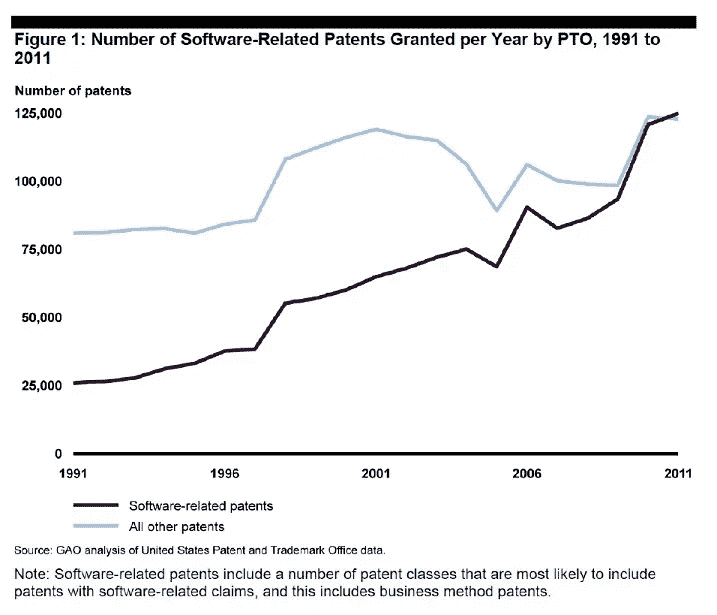
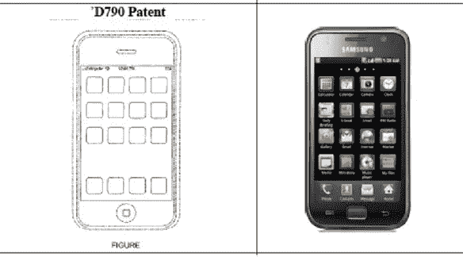
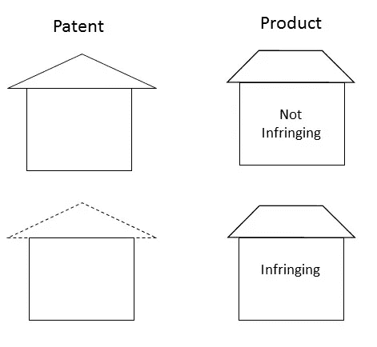
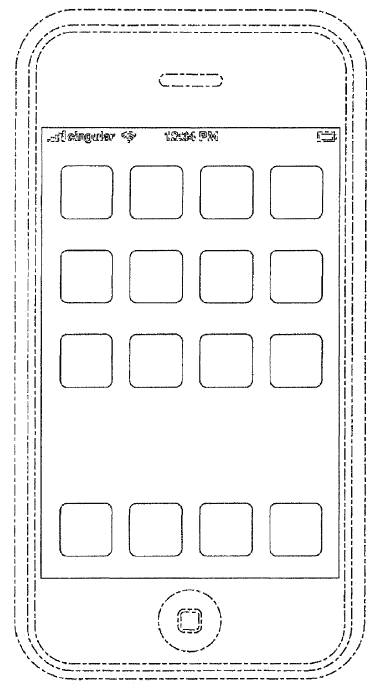
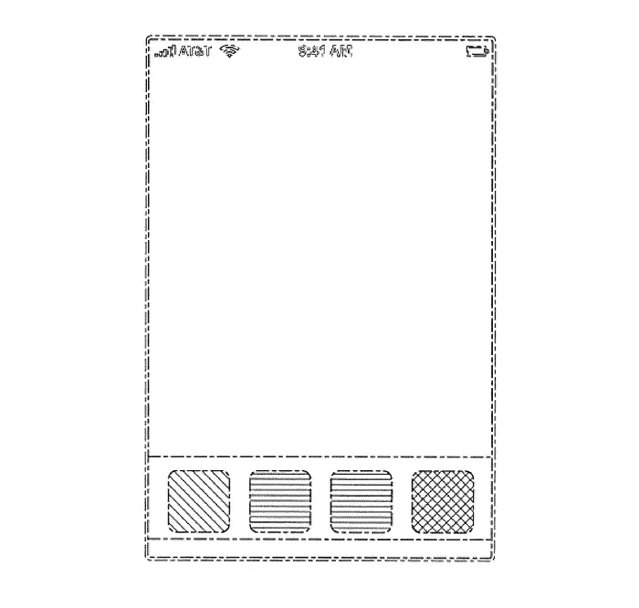
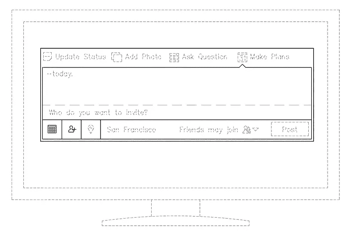
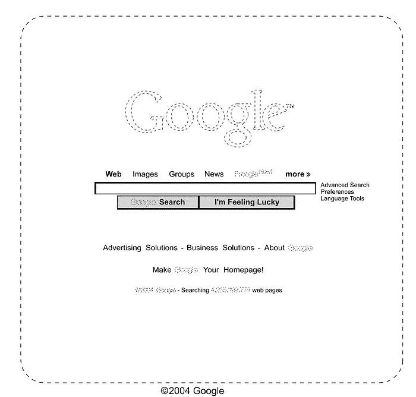
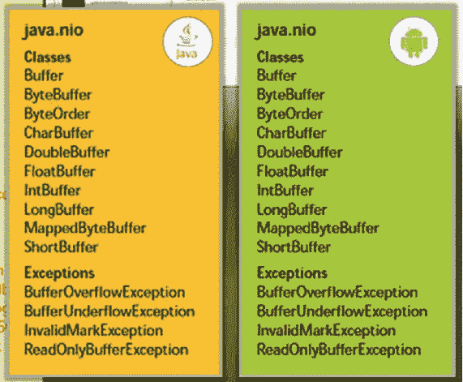

# 你的代码受到保护了吗？

> 原文：<https://medium.com/swlh/is-your-code-protected-70735e2e386>

# 各地的法院都发现软件专利无效，那么接下来呢？

在过去的几十年里，从初创公司到大型跨国公司的公司首先求助于实用专利来保护他们的创新软件。这些专利保护了一切，从微处理器操作的微小细节(*例如*、[英特尔的微处理器功耗专利](https://docs.google.com/viewer?url=patentimages.storage.googleapis.com/pdfs/US5537656.pdf))到搜索引擎的算法(*例如*)。[谷歌/斯坦福的页面排名专利](https://docs.google.com/viewer?url=patentimages.storage.googleapis.com/pdfs/US6285999.pdf))到创新的用户界面*例如*，[亚马逊的“一键点击”专利](http://www.google.com/patents/US5960411)。事实上，到 2011 年，软件专利占所有专利的一半以上。

See the August 2013 report from the Government Accountability Office on Intellectual Property [here](http://www.gao.gov/assets/660/657103.pdf).

最高法院 2014 年 6 月在 [*爱丽丝诉 CLS 银行*](http://www.supremecourt.gov/opinions/13pdf/13-298_7lh8.pdf) 一案中的裁决对这些发布的计算机软件实用专利提出了质疑。在*爱丽丝*案中，最高法院发现一项保护高频交易软件的专利无效，因为它是针对不符合专利条件的主题。

那么显而易见的问题是，是什么使一个主题或概念专利不合格。不幸的是，法院很少或根本没有就如何确定专利不合格提供指导。法院称，“不符合专利条件的概念”是“一个抽象的概念”所以自然的下一个问题一定是:什么是抽象概念？最高法院将“抽象观念”定义为“一种自身的观念”，或者是“一种基本真理”。

随着已发布的专利在 *Alice* 案中受到质疑，法院使用这一定义认为它们指向一个“抽象概念”,因此专利不合格。但法院没有解释专利权利主张是如何在高频交易软件领域“被引入中介结算的抽象概念”的。法院没有指出专利声称保护的是什么基本真理，因此它们是不合格的。

实际上，法院对爱丽丝的判决可以归结为一个“当你看到它时你就知道”的测试。在最高法院的裁决之后，地区法院以类似的方式应用了这一测试，对已颁发的软件专利产生了毁灭性的影响。以下已发布的专利最近被发现无效，因为它们针对的是不符合专利要求的主题:

*   [“交互式点播媒体和节目指南”专利](https://docs.justia.com/cases/federal/district-courts/california/candce/4:2011cv06591/251721/171)(美国专利号 [6，898，762](https://docs.google.com/viewer?url=patentimages.storage.googleapis.com/pdfs/US6898762.pdf)；[7065709](https://docs.google.com/viewer?url=patentimages.storage.googleapis.com/pdfs/US7065709.pdf)；[7103906](https://docs.google.com/viewer?url=patentimages.storage.googleapis.com/pdfs/US7103906.pdf)；[7945929](https://docs.google.com/viewer?url=patentimages.storage.googleapis.com/pdfs/US7945929.pdf)；和 [7，974，962](https://docs.google.com/viewer?url=patentimages.storage.googleapis.com/pdfs/US7974962.pdf) ):这些专利涉及搜索、查找、标记和查看用户可用的媒体和节目，其中用户与节目交互以识别要观看和保存的媒体和节目。
*   [“商业智能”专利](https://docs.justia.com/cases/federal/district-courts/virginia/vaedce/3:2015cv00021/312033/24)(美国专利号[6859798](https://docs.google.com/viewer?url=patentimages.storage.googleapis.com/pdfs/US6859798.pdf)；[7260577](https://docs.google.com/viewer?url=patentimages.storage.googleapis.com/pdfs/US7260577.pdf)；和 [7，228，303](https://docs.google.com/viewer?url=patentimages.storage.googleapis.com/pdfs/US7228303.pdf) ):这些专利涵盖了涉及报告创建的商业智能服务器系统、提供具有减少的客户端处理的商业智能 web 内容的方法和系统，以及用于远程操纵分析报告的系统和方法。
*   [“紧急呼叫分析”专利](https://docs.justia.com/cases/federal/district-courts/california/caedce/2:2014cv01927/271524/43)(美国专利号 [8，447，263](https://docs.google.com/viewer?url=patentimages.storage.googleapis.com/pdfs/US8447263.pdf) ):该专利涵盖了一个仪表板系统，该系统接收紧急呼叫信息，如 911 呼叫，对收到的呼叫进行统计分析，并以可定制的可视方式显示分析结果，按地理位置、呼叫类型等进行组织。
*   [“飞行喷射运动跟踪”专利](http://law.justia.com/cases/federal/district-courts/federal-claims/cofce/1:2014cv00513/29723/61/)(美国专利号 [6，474，159](https://docs.google.com/viewer?url=patentimages.storage.googleapis.com/pdfs/US6474159.pdf) ):该专利描述并要求保护使用惯性跟踪器来跟踪相对于移动平台而不是相对于地球的运动的系统。所公开的这种方法允许在移动平台上实现基于惯性的运动跟踪的好处，而头部跟踪精度不会受到平台的不可预测运动的干扰。
*   [云计算/分布式处理专利](https://www.docketnavigator.com/document/order/d7c03eaf-9382-9ceb-be51-ade08d25f1fc)(美国专利号 [8，200，746](https://docs.google.com/viewer?url=patentimages.storage.googleapis.com/pdfs/US8200746.pdf) 和 [8，341，209](https://docs.google.com/viewer?url=patentimages.storage.googleapis.com/pdfs/US8341209.pdf) ):这些专利公开了使用多个参与者的网络来有效和可靠地处理信息和/或通过将工作分解成小块来完成任务的系统和方法，每个小块由在内部层级中组织的不同参与者来处理。

> 随着 Alice 的实施及其影响，软件技术公司不能再仅仅依靠实用专利来保护。

公司不应该放弃目前的实用专利申请策略，因为不清楚法律会以多快的速度改变，软件和商业方法的实用专利可能会重新获得优势。但是一个全面的战略方法应该包括在版权和商业秘密保护的同时使用设计专利。

额外的知识产权保护将使公司的竞争对手更难直接复制传统上在针对软件或商业方法的已发布专利或已发布申请中描述的大量研发工作。

# ***那么一家科技公司能做些什么来保护自己的软件呢？***

大多数公司以前并不严重依赖这些其他保护，因为与实用专利保护相比，它们的覆盖范围更有限。然而，实用专利资格要求的转变要求公司现在考虑对软件技术的其他保护，如设计专利、版权和商业秘密。

1.  **外观设计专利:**外观设计专利不同于我们通常所说的专利。专利通常指的是“[实用专利](https://www.law.cornell.edu/uscode/text/35/101)”，软件公司不能再依靠它来获得保护，如上所述。[外观设计专利](https://www.law.cornell.edu/uscode/text/35/171)是指授予功能项目的外观设计的法律保护。外观设计专利不需要满足上述专利要求。
2.  **版权:** [版权](https://www.law.cornell.edu/uscode/text/17/106)是授予原创作品的创作者在有限时间内对其使用和发行的专有权。与专利不同，这些专有权不是绝对的。例如，[合理使用原则](https://www.law.cornell.edu/uscode/text/17/107)是版权法中的一个例外，它允许出于有限的“转化”目的使用受版权保护的材料，例如评论、批评和/或模仿受版权保护的作品。
3.  **商业秘密:**商业秘密保护可以针对配方、实践、工艺、设计、工具、图案、商业方法或信息汇编而寻求。[商业秘密](https://www.law.cornell.edu/uscode/text/18/1839)是指(1)信息；(2)为保护信息而采取的合理措施；(3)因不为公众所知而获得独立经济价值。商业秘密法因州而异，但三个定义特征通常是一致的。

# 那么，如何将这些知识产权保护应用到软件领域呢？

为了将这些不同的法律保护应用到软件中，将软件栈分解成层是有帮助的:(1)用户界面和体验；(2)应用编程接口(API)和动作层；(3)数据建模和业务逻辑；以及(4)服务器/网络/主机环境。

第一层，用户界面和体验，是大多数消费者都会遇到的前端。一部分是品牌，一部分是外观和感觉，一部分是功能。这一层可以受到外观设计专利的保护。

下一层是 API 或动作层，允许外部世界与正在创建的复杂软件进行通信。API 是一种快捷方式，允许程序员使用预先编写的代码和库将功能构建到他们的程序中，而无需从头开始编写所有代码。允许软件开发者访问某些 API 已经变得很平常了。这一层可以受版权保护。

最后两层是任何软件的核心——这些层包括最需要关注的复杂的大创意，如算法和数据模型。这些层可以作为商业秘密受到保护。

# 设计专利可以保护用户界面层

设计专利对科技公司来说是越来越重要的知识产权保护。外观设计专利不具备与实用专利相同的资格要求，它们不保护功能，但可以保护用户界面和体验。外观设计专利只授予新颖的、不明显的外观设计。为了有资格获得这种保护，外观设计方面必须具有功能，但设计不能受功能支配。

一家著名的公司已经积累了涵盖其用户界面和硬件设计的设计专利。事实上，该公司在对其最大竞争对手的诉讼中取得的成功在很大程度上可以归功于其设计专利。你能猜出这是什么公司吗？(提示:是一种红色的水果，让医生远离。)

苹果最近在对三星的诉讼中使用了两项设计专利作为弹药。在*苹果诉三星*专利纠纷中，苹果指控三星侵犯了多项专利，包括一项保护苹果 iOS 用户界面在 iPhone 上外观的设计专利(美国专利号 [D627，790](https://docs.google.com/viewer?url=patentimages.storage.googleapis.com/pdfs/USD627790.pdf) 或“D790 专利”)。

以下是受保护的设计和涉嫌侵权的三星设备的照片:

A comparison from the lawsuit between the ‘D790 patent and the infringing Samsung device.

要确定是否侵犯了外观设计专利，只需对比实线即可。虚线不算。这里有一个例子:

An example of determining design patent infringement

这意味着外观设计专利中的实线越少，或者反过来说，外观设计专利中的虚线越多，专利越强。

下面是苹果外观设计专利图片的特写:

Figure in the ‘D790 Patent

基于设计专利原则，苹果选择保护其圆形用户界面图标和布局的外观和布局，但不保护其设计中的任何其他功能。苹果在追求用户界面设计专利方面尤其积极，其他科技巨头也是如此。

以下是用户界面专利的其他例子:

Figure in U.S. Patent No. [D668666](https://docs.google.com/viewer?url=patentimages.storage.googleapis.com/pdfs/USD668666.pdf) assigned to Apple

苹果的设计专利(左)保护了底部一排四个图标的用户界面。除了底部行上的图标数量之外，其他所有内容(包括底部行中图标的形状)都以虚线绘制。

Figure 1 in U.S. Patent No. [D691622](https://docs.google.com/viewer?url=patentimages.storage.googleapis.com/pdfs/USD691622.pdf) assigned to Facebook

脸书的“状态更新”用户界面设计专利(左)使用虚线表示计算机显示器、所有文本以及某些图标和按钮。只有实线显示了脸书状态更新界面的受保护部分。

Figure in U.S. Patent No. [D599372](https://docs.google.com/viewer?url=patentimages.storage.googleapis.com/pdfs/USD599372.pdf) assigned to Google

谷歌的登陆页面设计专利保护了其简洁的外观。如果有人使用该布局，但替换了“谷歌”，专利将被侵犯。请注意，图的底部标有一个圆圈-c。这表明谷歌也要求对这种布局的版权保护。

> 软件应用的成功取决于用户的设计和体验，因此使用设计专利保护公司的设计选择非常重要。

此外，随着专利法的变化，特别是软件不再受实用专利保护，公司保护其新颖的面向用户的设计变得至关重要。

# 版权可以保护 API 和动作层

软件公司可以得到的另一种保护是版权。最近，由于甲骨文诉谷歌的纠纷，API 可以受到版权法的保护。该案中的版权侵权指控围绕着一组广为人知的 API——Java API。

Sun Microsystems 最初于 1991 年开发了 Java，这是一种编程语言、一个虚拟机和一组与该语言一起使用的库。当谷歌在 2007 年发布 Android 操作系统时，它提到将使用一些 Java 技术。事实上，谷歌和 Sun 就可能的合作关系进行了谈判，但没有达成任何协议。2010 年初，甲骨文收购 Sun，继续开发 Java。甲骨文和谷歌也讨论了可能的许可协议，但从未达成协议。

当年晚些时候，甲骨文起诉谷歌侵犯了某些 Java APIs 的结构、序列和组织以及 Android 中使用的 API 文档的版权。下面是一个 Java API 的试用示例，显示了结构和类名是相同的:

From slides presented at trial the API structure of Java and Android, additional discussion available [here.](http://www.cnet.com/news/android-java-and-the-tech-behind-oracle-v-google-faq/)

谷歌没有否认抄袭，而是认为应该允许它抄袭如此少量的代码。在出示证据后，2012 年，陪审团发现该 API 违反了版权法，并驳回了谷歌对复制和合理使用的辩护。

然而，法官驳回了陪审团的裁决，裁定 API 在法律上不符合版权保护的条件，是不值得版权保护的功能性“操作方法”。甲骨文对该裁决提出上诉，去年,[联邦巡回法院推翻了](https://www.eff.org/files/2014/11/10/oracle_v_google_13-1021.opinion.5-7-2014.1.pdf),并发现命名和组织 API 的特殊方式是受版权保护的。今年 6 月，[最高法院选择不重审联邦巡回法院的裁决](http://www.scotusblog.com/case-files/cases/google-inc-v-oracle-america-inc/)。

> 要点是版权法可以保护 API 的结构、序列和组织。

为了保护 API，API 和 API 文档都必须公开披露，并在[版权局](http://copyright.gov/eco/)注册。注意，这将只保护公开的 API，而不是使用 API 的特定实现或源代码。

为了决定使用版权法保护什么，公司应该考虑到版权法要求公开披露。考虑到这一要求，公司可能会选择对易于逆向工程的 API 或出于互操作性原因将公开披露的 API 寻求版权保护。

版权保护的另一个考虑是合理使用原则是否适用于 API。合理使用原则是一种法律原则，通过允许在某些情况下未经许可使用受版权保护的作品来促进言论自由。

在甲骨文诉谷歌一案中，联邦巡回法院将案件发回地区法院，在那里将决定谷歌对 Java APIs 的使用是否属于合理使用。在最高法院决定不复审此案之前，美国司法部长在法庭之友简报中承认谷歌有权进行合理使用辩护:

*”。。。[I]这是合理使用原则的功能。。。确定未经授权使用受版权保护的材料将促进而不是损害版权法的目的的情况。”*

使用版权来保护源代码。API 的实现)不受欢迎。如上所述，版权保护要求公开披露材料。与 API 不同，源代码实现更加复杂，并且包含公司可能希望保密的信息。根据经验，版权不是保护所有 API 实现或源代码文件本身的合适工具。

# 商业秘密法可以保护剩下的几层

最后一种类型的保护，商业秘密，可以被称为是你想要保护的“包罗万象”的东西。为什么是商业秘密？因为知识产权是保密的。这种保护与软件的最后两层特别相关:数据建模和业务逻辑，以及服务器/网络/托管环境，因为它代表了贵公司开发的有效提供服务的模型和算法——无论是向用户提供输出的数据建模，还是允许贵公司扩展的内部算法。

拥有强大的商业秘密政策的技术公司实际上可能比那些拥有一系列实用专利但几乎没有商业秘密的技术公司受到更好的保护。实用专利在一定时间后过期，一旦过期，专利中的一切都是免费的；商业秘密永远存在。

例如，可口可乐的配方已经有近一个世纪的历史了(可能是世界上最著名的商业秘密)。如果可口可乐决定为其配方申请专利，该专利早在几十年前就已经过期，该公司也不会成为今天的巨头。科技公司也不例外。谷歌(或 Alphabet)的寿命，在某种程度上，将由它对其不断发展的搜索算法的保密程度来衡量。

与专利不同，商业秘密立即生效，不需要与获得专利相关的前期费用。例如，申请专利需要律师或专利代理人起草一份详细的专利，以便专家能够理解发明是如何制造的，以及应该如何使用。

虽然商业秘密的要求较少，但要使商业秘密继续受到保护，就必须满足这些要求。要成为商业秘密，受保护的信息必须具有经济价值，并且必须保密。如果信息被公开披露，商业秘密保护将永远失去。因此，保持信息的机密性需要采取持续的措施。

一些公司，如可口可乐，采用极端的持续措施来保护商业秘密配方。我们知道，可口可乐至少做了以下事情:(1)将配方锁在总部的金库里，(从存放配方 86 年的银行金库里搬出来)；(2)只有两个可口可乐的高级管理人员同时知道这个配方；以及(3)这两位高管的身份从来没有向公众透露过，也不能同时乘坐同一架飞机。

这些非常规的商业秘密保护措施很少是必要的。然而，非常重要的是，对受保护信息的访问仅限于有限数量的人，并且这些人签署保密协议，或通常称为 NDA。这种保护措施允许人们确定[采取了合理的预防措施](https://www.law.cornell.edu/wex/trade_secret)来防止机密信息的泄露。

> 法院反复重申，使用保密协议是维护机密信息的最重要的方法。

除了保密协议，公司还应该有其他合理的预防措施来保护商业秘密信息。商业秘密受州法律管辖，州法律在保密要求方面可能有所不同，但某些预防措施是通用的，如划分信息、应用物理(锁和钥匙)、应用计算机安全以及针对信息泄露者的执法行动。

公司可以采用简单的方法来建立和加强对其软件的商业秘密保护:

1.  **对你的源代码库使用访问控制。**大多数软件开发人员(如果不是全部的话)只需要访问公司源代码的特定部分。仅允许开发人员访问源代码的有限部分，可以显著降低无意中泄露或单个恶意员工泄露的风险。竞争对手不能再雇佣一个能接触一切的人。
2.  **创建并维护强有力的文档保留政策。这适用于所有文档——从电子邮件、错误报告到源代码档案。该政策应限制文档在员工笔记本电脑和移动设备上保持“活动”的时间。公开的商业秘密越少，就越秘密。**
3.  创建并要求员工签署知识产权政策。任何科技公司都应该制定知识产权(IP)政策，其中包括对其商业秘密和保密措施的讨论。公司应该让所有能接触到商业机密的员工都在上面签名。然而，根据经验，公司让所有员工签署这样的政策通常更容易。该政策可以包括让员工知道公司将跟踪他们对公司服务器的使用，并收集证据以确认员工没有泄露任何与商业秘密和知识产权相关的信息。
4.  **重申知识产权政策的离职面谈。**科技公司的员工流动率可能很高，因此离职面谈通常是公司保护员工可能试图带走的信息的一种工具。确保离职面谈要求离职员工确认她没有违反知识产权政策。这可以作为正确程序的有用提示。
5.  **反竞争条款在某些州可能会有所帮助。**反竞争条款不能在所有州使用。例如，[竞业禁止条款在加利福尼亚州是不可执行的](https://scholar.google.com/scholar_case?case=3664324957067638309&hl=en&as_sdt=6&as_vis=1&oi=scholarr) —想离开去为竞争对手工作的员工可以这样做，即使她已经签署了包含竞业禁止条款的雇佣协议。在这样的州，上面讨论的四种保护商业秘密的方法尤其必要。在其他州，如马萨诸塞州，公司可以添加反竞争条款，以帮助保护它希望作为商业秘密保护的信息。

尽管商业秘密法是一种“包罗万象”的保护，但它并不完美。

在过去的几年里，一个软件开发人员为高盛公司开发高频交易系统的传奇故事让人们对商业秘密法中的失败和漏洞有了一些了解。

高频交易系统使用联网的计算机来执行复杂的算法，以高速率处理订单。高盛的系统是严格保密的商业秘密，开发者是在严格的保密义务下受雇的。此外，在软件开发团队的 25 名程序员中，开发人员的薪酬最高，为 40 万美元。

2009 年 4 月底或 5 月初，这位开发人员辞职，接受了芝加哥另一家高频交易公司 Teza Technologies LLC 的计算机程序员职位，年薪 120 万美元。

该开发商两次因刑事指控被捕，两次被判有罪(第一次是盗窃商业秘密和运输被盗财产，第二次是非法使用秘密科学材料)，但每次定罪都在上诉阶段被推翻。一家上诉法院在其判决中指出:

> “数字时代的要求无疑将要求我们进一步完善刑法。但适用现有法律是法院的工作。”

*纽约州诉 Aleynikov* ，04447–2012，纽约州最高法院，纽约县(曼哈顿)(2015 年 7 月 6 日)(推翻纽约州法院定罪，驳回起诉书)。关于此案及其他商业秘密案件的更多详情[在此](http://www.law360.com/articles/678723/reflections-on-the-goldman-ip-theft-saga)和[在此](http://www.bloomberg.com/news/articles/2015-05-01/-flash-boys-programmer-convicted-in-goldman-code-theft-trial)。

鉴于商业秘密法并不总能解决不断发展的技术，从长远来看，软件的实用专利可能会更好，特别是如果专利格局确实发生变化的话。目前，同时寻求所有这些保护，包括实用专利，可能是科技公司的最佳选择。

[*Mansi H. Shah*](https://about.me/mansishah) *是一名具有计算机科学背景的知识产权诉讼律师，是北加州*[*Valorem Law Group*](http://www.valoremlaw.com/)*的合伙人。她是* [*萨巴北美*](http://www.sabanorthamerica.com/)的前任总裁。在推特上关注她[*@ mansiesq*](https://twitter.com/mansiesq)*。*

*此处的任何内容都不应被视为法律建议或建立律师-客户关系。*

*编辑*[*Wendy McGuire Coats*](http://www.mcguirecoats.com/attorney-profiles/wendy-mcguire-coats)*。*

*发表于* **《创业、旅游癖和人生黑客》**

-