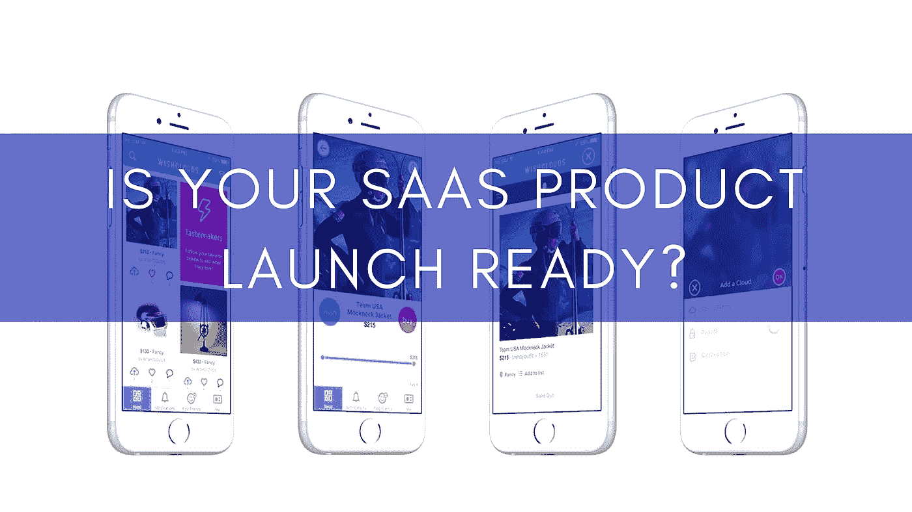

# 你的 SaaS 产品发布会准备好了吗？

> 原文：<https://medium.com/swlh/is-your-saas-product-launch-ready-f79094c2bb02>

我们了解开发一个产品所花费的精力和时间，但是你了解让人们足够关心你的产品并购买它所花费的精力和时间吗？这是一个漫长的跋涉，许多有抱负的企业家没有充分考虑或理解。事实上，你可能有一个奇妙的、真正独特的产品，当你发布它时，你可能除了蟋蟀什么也得不到。你预想的成长是不存在的，现在你在怀疑自己，想知道自己做错了什么。

对于一家[初创公司](https://www.datadab.com)的创始团队来说，发布日感觉就像是末日。然而，实际上，这是一个开始。发布会是你真正开始工作的时候，这是你需要正确的销售策略的时候。你有吗？但是销售有个特点，它总是让我们有点紧张。我们是创造者和建设者。大多数创始人也是如此。我们从事商业是因为我们喜欢制造伟大的产品，而不是销售它们。但是，如果我告诉你，你不应该卖任何东西才能成功呢？如果你唯一的策略是让你的客户尽可能成功，会怎么样？你的产品到了吗？

> *推出一款产品到底意味着什么？*

从技术上来说，如果你的产品正在做你想让它做的事情，你就可以发布了。如果你是精益的，你的产品只反映验证你的概念所必需的东西。这个管用。但是你在这里真正要寻找的是你产品的发布，让人们使用你的产品，并从热情的早期采用者那里收集大量的反馈。

现在，如果你正在推出一个 B2B SaaS 产品呢？你正在寻找一些宣传和一群新客户吗？很有可能，没有多少人会注意到你的发布，也不会带来新的业务。如果是这样，不要吃惊。从中吸取教训。第二个最有可能的结果是吸引一些早期用户试用你的产品，却发现它并没有像你想象的那样解决他们的问题。

但是我们需要发射来找出这一切...对吗？不一定。当你发布产品时，你必须清楚谁是你的潜在客户，你的产品能为他们解决什么问题。否则，你就蒙着眼睛走进竞技场。

> 你的产品准备好上市了吗？

他们说，如果你不为发布产品而感到尴尬，那你已经等得太久了。这是千真万确的，因为我们总能在产品中找到可以永远调整的地方，因为总有一些改进的空间。然而，在你发布之前，你必须做好你的功课，弄清楚什么对你的早期目标用户是至关重要的。当你还在验证你的概念时，你不需要很多用户。你所需要的就是一把来验证你的概念。在你确定你的产品对某个目标群体有效之前，不要投放市场，也不要忘记确定他们是否愿意为你的产品付费。

把你的 MVP 想象成一个普通的披萨。它不需要所有的配料，但你需要有一个坚实的基础和一些奶酪来展示。即使是一块普通的披萨，也不允许在任何可能对用户体验你的产品产生重大负面影响的事情上留有捷径。您可能已经准备好了所有的功能，但是如果您的用户不知道如何或者不理解为什么他们应该使用这些功能，那么您就失败了。用 SaaS 的话来说，你不仅应该在技术上努力，还应该在集成、简单设置、文档、可用性、在线指南和一大堆事情上努力。

不要走捷径，比如用虚拟模型替代功能，甚至在幕后做大量的手工工作。如果你的目标是提供好的甚至伟大的用户体验，这可能会带来积极的评价和许多注册，并最终带来满意的客户。一天下来，调整心态。仅仅展示你的产品是不够的。不管你有多喜欢你的产品，它都不是关于你的。而是关于你的用户。

> *你需要的是展示价值的能力。*

归根结底，从用户[开始免费试用](https://www.zibtek.com/blog/how-long-should-your-saas-software-trial-period-be/)的那一刻起，它就为用户提供了真正的价值。注册时，你的用户希望你的产品能解决他们当前面临的某个问题。你的 [MVP 的](https://www.zibtek.com/blog/what-makes-a-good-mvp/)目的应该是为特定的问题找到最简单的解决方案，这可以证明价值。这并不意味着你建立了最简单的工作，而是解决了一些真正的痛点，你的目标客户愿意使用。

你可能还没到那一步。至少，没有达到你想要的水平。这就是为什么我们大多数人还没有正式推出我们的产品，并且在过去的几个月里处于测试状态。但重要的是要忙于完成清单，并最终让产品面向更广泛的受众。

> 时机至关重要。

我相信你已经被预先警告过了，但是强调这一点并没有坏处。当你过早推出时，你的产品可能不够精致，无法脱颖而出。提醒你自己，你的 MVP 不应该是你的产品的最简单版本，而是你的牛逼产品的最简单版本。MVP 应该还是很牛逼的。

另一方面，当你等得太久，市场可能已经被淹没，被竞争对手抢走了。或者更糟的是，你可能在看不到付费客户的情况下耗尽现金。

所以找到平衡是关键。走捷径是不可避免的。只要确保你仔细选择了要走的捷径。当谈到客户体验时，轻微的不便和纯粹的沮丧之间只有一线之隔。

# 结论:

我们看到如此多的初创公司如此害怕出售，以至于他们在招揽第一个客户之前等待了太长时间。他们把所有的时间都花在设计他们的标志或网站上，而没有足够的时间去寻找潜在客户。

不要误解我。我们理解在职业上展现自我的重要性。在这种程度上，标志和网站是伟大的。然而，当你开始时，你的首要任务必须是争取客户。别再拖延和计划了。开始销售。

***原载于***[***cognitive clouds***](https://www.cognitiveclouds.com/insights/is-your-saas-product-launch-ready/)***:一顶*** [***SaaS 发展公司***](https://www.cognitiveclouds.com/custom-software-development-services/saas-application-development-company)

## 这篇文章发表在 [The Startup](https://medium.com/swlh) 上，这是媒体最大的创业刊物，拥有 292，582+人关注。

## 在这里订阅接收[我们的头条新闻](http://growthsupply.com/the-startup-newsletter/)。

