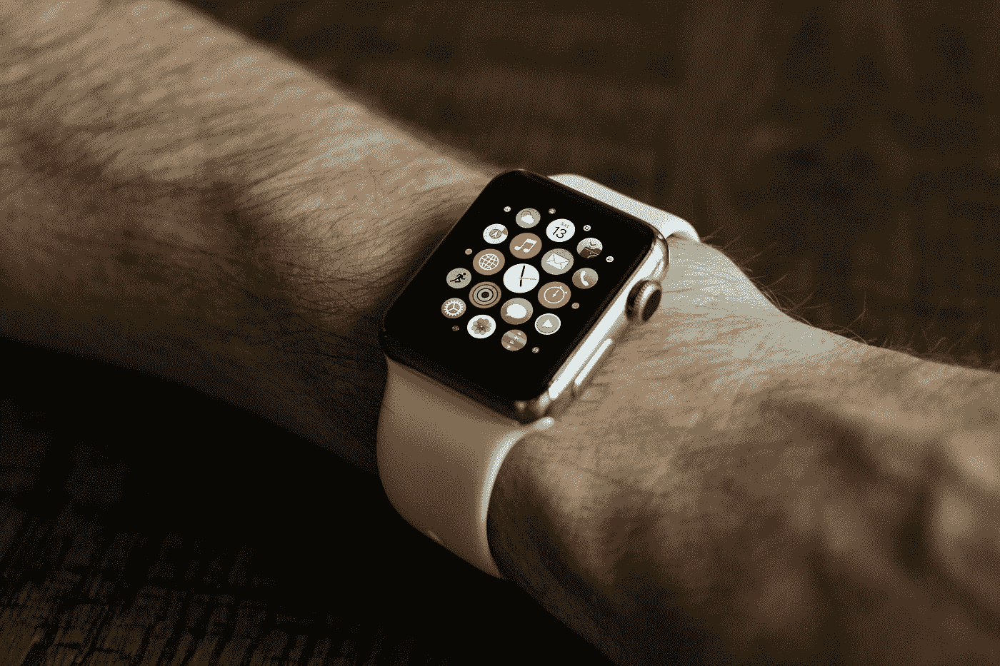
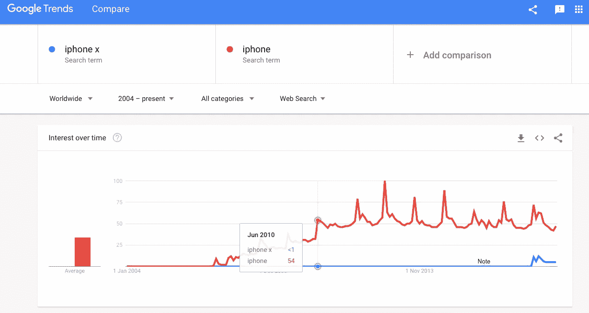

# 你的创业是需要还是贪婪？

> 原文：<https://medium.com/swlh/is-your-startup-a-need-or-a-greed-b5f28982fbb1>

## 你是 iPod 还是 Apple Watch？

在我的童年和少年时代，我见证了父亲的创业历程。他有一些绝妙的想法，这些想法发展成了三家不同的创业公司。

我和我的兄弟姐妹们学到的关于创业的早期课程之一就是**总是寻找需求**。能改善人们生活的东西。通常是还不存在的东西。就像一台自动洗衣机，只要有一堆衣服就能洗，还能帮你按颜色分类。这只是我想到的一件事。

尽管已经有解决该问题的产品，但有时仍有需求。比如 [Citymapper](https://medium.com/u/728642adfce1?source=post_page-----b5f28982fbb1--------------------------------) 。这是一个交通应用程序，可以帮助你在城市中轻松导航。它成立于谷歌地图推出六年后。创始人 Azmat Yusuf 是一名前谷歌员工，他意识到尽管有谷歌地图，但对这种服务的需求仍然存在。这正是 Waze 为司机所做的。它变得如此受欢迎，最终谷歌在 2013 年收购了 Waze。

从那以后，我父亲给我的建议一直萦绕在我的心头。无论我走到哪里，我都倾向于发现需求并集思广益寻找可能的解决方案。与此同时，我不禁注意到，一些大大小小的初创公司在创业中采取了不同的方式。

# 以苹果公司为例

> "创新区分了领导者和追随者."~史蒂夫·乔布斯

一家由企业家创立的公司，他们将自己的激情与市场需求结合起来。他们创造了一些最好的电脑。他们没有停下来。2001 年，他们发布了第一款 iPod。一个改变了我们消费音乐方式的设备。当然，之前也有一些其他的 MP3 播放器和老的随身听(RIP 1979-2010)。但是苹果找到了解决这一需求的方法，并创造了一种产品，这种产品迅速成为历史上最受欢迎的音乐播放器。
后来，新一代 iPod 增加了观看视频的功能。它最终形成了第一代 iPhone，于 2007 年 6 月发布，正好是 11 年前。

近年来，苹果采取了不同的方式。他们不断发布新产品，但没有多少创新。例如，iPhones 是他们最大的收入来源，所以他们每年都会发布新的升级产品。虽然它确实满足了需求，但新款 iPhones 只有两个主要区别:设计和成本。作为世界上最受欢迎的品牌，苹果进入了舒适区。他们不再有创造力。事实上，自从 iPhone 和 iPad 发布以来(分别是 2007 年和 2010 年)，苹果只发布了两款新产品:Apple Watch(2015 年)和 HomePod (2018 年)。然而，这些项目并不具有开创性。这让我想到:
**这是一种需要还是一种贪婪？**

# 需求还是贪婪？

pple Watch 并不那么受欢迎，HomePod 比亚马逊的 Echo 晚了近三年才发布。**太少，太迟？iPhone 在市场上的主导地位似乎对苹果的创新技能产生了负面影响。就连 iPhone X 也不过是另一部 iPhone(不过要贵得多)。
10 年前才烧遍这家公司的创业之火，似乎已经褪去。
我最近看了苹果 WWDC 的集锦。他们一直在谈论 animoji 的“舌头检测”等功能。真的吗？**

像苹果这样的大公司拥有巨大的权力。在许多方面，它们塑造了我们的思维和行为方式。不幸的是，这些公司经常制造需求，而不是解决需求。他们为一种时髦但不需要的新产品做广告来创收。但是，如果不能真正改善我们的生活，即使是最时尚的产品也不会持续很久。不相信我？看看这个:

iPhone 的时尚度(红线)持续增长了近四年，直到 2010 年 7 月 iPhone 4 发布。从那以后，每部新 iPhone 的促销活动都会有一个峰值。蓝线代表 iPhone X 的时髦度，在发布后大幅下降。

# 需要是不够的

> “很难判断这些互联网初创公司是真的对创建公司感兴趣，还是仅仅对钱感兴趣。不过，我可以告诉你:如果他们不是真的想建立一家公司，他们不会侥幸成功。那是因为太难了，如果你没有激情，你就会放弃。”~史蒂夫·乔布斯

不幸的是，有许多公司试图强加一种需求。后乔布斯时代的苹果只是一个例子。
许多公司创造和销售的产品都是基于贪婪，而不是实际需求。
事实是，许多所谓的企业家也在追求快速致富。他们眼中有金钱的符号，而不是心中的激情。
如果你的人生目标是成为‘30 岁以下的百万富翁’，那么请节省我们的时间和金钱，不要卖给我们无用的产品。

**企业家是创新者。他们寻找需要，而不是出于纯粹的贪婪。但仅此还不够。因为如果我对技术没有热情，我不可能创造出第一代 iPhone。
没错。即使有真正的市场需求，如果你对它没有热情，你也无法创造出有价值的产品(或服务)。**
以在线音乐平台 Soundcloud 为例。创始人 Alexander Ljung 和 Eric Wahlforss 都是音乐家。
或者是另一位音乐家杰克·康特，他想找到一种方法来资助他的音乐，并成立了 Patreon。

那些带着对金钱的渴望创造产品的人，就像是因为想出名而写歌的音乐家。就像一个小女孩说她想成为名人。或者一个想发财的男孩。

这个世界不需要那些想成为企业家的人，他们把“企业家”这个词当作“富有”的同义词。我们需要被有创造力的人包围，他们不仅能看到需求，还能关心需求。想要改善自己和他人生活的人。
像 Soundcloud 的创始人一样。或者帕特里翁。或者史蒂夫·乔布斯。

# 一个没有冰箱发明的世界

我想象如果人们继续卖冰和烘干食物，而不是找到更好的保存食物的方法，会发生什么。想象一下你的生活，就像今天一样，没有在线搜索和所有你可以在一秒钟内访问的数据。

制造更多的汽车模型不会帮助我们节省路上的时间。Waze 之类的应用会。自动驾驶汽车会。拼车解决方案会。飞行汽车会。我们需要更多像 iPhone 一样的创新，但不要更多雷同。

## 我们将永远拥有的一个也是最重要的需求是对充满激情、富有创新精神的人的需求。

> 如果你觉得那是你想做的，就一起鼓掌👏

# 感谢阅读！欢迎[关注我](/@saaroron):

 [## 萨尔·oron⁦⁦写的最新故事👈-中等

### 阅读萨尔·oron⁦⁦写的最新故事👈在介质上。嗨！我是萨尔。我对音乐和人充满热情…

medium.com](https://medium.com/@saaroron/latest) 

## **阅读更多:**

 [## 这就是企业家与大多数人的不同之处

### 对创业的误解

medium.com](/swlh/this-is-what-differs-entrepreneurs-from-most-people-7303ad592d9f)  [## 为什么“努力工作”并不总是答案

### 努力的真正价值到底是什么？

medium.com](/swlh/why-hard-work-is-not-always-the-answer-dee67accde1a) 

## 这篇文章发表在《初创企业》杂志上，这是 Medium 最大的创业刊物，有 333，253 人关注。

## 订阅接收[我们的头条新闻](http://growthsupply.com/the-startup-newsletter/)。

