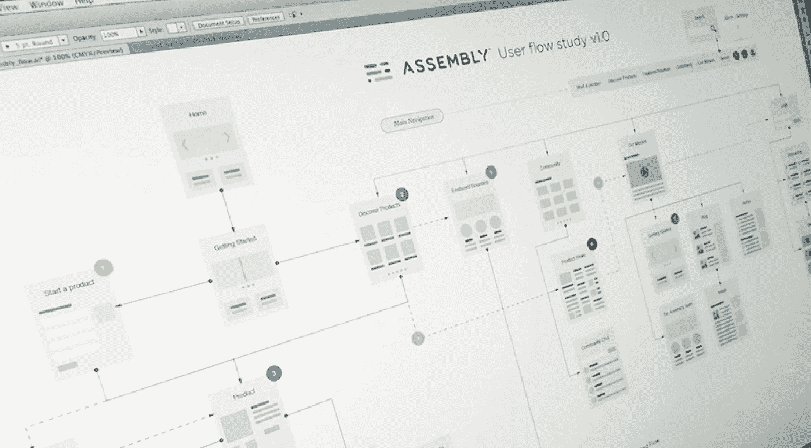

# 你的 UX 战略要改变了吗？

> 原文：<https://medium.com/swlh/is-your-ux-strategy-up-for-a-change-c88901a38169>

User Flow’in by [Bill S Kenney](https://dribbble.com/BillSKenney)

UX 战略是一个组织对用户、他们的需求和他们的行动的最深刻的理解。UX 战略是关于:

1.  在用户体验的质量和由此给公司带来的收益或损失之间画一条虚线。
2.  将产品团队、客户支持团队和营销团队聚集在一起，因为否则不可能实现 UX 战略。
3.  橡胶接触路面的地方。你已经定义了品牌价值，并在讲台上谈论它们——但 UX 战略将指导如何在不同的用户接触点实现它们。
4.  陈述对用户和企业的结果。它将努力实现双方的双赢。将用户的旅程与品牌一起绘制成 UX 设计的指南。

# 考虑改变你的 UX 战略吗？

你的公司必须清楚为什么要进行这样的转移。

以下是一些有效的步骤:

## 1.回顾用户的体验

记录当前的限制。用户目前被剥夺了什么？现在谁在要求 UX 改进？

## 2.了解触发因素

有一个明确的触发因素来开始改善用户交互的工作。以此为参考，UX 团队定义了合适的指标，并向其他团队解释这些指标将如何帮助公司实现其业务目标。

## 3.规划优先级

计划以便到达目标 UX。找出如何与其他团队紧密合作，使每个人在时间表、预算和优先级方面达成一致。

## **4。不同用户的不同用户体验**

对用户进行分组分析。例如，新手用户必须发现导航足够容易。专家用户必须有快捷方式来节省时间。可用性测试必须牢记两个层次的用户，以满足他们不同的需求。

## **5。明确区分主要和次要动作**

绝对确保清楚哪个是主要动作，以及如何将它与次要动作区分开来。这将最大限度地减少用户在交互过程中的错误和困惑。在这里，您可以确保元素的位置、大小和颜色都有助于区分不同的操作。

## **6。随时通知用户**

到目前为止，上述问题都已解决，列表上还有一些常规问题。表单域就是一个例子。总是让用户知道输入是否成功，并确认收到用户的提交。这不仅仅是一种形式，而是一种有价值的保证。

## **7。定期审查**

做定期审查。用户在变。你最可爱的 UX 设计仍然需要更新。

## **8。保持内容格式良好**

内容被添加、修改和重新安排。在任何时候，使用不同的字体样式(加上颜色和位置),这样控件(交互)元素很容易与它分开。

## **你公司的 UX 战略什么时候够好？**

首先，让你的顾客大吃一惊。第二，它必须相对优于你的品牌的竞争。第三，数字创新是快速的，因此你的 UX 战略必须包含站在变革前沿的观点。

*您可以关注我们的* [*脸书*](https://www.facebook.com/monsoonfish)*/*[*LinkedIn*](https://www.linkedin.com/company/13404751/)*/*[*Twitter*](https://twitter.com/monsoonfishy)*/*[*Dribbble*](https://dribbble.com/monsoonfish)

*原载于 2018 年 2 月 05 日*[*monsoonfish.com*](http://monsoonfish.com)*。*

## 这个故事发表在 [The Startup](https://medium.com/swlh) 上，这是 Medium 最大的企业家出版物，拥有 293，189+人。

## 在这里订阅接收[我们的头条新闻](http://growthsupply.com/the-startup-newsletter/)。

