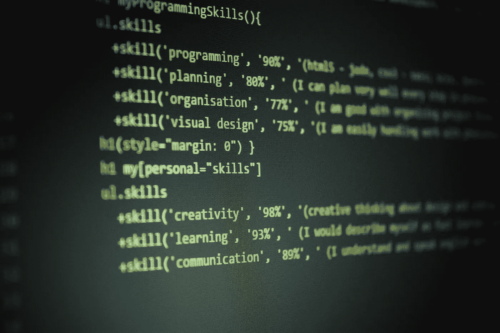

# 这是一个基于技能的世界

> 原文：<https://medium.com/swlh/its-a-skill-based-world-a50391e61a17>

工作场所正在发生变化。谁准备好了？

Photo by [Branko Stancevic](https://unsplash.com/photos/GI1hwOGqGtE?utm_source=unsplash&utm_medium=referral&utm_content=creditCopyText) on [Unsplash](https://unsplash.com/search/photos/skill-building?utm_source=unsplash&utm_medium=referral&utm_content=creditCopyText)

在我成长的过程中，我爸爸总是告诉我要把从篮球中学到的东西运用到生活中去。很难理解小时候打完篮球后的生活，所以直到多年后他的话才被理解。我从篮球生涯中学到的一个重要教训是，如何*而不是*去练习。

作为一名寻求进步的篮球运动员，我遵循传统的技能培养态度:投入数千小时变得真正优秀。我抱着大学打球的梦想，自己坚持不懈地练习。多年的重复——一个周末打八场比赛，连续几个小时投篮——在一定程度上有所帮助。

然而，我的技能在我高三的时候停滞不前。沮丧之余，我投入了更多的时间练习，但这并没有帮助。最后我打了一年大学篮球才决定挂靴。

虽然我当时没有意识到，但我的实践方法忽略了几个需要改进的关键方面。几年后，当我决定成为一名职业作家时，我意识到了这一点，我需要提高我的写作技巧。

我们都知道技能很重要。但是很少被提及的是如何正确地建造它们，因为我们大多数人都做错了，就像我打篮球一样。由于工作场所越来越以技能为基础，我们需要知道如何以正确的方式培养技能。

# 正确的练习方法:刻意

心理学家 K. Anders Ericsson 在他的书《T4 巅峰》中讲述了 Benjamin Franklin 如何创造练习来帮助自己写得更好的故事。例如，在一次练习中，富兰克林找到了一篇来自他喜欢的英国杂志《旁观者》的文章，并记下了每个句子的简短描述。几天后，富兰克林试图根据他的描述重写文章。

然后，他将自己的版本与原文进行了对比，并进行了修改。“这教会了他清晰而有说服力地表达想法，”埃里克森总结道。他没有为了写文章而反复写文章，而是集中在写作的一个方面，利用*旁观者*进行反馈。这种做法激发了更多的练习，以提高他的工艺的其他方面。

富兰克林的练习方法强调了*刻意练习*的几个基本要素——爱立信用这个术语来描述发展专业技能所需的练习类型。刻意练习是关于技能发展的。这是一种完全专注的、有意识的努力，它带你走出你的“舒适区”，专注于一个特定的目标，“需要近乎最大的努力。”换句话说，你不是在走过场，做一些容易或自然的事情。“的标志。。。埃里克森写道，“刻意练习就是你试图去做你做不到的事情。”

反馈对刻意练习至关重要，因此你可以从中学习并改正错误。对富兰克林来说，反馈来自于将他的文章版本与原文进行比较。当代的一个例子是艺术家 Kate Leigh Cutler，她经常参加艺术评论。这是这位新泽西艺术家已经坚持了大约 25 年的做法。“批评很重要，因为这是我学习的方式，”她说。

对医生长期表现的研究进一步强调了反馈的重要性。与我们预期的相反，根据 2005 年*内科年报的一篇综述，“执业时间较长的医生可能面临提供低质量医疗服务的风险”。然而，某种类型的医生——外科医生——确实会随着经验的增加而变得更好。埃里克森指出，原因在于反馈:“外科手术不同于医学的大多数其他领域，因为许多问题会立即显现，例如血管破裂或组织损伤。”相比之下，家庭医生可能会一次又一次地误诊同一种疾病，因为没有任何东西提醒他犯了错误。*

*与教练或老师一起工作是有意练习的另一个组成部分。他们发现问题并提供指导和反馈。虽然我们可能认为教练是运动员和音乐家的专利，但是各行各业的专业人士，从销售到编程到写作，也在使用他们。《旁观者》为富兰克林扮演了这个角色，他将自己版本的文章与原文进行了比较。这个想法是，随着时间的推移，学生“学会监控自己”，找到并修复错误，这需要“有效的心理表征”。*

# *从新手到专家*

*爱立信称之为心理表征，是“与一个物体、一个想法、一组信息或其他任何东西相对应的心理结构。。。大脑正在思考的东西。”例如，当有人谈论文森特·梵高的画作《星夜》时，你可能会“看到”主导背景的漩涡状蓝天和最右侧角落的太阳。心理表征以类似的方式应用于技能培养工作。*

*一个有着精致心理表征的四分卫看到了潜在比赛的机会，而一个新手看到的是运动员在场上随机奔跑，互相抢断。作家看到的是单词如何塑造句子，句子如何构建段落，而新手看到的只是一页上的一堆单词。经过多年的实践，你可以对你所在领域的不同情况形成“复杂”的表述。埃里克森写道:“[富兰克林]练习得越多，他的心理表征就变得越发达，直到他可以在没有具体例子的情况下，以旁观者的水平写作。”随着时间的推移，你可以“在特定情况下做出更快、更准确的决策，并做出更快、更有效的反应。”*

*擅长国际象棋和中国武术太极拳的乔希·怀茨金(Josh Waitzkin)将类似的技巧归功于他的成功。*

*威茨金开始在纽约市的华盛顿广场公园下棋，他在自己的书*学习的艺术*中回忆道，“成了街上的门徒”。他也很快主宰了职业国际象棋世界，九岁时赢得全国国际象棋冠军，十六岁成为国际大师。然后，在二十一岁时，他开始学习太极拳。仅仅几年时间，他就赢得了所在部门的全国和世界冠军。“我最擅长的不是太极，”怀兹金写道，“也不是象棋——我最擅长的是学习的艺术。”*

*他建议在一段时间内专注于一项特定的技术，以“逐渐内化知识”例如，他“专注于微小的动作，有时会花几个小时将手伸出几英寸，然后再松开。”这个过程产生了对一个概念的“精炼的、细致入微的理解”,这个概念已经深入到潜意识中，并被快速地、自动地引用。他称这种练习方式为“缩小圈子”*

*“缩小圈子”是“高级学习和行动”的起点，Waitzkin 说。富兰克林又一次是一个很好的例子。埃里克森解释说，他创造了一个诗歌写作练习来帮助他在写作时回忆词汇，然后是另一个专注于他散文的“结构和逻辑”的练习。我们可以把这个原则应用到我们今天的职业生活中。一名销售人员参加了一个演讲会小组来提高他的公开演讲技巧。然后，他专注于数据分析:学习如何读取数据以提高销售额。关键是将一项技能分解成小块，并专注于它们。*

# *现在的文化*

*如果刻意练习是成为专家的秘方，为什么没有更多人去做呢？三个原因似乎是合理的。首先，像富兰克林那样进行严格的练习需要很多时间和努力，大多数人不愿意投入时间和精力。*

*第二，刻意练习的要求偏离了我们“现在”的文化。想娱乐一下吗？上网。想要最新的八卦？扫描社交媒体源。想预订旅行吗？在智能手机上使用任意数量的应用程序。许多人以同样的方式对待技能培养:快速学习，现在就学习。他们没有关注学习技能的最佳方式，而是默认了快速解决的方法。这种趋势在今天的工作场所很普遍。*

*老板派员工去参加会议、研讨会和夏令营，这样他们可以在几天或几周内学会如何销售、写作或公开演讲。训练营特别受欢迎。许多人通过承诺他们将在几周内学会编程或成为数据科学家来吸引与会者。但是首席 JavaScript 工程师奇-王驰指出，“训练营，就像视频教程和大学课程一样，只是一个起点。”他是对的。像程序员一样思考不是一蹴而就的。*

*第三种可能性是，有意的练习与广为接受的智慧背道而驰，我们需要投入成千上万个小时来获得成为“专家”的技能，或者是这样的论点。作为一名篮球运动员，我成了这种心态的受害者，并且发现它不起作用。明确地说，你肯定会花时间进行有意识的练习——这是*而不是*黑客行为。但是要成为专家需要*正确的*类型的练习:走过场地打出一个神奇的数字不会减少它。*

*然而，社会不会有任何其他方式。这就是为什么人们选择有几十年经验的专业人士。但是研究表明，即使是经验也有其局限性。*

*多年的练习可以在一定程度上帮助你提高。投篮足够多，你可能会提高你的比赛。然而，总的来说，“一旦一个人的表现和自动性达到了‘可接受’的水平，额外几年的‘练习’并不会带来进步，”爱立信在谈到这个主题的研究时说。他补充说，事实上，这可能会让他们变得更糟，因为没有旨在进步的“刻意努力”，“自动化能力”会慢慢恶化。*

*作为职业人士，刻意练习很重要，因为技能很重要——而且它们在今天的工作场所发挥着重要作用。我们中的大多数人已经错误地努力了太长时间，这需要改变，因为反复培养技能是工作的未来。*

# *不断变化的工作场所*

*[乔·马斯提](http://josephmastey.com/)，一位独立的技术顾问和演讲者，将技能培养作为自己职业生涯的重中之重。尽管他已经从事编程工作将近 15 年，但他遵循着一个严格的改进计划:他“怀着面向业务的目标”编写代码，学习新的“编程技术”，并探索最新的技术。而这只是为了编程。他还在学习日语，每周花几个小时练习语言技能。*

*马斯提培养技能不仅是因为他*有*要，也因为他*想要*要。他说，在编程中不断学习是很重要的，“否则你就会落后。”他也“更专注于工作和生活。。。学习新东西。”如今，专业人士通过不断利用自己的时间和金钱来掌握自己的职业技能，但这是为什么呢？*

*从纽约到印度，工作场所正在以两种主要方式发生转变。首先，技术进步对就业构成了威胁。根据[世界经济论坛](https://www.weforum.org/agenda/2017/07/how-long-before-a-robot-takes-your-job-here-s-when-ai-experts-think-it-will-happen/)，到 2020 年，由于“人工智能、机器人、纳米技术和其他社会经济因素”，大约 500 万人类工人将被取代。“如果技术没有消除或改变你需要的技能。。。雷德·霍夫曼和本·卡斯诺查在他们的书《你的创业》中指出:“这至少能让世界各地更多的人来竞争你的职位。”。然而，对外包工作的大肆宣传可以与“机器人外包”相媲美，“机器人外包”被定义为“机器人取代人类工作”。*

*许多人预测，随着其他人因人工智能而失业，新的工作将会出现，我们需要做好准备。《哈佛商业评论》*说:“随着人工智能和机器学习接管我们的其他任务，像说服、社会理解和移情这样的技能将成为差异化因素。**

**第二个变化是蓬勃发展的千禧一代。根据 ManpowerGroup 的数据，千禧一代已经是美国最大的一代人，到 2020 年，他们将占全球劳动力的三分之一以上。新一代人带来了新的价值观。盖洛普报告称:“他们对发展的强烈渴望可能是他们与职场上其他所有一代人的最大区别。”。他们也愿意为此投入自己的时间和金钱。**

**总之，这些变化加剧了工作场所的竞争，并重视持续的技能发展。**

# **技能很重要**

**技能培养有实际的好处。王解释说，首先，有技能的员工需要跟上消费者的期望。消费者期待“更时尚、更强大的体验”，这意味着员工需要提高技能以“满足这些需求”。iPhone 用户可以理解。每年他们都期待新 iPhone 的发布——相信每个版本都比前一个版本好。**

**另一方面，全栈工程师 Ozzy Chagatai 说，技能培养给你提供了解决问题的新方法。“学习技能，尤其是那些不属于你工作所需的技能，会给你一个新的视角。”事实上，他试图专注于他在日常工作中“没有机会提高”的技能。**

**发展新技能也可以帮助你为未来的角色做好准备。健康和保健网络 Havas Health & You 的首席发展官兼合伙人杰夫·霍夫曼(Jeff Hoffman)承认，他“无法永远保持这种速度”，他指的是自己目前的角色。他通过成为制药行业的认证教练为未来做准备。为了建立自己的技能组合，他紧跟技术，增长自己的行业知识，并教授创业和领导力课程。**

**然而，技能培养不仅仅与工作有关。富兰克林和威兹金，以及本文采访的个人，揭示了另一个动机:学习的欲望。王说，他的主要动机是学习他认为“有趣和具有挑战性”的概念，并补充说，他“不再需要学习的那一天，就是他不再以(网络开发)为生的那一天。”对察合台来说，是对自己和手艺的“不断提高”。77 岁的艺术家凯特·利·卡特勒(Kate Leigh Cutler)仍在寻求进步，并将技能培养视为“一个过程，而不是终点”她目前专注于一种技术，将马克·罗斯科画作中的情感男高音与 J.M.W .特纳令人惊叹的大气效果结合起来。**

**他们有所发现。“专业的表演者。。。埃里克森在《巅峰时期》中写道:“通过推动自己发展新技能，获得巨大的个人成就感。“就好像他们在一个不断刺激的旅程中。。。因为总有新的挑战和机遇。”他是对的。当我用刻意的练习来提高我的写作技巧时，我发现这个过程既刺激又充实。这是我从篮球生涯中学到的另一个教训:享受旅程。**

***如果你喜欢这篇文章，那么* [*订阅我的博客简讯*](http://amymhaddad.us10.list-manage.com/subscribe?u=bd9ac04321dc5549e9319ddb3&id=11053c7cab) *。当有新文章发表时，我会发邮件给你。感谢阅读！***

****

## **这篇文章发表在《创业公司》杂志上，这是 Medium 最大的创业刊物，有 318，983 人关注。**

## **订阅接收[我们的头条](http://growthsupply.com/the-startup-newsletter/)。**

****