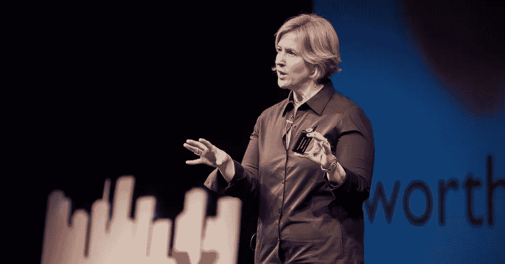

# 这是关于对脆弱性的偏好，而不是风险。

> 原文：<https://medium.com/swlh/its-about-appetite-for-vulnerability-not-risk-3ef4cac5bf99>

## 在布琳·布朗博士关于脆弱性的 TED 演讲火了起来之后(3500 万病毒！)她得到了许多在美国各地演讲的邀请。从学校、家长会到财富 500 强公司的每一个人。

但是这些公司会要求她不要提及 T2 的弱点或 T4 的耻辱。

“那你想让我谈些什么？”从事脆弱性和羞耻感研究超过 10 年的布雷内问道。

这是商界最常见的三个答案:创新、创造力和变革。

> 这是 Brené的回答，“脆弱性是创新、创造力和变革的发源地。”

请允许我绕道一会儿。这就是我想写企业家精神的原因。在商界，我们都试图展示自己的男子气概。**创新、创造和改变——在商业中是积极的陈词滥调。但是真正的珍宝，真正的创新、创造和改变，只有那些有足够勇气去挖掘泥沼的人才能发现。直到最近几年，情感健康才不再是商界的禁忌。即便如此，耐受性也仅限于被诊断出的、据称可以被大型制药公司治疗的疾病，比如抑郁症和焦虑症。而瑜伽和冥想主要是在提高效率的背景下推广的。**

我们需要迈出额外的一步，进入商界仍在回避的领域。也许不可诊断，也不可测量，但却是非常现实的问题，比如目标、意义、幸福和满足感(或缺乏满足感)。这些是布琳·布朗博士称之为“全心生活”和灵性的品质。在这个重要的话题上，任何有意义的谈话都无法避免提及羞耻、恐惧和脆弱。

至此，欢迎来到企业家精神系列。这是 2 号入口。(向下滚动到前面条目的末尾。)

# 关于企业家风险偏好的神话

有些人仍然认为企业家是天生的冒险家。他们不是。

好的企业家不是赌徒。任何人都不应该单纯地去冒险。

为什么？因为风险是可以管理的。

在担任内部法律顾问期间，我与风险管理部门并肩工作，我知道风险是不可避免的。与其逃避它，不如靠近它研究它。了解它的一切，衡量它，分析它，制定应急计划，并根据您所做的所有可靠的风险管理作业做出决策。

企业家面临的风险与任何小型或大型企业没有什么不同。它们有着共同的风险，如财务风险和运营风险(在大多数情况下，这些风险对已建立的企业来说要大得多。)人们倾向于关注的主要额外风险是未经证实的产品市场适合度——没有人或者没有足够多的人愿意购买你提供的产品。

预计到可能没有足够多的客户，或者你可能在实现业务目标之前就完成了创业公司的跑道，关闭企业的最坏情况下的损失程度是已知和可控的:

*   你应该在一个有限责任实体的背后运作，这样你所有的个人资产都不受限制；
*   没有人可以强迫你承担任何个人债务或为企业担保(如果你选择这样做，那是你的个人选择，你可能会投资股票市场，这不仅仅是因为你是一名企业家)；
*   如果你的机会成本和生活费用特别高(例如，你有一份高薪工作，或者有家眷，或者有贷款要还)，你可以考虑在不放弃薪水的情况下兼职创业。

因此，似乎任何结婚的人都比任何(了解风险的)企业家承担更多的风险！你只能做婚前协议，但这在世界上大多数地方都是不可执行的。

但是有一些东西确实是企业家所特有的。据我所知，离婚率仍然低于创业失败率。

真正可怕的是**失败**的可能结果。

损失还不是最严重的。

什么是？

最糟糕的，绝对的地狱，我们都尽一切办法避免*只是这个:看起来不好。*

*没有办法摆脱难看的外表。*

# *企业家是有勇气让自己看起来很糟糕的人*

*让自己看起来糟糕的勇气正是脆弱的定义。*

*告诉某人你爱他或她，不知道会不会被拒绝甚至羞辱；*

*组织一个大型聚会，不知道是否有人会出现；*

*坚持你的信仰，不知道你是否会被嘲笑。*

*当你失败时，你就丢脸了。不仅如此，你失去了信仰。把我们自己放在那里，真正出现，后果是不可控制的。它经常让我们敞开心扉，改变我们，不管是以一种看似“好”还是“坏”的方式。*

> **脆弱不是软弱；这是我们最大的勇气。—布琳·布朗**

*失败的企业家。*

*我刚去过那里。*

*这是*我不够*的耻辱的巨大导火索。即使这个问题已经解决了，我是谁的阴影可能会在未来很长一段时间内继续追寻这个没人敢做的梦。*

*在我最黑暗的日子里，这是我学到的:*

*我需要培养自己脆弱的勇气。我需要出现。求助。跟随我的真相。*

*一旦我开始这样做，对别人诚实，更重要的是对自己诚实，坦诚是强大的。一个安静但坚实的基础重新出现。在推销和营销、融资以及人工智能和人工智能会谈的花哨的创业世界里，**脆弱却是成为**最可靠的方式。*

*这就是脆弱的力量。*

*如果您觉得这篇文章有帮助，请继续阅读下面的系列文章。非常感谢！😊希望这有帮助！*

***系列:企业家精神***

*[序幕](/@elainesiu/spirituality-in-entrepreneurship-prologue-8237ca0d3147)*

*[0。简介](/swlh/spirituality-in-entrepreneurship-an-introduction-9f19accc765b)*

1.  *[身份危机](/swlh/spirituality-in-entrepreneurship-1-identity-crisis-6ae4bec46757)*

**

## *这篇文章发表在 [The Startup](https://medium.com/swlh) 上，这是 Medium 最大的创业刊物，拥有 340，876+的读者。*

## *在此订阅接收[我们的头条新闻](http://growthsupply.com/the-startup-newsletter/)。*

**