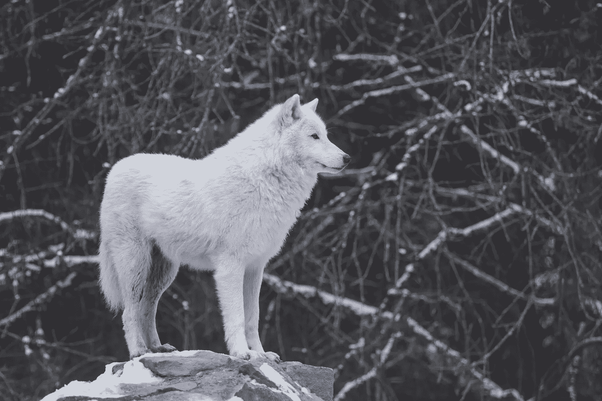

# 现在越来越真实了。我们不能再在环境上向左滑动。我们必须向右滑动并参与…

> 原文：<https://medium.com/swlh/its-getting-real-now-36adcba31614>

Photo by [Philippe Montes](https://unsplash.com/photos/lZw3Gb3Okvo?utm_source=unsplash&utm_medium=referral&utm_content=creditCopyText) on [Unsplash](https://unsplash.com/search/photos/wolf?utm_source=unsplash&utm_medium=referral&utm_content=creditCopyText)

我永远被“零年 T2”这个词所感动，我的生活将不再一样。

按照目前的下降速度，数学模型预测所有重要的野生动物种群将在 2026 年消失。