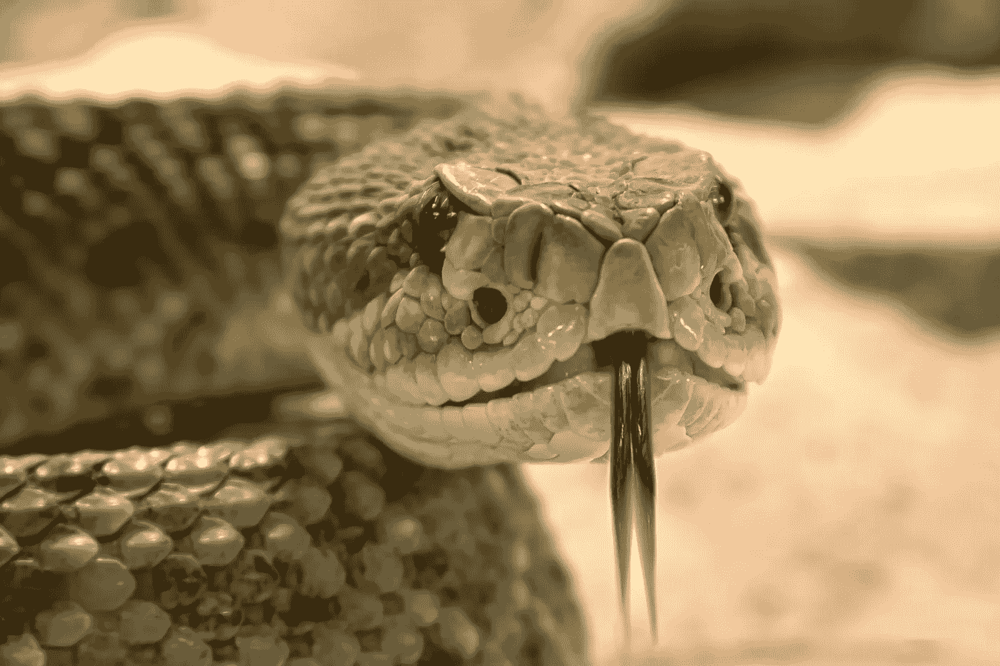

# 在错误的环境中成长几乎是不可能的——不要呆在那里

> 原文：<https://medium.com/swlh/its-near-impossible-to-thrive-in-the-wrong-environment-don-t-stay-there-db32ca2d21e3>

Photo by [pixelbay](https://www.pexels.com/@pixabay) on [Pexels](https://www.pexels.com/photo/dry-animal-gift-dangerous-38438/)

## 从伟大和平庸的环境中学到的经验

两天前，我降落在哥伦比亚的麦德林。我已经为我的到来做好了一切准备。我已经在一套与当地人合住的公寓里找到了一间不错的卧室，我已经找到了我会去的健身房，我还找到了同事…