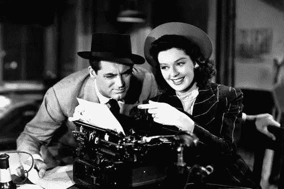

# 这实际上与写作无关

> 原文：<https://medium.com/swlh/its-not-actually-about-the-writing-2f48318efb56>

## 如果你想以写作为生，你需要换一种方式思考。

一份手稿啪嗒一声落在编辑的桌子上。这篇散文绝对迷人，每一个字都写得完美无缺。阅读的乐趣。这是一个关于一个男孩巫师的故事，他参加了一所魔法学校，同时与一个与他的过去有关的邪恶势力做斗争。只有这部小说是由……我们姑且称他们为‘戴夫’吧。来自…