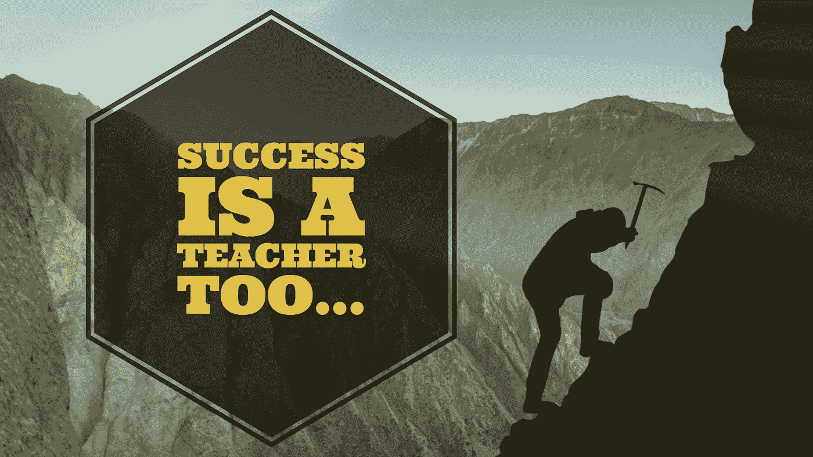

# 失败并不代表一切，成功也是一位老师

> 原文：<https://medium.com/swlh/its-not-all-about-failure-3e1708dffaa3>

## 两个对立面的故事

1.  两个相反的人走在华尔街，这个超级富人的家园。价值数百万美元的西装革履的人走过时，会像老朋友一样拍拍其中一个对立面的后背，同时虔诚地忽略另一个。
2.  同样的两个对立面走过创意社区。家喻户晓的人物写书、画画、讲述一个人的故事，同时礼貌地推迟关于另一个人的谈话。

让我们承认吧，如今失败几乎占据了自我提升的所有时间。我的意思是，在过去的两周里，我写了两篇文章，内容是关于在你的生活中，你需要为失败留有余地，以及当你失败时，这并不是结束。失败是每个人都喜欢谈论的悖论。与此同时，成功在角落里工作，他的下一个项目。虽然我们可以从失败中学到很多，但我们也可以从成功中学到同样多甚至更多的东西。

## 失败教会我们不要做什么。

我们可以将这些信息应用到我们的生活中，但是无论我们应用得多好，我们仍然在朝着我们的目标“试错”前进。不一定是最快的方法。

## 另一方面，成功告诉我们什么是有效的。

我们可以将这些信息应用到类似的情况中，并期望得到类似的结果。反馈是不同的，它可以帮助我们突飞猛进！没有那么多的尝试和错误，更多的小课程修正，结果是一个更平稳的旅程。

## 快速提示

也许今天，不要从失败中寻找你可以学习的教训，而是集中精力检查你最近的成功。

***>什么奏效了？***

***>你能学到什么教训？***

下次你如何复制那种成功？

一旦你有了这些信息，走出去并应用它。今天应用，明天应用，后天应用。努力的一致性是关键。你能做到的！

# 行动呼吁

我写了一本关于如何克服阻碍你成功的障碍的电子书。每个人内心深处都有创造力，都有与之匹配的梦想。如果你想开始或重振你的创意之旅，看看我的免费电子书: ***创意之旅——入门指南*** *。*

## [点击此处免费获取！](http://www.michaelehenson.com/opt-in)

## 最后一件事…

如果你喜欢这篇文章，请点击👏下面，这样其他人可以在媒体上阅读和欣赏。

## 这个故事发表在 [The Startup](https://medium.com/swlh) 上，这是 Medium 最大的企业家出版物，拥有 276，798+人。

## 在这里订阅接收[我们的头条新闻](http://growthsupply.com/the-startup-newsletter/)。

