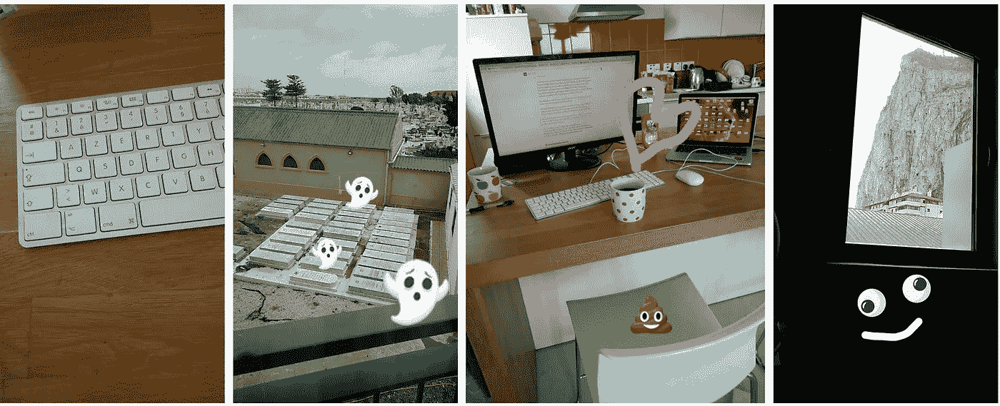
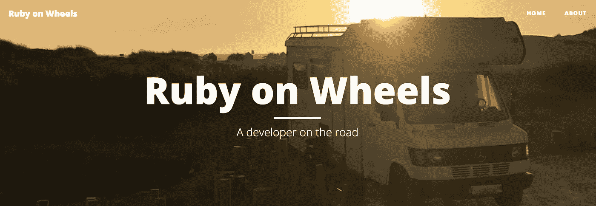

# 你在哪里不重要，重要的是你做了什么

> 原文：<https://medium.com/swlh/its-not-where-you-are-it-s-what-you-do-f8c73222c023>

我以前从来没有想过我的生活，但我意识到我的故事是一个很棒的例子，你不需要住在硅谷，甚至不需要远离任何充满活力的设计社区，就可以在这个行业取得一点成功。你可以在世界上任何地方制造和推出一个产品，只需要很少的人和很少的钱。

我想分享我制作原型和开发来自直布罗陀这个小国的其他产品的奇特生活。我希望它表明，你是谁或你住在哪里并不重要，真正重要的是你做什么！

> 你是谁或你住在哪里并不重要，真正重要的是你做什么！

我也不是唯一的一个——我遇到过一些非常鼓舞人心的人，他们以非常小的团队运送产品，从一些人看来不可能的地方运送。这很常见:

*   🇬🇷 [卡特琳娜](https://medium.com/u/4b8706e36863?source=post_page-----f8c73222c023--------------------------------)在希腊，她和[阿格洛斯·格苏利斯](https://medium.com/u/fd87014e34cb?source=post_page-----f8c73222c023--------------------------------)作为一个两人团队管理 [unDraw](http://undraw.co) 。
*   🇺🇦 [丽莎](https://medium.com/u/9f7968241d53?source=post_page-----f8c73222c023--------------------------------)和[艾哈迈德](https://medium.com/u/459701b05a52?source=post_page-----f8c73222c023--------------------------------)在乌克兰运行[完美的应用](http://flawlessapp.io)。他们开始是 2 人团队，最近随着 [Valia](https://medium.com/u/ad35b453f0c2?source=post_page-----f8c73222c023--------------------------------) 变成了 3 人。
*   🇮🇱 [尤瓦尔](https://medium.com/u/9e16c0b9e56f?source=post_page-----f8c73222c023--------------------------------)运营着一个来自以色列的全球 [UX 写作社区](https://www.facebook.com/groups/microcopy/)**作为个人项目。 [Kinneret](https://medium.com/u/8369367fc038?source=post_page-----f8c73222c023--------------------------------) 也在以色列，并推出了一本世界上最受欢迎的 [UX 自己写的书](https://www.microcopybook.com/)！**
*   **🇵🇱 [Thalion](https://medium.com/u/852341582ec1?source=post_page-----f8c73222c023--------------------------------) 在波兰，发布了一个非常受欢迎的[草图插件](https://blog.prototypr.io/squid-sketch-the-ultimate-guide-to-user-flows-creation-42622ec42af3)，在设计社区中广泛使用。**
*   **🇰🇷 [罗布](https://medium.com/u/a43687e6fc6a?source=post_page-----f8c73222c023--------------------------------)在南韩，在玻璃下跑**

****

**Lisa and Ahmed from [Flawless App](http://flawlessapp.io)**

**有些地方确实有很棒的设计社区，但在直布罗陀🇬🇮，我想我可以说是设计行业最不出名的地方。直布罗陀没有真正的设计社区——这里很少有人知道或关心我做什么。没有重大的创业场景，我们没有设计发布会([感谢上帝](https://blog.prototypr.io/why-most-design-conferences-suck-84d3f8b95609))，最大的行业不是赌博就是金融。**

**对于来自商业、投资和银行背景的密码爱好者来说，确实存在的一个创业活动是非常棒的。但是我的工作几乎被忽视了，因为设计目前没什么吸引力。**

**我过去常常想，也许我来错了地方。为什么没人关心？这些不是我的人。但我意识到，在引导产品的同时，我的大部分工作都是自己完成的，与制作 Hoodmaps 期间 [Pieter Levels](https://twitter.com/levelsio) 的视频看起来没有太大不同:**

**这表明，当你埋头工作时，你周围的环境可能真的没那么重要。**

## **凑合着用你有的**

**我一直想“做自己的老板”，灵活地开发自己的产品。我现在正在这么做，但这不是你想象的那样。从工作的角度来看，西奥多·罗斯福的这句话非常合适:**

> **尽你所能，用你所拥有的，在你所在的地方。**

**由于这个国家很少有其他远程工作者，我的大部分时间都是独自在一个可以俯瞰墓地的租来的公寓的厨房里度过的。我坐在一张相当不舒服的塑料高椅上，在 AZERTY 键盘上输入英语，屏幕的高度有点尴尬:**

****

**Left to right: AZERTY keyboard, lovely view, the chair I hate, the rock of Gibraltar**

**还不错，但是人机工程学和你在[界面爱好者](https://interfacelovers.com/)上看到的相去甚远。在其他日子里，我在我 13 英寸的屏幕上学习我朋友[索菲](https://medium.com/u/97c5403a26dd?source=post_page-----f8c73222c023--------------------------------)(*跟随她的* ) [语言学校](http://littleenglish.eu)，屏幕上有数百个标签。没有视网膜显示器，只有 MacBook。从这里开始， [Prototypr Weekly](http://prototypr.io/home) 面向成千上万的人，向他们展示你不需要在最受欢迎的地方制作令人敬畏的东西。**

> **当你工作的时候，真的在工作的时候，你会注意到你周围的事物吗？还是只是你正在做的工作？**

**我希望有一天能尝试一个更酷的例子，那就是 GitHub 的 Jakob 类的设置。他在一辆货车上运行 Ruby on Wheels:**

****** [## 货车生命的前 150 天——车轮上的红宝石

### 在路上的开发商。

车轮上的红宝石](https://ruby-on-wheels.github.io/blog/the-first-150-days-of-van-life/)** 

## **深耕**

**我认为这一切都行得通，因为在制作东西的时候，我发现随着*做*的实际过程出现在最前面，我周围的废话逐渐消失。称之为纽波特，称之为‘深度工作’:**

> **深度工作是专注于一项认知要求高的任务而不分心的能力。这是一种能让你快速掌握复杂信息并在更短时间内产生更好结果的技能。**

**这是重要的一部分，也是我们所有人能做的，无论你在哪里。从你产品的愿景开始，想象有很多人在使用它——然后坚持不懈地开发，直到达到那个愿景。在一天结束的时候，当笔来到纸上，无论如何你都是靠自己的——没有人能为你做你一生的工作。**

**因此，如果你在某个地方的一个小镇感到沮丧，认为你需要加入一个大城市才能去任何地方；或者你在等待什么事情发生，我希望这能鼓励你从你所在的地方开始，从你能抓住的地方开始。**

***附言* [*我现在正在做一件事*](https://www.producthunt.com/upcoming/tamarin-templates) 🐒你可以报名加入我的旅程，听更多的故事。**

** [## 柽柳模板-产品搜索

### Tamarin 模板——将静态 HTML 电子邮件转换成可重复使用的产品搜索时事通讯模板

www.producthunt.com](https://www.producthunt.com/upcoming/tamarin-templates) 

大声喊出来[启动研直布罗陀](https://www.startupgrind.com/gibraltar/)！** ****

## **这个故事发表在[的创业](https://medium.com/swlh)上，这是 Medium 最大的创业刊物，有 306，792+人关注。**

## **订阅接收[我们的头条新闻](http://growthsupply.com/the-startup-newsletter/)。**

****