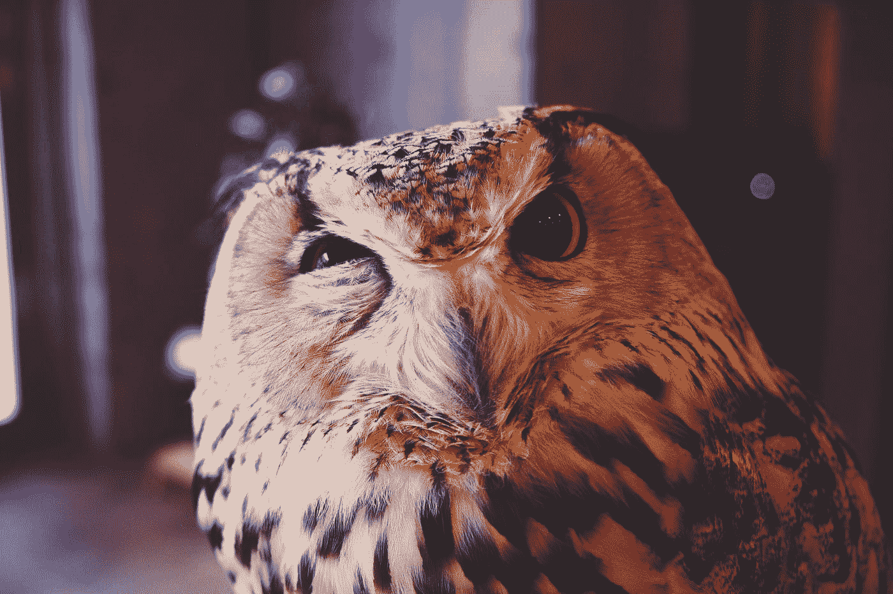

# “真的很好。我喜欢。”

> 原文：<https://medium.com/swlh/its-really-good-i-like-it-618684750f9b>

## 你能听到的最糟糕的六个词

by [Joe Green](https://unsplash.com/@jg?utm_source=medium&utm_medium=referral) on [Unsplash](https://unsplash.com?utm_source=medium&utm_medium=referral)

在我大学三年的写作学习中，我学到的最有用的技能是接受建设性批评并采取行动的能力。我很幸运地发现，即使在课程开始的时候，我也真的很享受从别人那里获得反馈的过程。很快我就意识到我对……