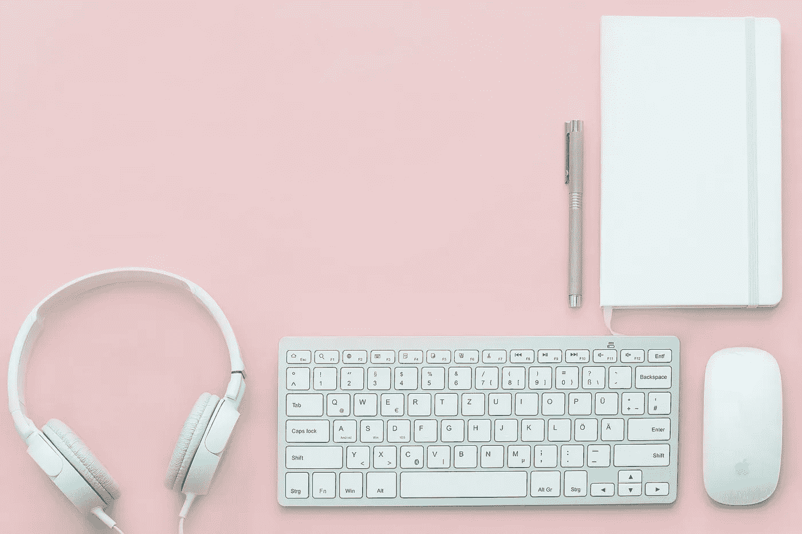

# 是时候打朝九晚五的脸了

> 原文：<https://medium.com/swlh/its-time-to-punch-9-to-5-in-the-face-27c4d0981289>

## 为什么上班打卡需要结束(没有双关语的意思)。

打你老板的脸。真的很难。

完全是开玩笑，但这里面可能有些道理。

原因如下:

几个月前，我的一个朋友给了我一本书。蒂莫西·费里斯的《每周 4 小时工作制》。

当我看到标题时，我想我笑了足足十分钟，直到她脸上的表情暗示她其实是认真的。

“你会喜欢这本书的。我发誓。”

我试图自卫。但最终，她是对的。

《T2》中的 4 小时工作制是希望鼓励其他人跳出低效的朝九晚五的思维，超越传统的 8 小时工作制。

它提倡高效的 4 小时“能量注射”，而不是漫不经心的 8 小时工作生产。

最精彩的部分？有科学依据的案例研究表明，有些人因为一个简单的改变，实际上收入翻了一番，克服了挑战，并彻底改造了工作车轮。

一句话:朝九晚五正在扼杀我们所有人，是时候做点什么了。

# 朝九晚五是从哪里来的？

8 小时工作制实际上诞生于 20 世纪工业革命时期。亨利·福特想出这个主意是为了吸引汽车工人，他们中的许多人习惯于 12 小时轮班。

在这段时间里，公司试图通过尽可能长时间地保持工厂运转来最大限度地提高工厂产量，实质上是实行“日出而作，日落而息”的工作时间。

这基本上意味着每天 10-16 小时是一个标准。

直到罗伯特·欧文挺身而出，开始了 8 小时工作日运动。他的口号围绕着八小时劳动、八小时娱乐和八小时休息。

很久以后，8 小时工作制实际上被实施了，并且一直保持至今。

但是今天，事情发生了变化。

技术使得在任何地方工作成为可能，在现代社会中，要想高效工作，并不需要坐在一张不舒服的、累人的椅子上八个小时。

富有成效是让创造性的汁液在正确的时间流动，创造动力，然后将所有的能量整合到每天 4 到 5 个小时的有效时间框架中。

从心理上来说，如果员工知道他们工作的时间正好合适，他们会更有动力、更有活力，甚至更兴奋地去完成工作。

这是因为他们现在看到了一种更符合逻辑和*可实现的*工作方式。

*想想这个:*

早上走进办公室，把手机收起来，把所有的精力都投入到工作中。

你知道你没有那么多时间来完成事情，因为现在时间更加紧迫，你不再有自由去做你不应该做的事情(比如查看个人邮件或浏览你的 Insta feed)。

通过强制实行 4 小时工作制而不是 8 小时工作制，员工不仅能完成工作，还能以更大的努力和注意力完成工作，因为几乎没有分心的空间。

把工作做完，你就可以走了。就这么简单。

# 我的第一个朝九晚五

大约一年前，我开始了我的第一份全职工作，惊喜地发现我完全热爱我工作的一切。

我喜欢这里的人，这里的氛围，还有我拿着报酬只是写作的事实。

工作一个月后，虽然我仍然热爱我正在做的事情，但我发现我能够在三个小时内完成一天中需要做的所有事情(没有休息)。

有传言说，早晨是写作的最佳时间，也是我最专注和精力最充沛的时候(我是个早起的人)。

我会在早上 8 点登录电脑(我总是提前一个小时来)，然后差不多一直写到 10:30 左右，那时我需要完成的大部分文章都准备好了。

这并不是说我忽略了一些因素，比如我快速编造文章的能力或者我思维过程的速度，但是我真的相信，仅仅是花一段非常专注的时间来实现你的所有目标就能走很长的路*。*

现在你可能在想，那你一天剩下的时间都做些什么呢？

女士们先生们，我什么也没做。

开个玩笑——我通常会想出新的主意或者简单地完成第二天的任务(同时对自己说，我可以在家里做很多更有成效的事情)。

如果朝九晚五的工作从来不存在，如果员工只是通过监控目标来工作，我会在早上 10 点就出门了

显然，这取决于个人能力和工作量。一些员工喜欢慢慢来，而另一些员工只是有很多事情要做。

尽管这可能是事实，但朝九晚五的理论仍然成立。

这可能是因为有很多事情要做会让你完全失去灵感，慢慢来也意味着注意力不集中，或者冒险去做其他事情。

底线是，当我们早上走进办公室时，在精神上，我们很难想象接下来的八小时工作。

如果看起来太多，那就很危险。这会导致我们失去动力，失去精力，工作效率降低。

另一方面，知道我们只有三个小时的时间来上班可以极大地改善我们的工作环境、职业道德、心理健康和整体表现。

# 我们的语言说明了一切

想想所有你在周一醒来的时候，你在社交媒体上滚动，甚至在走廊上遇到有人告诉你他们讨厌周一。

有卡通和没完没了的关于讨厌星期一的节目。甚至还有我们带去工作的咖啡杯来提醒我们应该讨厌星期一。好吧，你明白了。

当它是周末的时候，嗯——感谢上帝今天是星期五！(TGIF)。

甚至我们自己的语言和文化趋势也在暗示我们，这种朝九晚五的生活已经过时了。

所以下次当你在 8 小时的监狱里打卡时，想想这个问题，问问自己这真的是你的未来吗？

它肯定不是我的。

## 如果你喜欢这个故事，请点击👏按钮(记住:因果报应:)。

## 帮我分享这篇文章，这样别人也能找到！欢迎在下面留下评论，我喜欢反馈。非常感谢。

## 这个故事发表在[的创业](https://medium.com/swlh)上，这是 Medium 最大的创业刊物，有 340，876+人关注。

## 订阅接收[我们的头条新闻](http://growthsupply.com/the-startup-newsletter/)。

