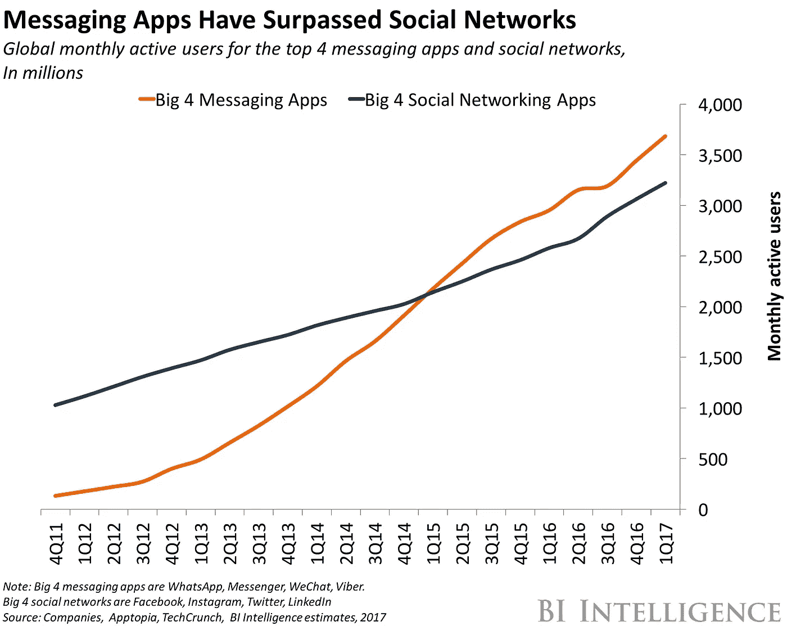

# 是时候让短信脱离苦海了

> 原文：<https://medium.com/swlh/its-time-to-put-sms-out-of-its-misery-944d9a1a70f9>

## 扼杀正在扼杀营销的信息平台

> 惊喜:)在这里获取:

这是我本周早些时候收到的一条真实的短信。

不明号码？这是第一面红旗。

后面跟着一个 bit.ly 链接？红旗二号。

我仍然不知道是谁发来的，除了那个链接还有什么，或者我做了什么应该得到这个。

现在，这条信息已经被删除了，同时被删除的还有成千上万的其他运输提醒、几乎不加掩饰的诈骗以及当地服务提供商对我大喊的最后一分钟的交易。

他们中没有人邀请或鼓励我参与。事实上，我现在几乎本能地害怕收到一个陌生号码发来的信息。

感觉有侵犯性。这完全没有人情味。这与联系或吸引我正好相反。

在一个邀请双向交流的信息平台上，事情可能会有所不同。

我本可以发现这只是我友好的邻居笑脸先生邀请我今天用他们的聊天机器人点买一送一的汉堡。

我本可以回复亚马逊的发货提醒，将我的一次性订单改为按月订阅。

曾经被忽视的短信可能是追加销售我，留住我，甚至只是收集更多我的数据的机会。

如果在一个流行的信息应用程序上安装聊天机器人，这些营销信息可能会成为竞争者。

短信根本无法与聊天机器人抗衡。他们的高互动指标仍然是一个没有告诉任何实际参与的红鲱鱼。

现代营销人员明白消费者需要有价值的、即时的一对一互动，他们选择聊天机器人而不是短信，原因有几个。

# 短信比什么都贵。

实际上，通过聊天机器人与客户交流是免费的。

当然，开发和管理机器人可能会有成本。但是对于世界上连接互联网的大部分人来说，通过聊天机器人发送和接收信息是免费的。

短信不是。

考虑一下每次发短信花一美分，这是短信的低端。听起来没那么糟，是吧？

事实并非如此——除非你考虑一下你的联系人列表的大小以及你想联系他们的频率。

把你的名单扩大到 100，000 个订户？厉害！每次你想给他们发一条 [160 个字符的](http://www.adweek.com/digital/the-reason-for-the-160-character-text-message-and-140-character-twitter-length-limits/)信息，就要 1000 美元。

50 万订户？现在我们说的是每条群发信息 5000 美元。

你明白了。

如果你甚至每隔一周*分享一次晋升，你一年将花费超过 10 万美元来发送几十个句子到你的清单上。*

许多单独的聊天会话可以达到这个长度——你可以免费拥有一百万个这样的会话。

这里的矛盾是，当你想扩大你的联系人名单时，通过短信与你的用户交流的费用将很快变得令人望而却步。

# 短信并不像人们曾经认为的那样是无处不在的营销渠道。

经济实惠的技术和广泛的低成本互联网连接每月都吸引数百万活跃用户使用消息应用。

短信不再是营销人员可以利用的最广泛的沟通渠道。

它也不像我们曾经认为的那样无处不在。

是的，几乎所有的移动设备都预装了某种短信应用。但是你最近有没有试过从加州给你在德国的朋友发一条短信？

> “如果你是一个想要向美国、加拿大、墨西哥和英国的人们传递信息的品牌。这意味着 4 种不同的 SMS 设置，4 种不同的成本结构…
> 
> 如果你在同样的四个国家发布 FB Messenger，这是一次发布，当然还有一个成本结构(免费的),而且构建是针对一个 API 的。

[SMS 供应商按位置划分](https://chatbotsmagazine.com/facebook-messenger-vs-sms-700bbe16f3c2)。成本无处不在，营销人员将不得不根据他们希望做广告的每个国家的短信供应商的规定建立全新的活动。

现在*那个*听起来是花一周时间准备一个激动人心的新发布的好方法。

相比之下，大多数通讯应用并没有按照位置进行细分。虽然在不同的国家，一些应用程序肯定比其他应用程序更受欢迎，但营销人员可以建立一个单一的信息宣传活动，对该应用程序中的任何用户都完美地起作用——不管他们来自哪个国家或他们当时在哪个国家。

Facebook Messenger 在全球拥有[10 亿月活跃用户](https://research.hubspot.com/charts/messaging-apps-have-over-4b-monthly-active-users)的权重。

搭载世界上最大的消息应用程序之一的能力是 SMS 永远无法利用的，但这是越来越多的聊天机器人每天都在做的事情。

# 对，短信互动高…

根据 [2016 年电子邮件营销指标基准研究](http://www.ellisjones.com.au/wp-content/uploads/2016/10/Email-Marketing-Metrics-Benchmark-Study-2016-IBM.pdf)，全球电子邮件平均打开率为 21.8%。点击率？令人沮丧的 3.3%。

另一方面，我们有 SMS，Salesforce 的移动产品经理 Greg Murphy 说它的打开率为 98 %,转化率为 45%。

*方式*更好。

## 聊天机器人就在那里。

电子邮件营销传道者尼尔·帕特尔发现聊天机器人获得了 88%的打开率和 56%的点击率。

在通过电子邮件和聊天机器人向用户发送相同的内容后，Olyo 的[定制机器人建造者观察到了惊人的结果:](https://chatbotsmagazine.com/messenger-chatbots-can-lead-your-campaigns-to-a-98-open-rate-9539c6c7a8ee)

> “使用聊天机器人获得的结果是非凡的:点击率比通过电子邮件获得的点击率高 12 倍……”

我们不必假设聊天机器人和短信等基于消息的交流比电子邮件营销更有效。它在数字里。

虽然短信和聊天机器人在 opens 和 CTR 方面不相上下，但在这两个平台上进行的互动却有天壤之别。

## …但是[实际订婚](https://blog.ubisend.com/hubfs/white-papers/ubisend_chatbot_survey_2017.pdf)呢？

> “消费者不再想通过电话或电子邮件与企业交流；他们已经在个人生活中使用社交媒体和信息，为什么在处理业务时不使用呢？
> 
> 便利就是胜利。人们不想等待或寻找答案，他们希望答案自己找上门来。"

1989 年，CompuServe 使互联网用户可以相互发送电子邮件。

从那以后，我们用*打开*和*点击*这样的指标来衡量参与度。

因为技术不支持实时的信息交流，所以对话没有被测量。

现在已经不是 80 年代了。

如果我们一直称之为“参与”的东西实际上一直只是“互动”呢？

因为我不知道一个比“参与”更好的词来形容今天人们用聊天机器人做的事情。

售后客户服务工具 Narvar 的首席执行官 Amit Sharma 发现，不到 1%的客户会使用公司发送的数百万条短信来跟进交易。

对于聊天机器人来说，这与事实相去甚远。

> “Narvar 的聊天机器人看到了几乎 100%的客户回复率，其中 65%的人会像对待人类一样对待机器人，说一些像‘谢谢’或发送表情符号和竖起大拇指之类的话。”

很明显，转变正在发生。

人们将聊天机器人视为与品牌对话的机会；短信作为信息被推送给他们*来自*一个品牌。

人们*正在*与短信高速互动，但这一切都在传递中。

在我们经常与朋友和家人交流的应用程序中，我们中有谁不会快速回复通知？这也是机器人工作的原因。

互动率非常相似，但参与度却完全不同。

# 订婚是双向的。

机器人能够穿越它。短信在街角等着。是的，很多人看到他站在那里挥舞着他的牌子，大声喊着打折，但是有多少人放慢脚步，参与进来呢？

经过多年对潜在客户反应的研究，[InsideSales.com 推断出](https://www.insidesales.com/insider/lead-response-management/infographic-2/)如果你在潜在客户表示对你的提议感兴趣后五分钟内与他们接触，你实际与他们交谈的可能性是等待 30 分钟的 100 倍。

获得这一领先优势的几率也高出 21 倍。

尽管事实如此, [Drift 发现](https://chatbotsmagazine.com/how-bots-can-rescue-b2b-marketing-b06cee24d408)有太多的公司忽略了这条五分钟规则。

> “……我们发现 93%的公司都忽略了 5 分钟规则。
> 
> 只有 7%的公司在 5 分钟或更短时间内回复了销售咨询，而高达 55%的公司需要超过 5 天的时间来回复。"

这正好说明了[即时性很重要](https://blog.growthbot.org/why-chat-should-be-part-of-your-b2b-or-b2c-marketing-strategy)。

一个聊天机器人的交战时间不到秒。短信的订婚时间是… *什么订婚*？

不幸的是，企业已经告诉消费者，通过许多常见的销售和营销渠道(表格、短信、电子邮件)参与和留下语音邮件一样有效——甚至不用费心。

> “我不知道有谁喜欢给企业打电话。没有人想为他们互动的每一个业务或服务安装新的应用程序。我们认为，你应该能够给企业发信息，就像给朋友发信息一样。”—[2016 年马克·扎克伯格在 F8](https://chatbotsmagazine.com/11-examples-of-conversational-commerce-57bb8783d332)。

但是聊天机器人有一种收集数据的方式，大多数人甚至没有注册为营销。

通过 Facebook Messenger 与您感兴趣的企业分享一些信息感觉很自然。你不必改变你的习惯，也不必带着永远得不到回应的期望加入对话。

这是双赢的局面。

## SMS 不可扩展。

正如我在“[为什么聊天机器人会改变我们所知的营销方式](https://blog.growthbot.org/why-chatbots-will-change-marketing-as-we-know-it)中解释的那样:

> “信息传递是营销的新领域。机器人让我们有机会通过直接与消费者建立可扩展的一对一互动来利用它。”

不仅仅是短信的成本太高，你很少会让人们想到“[,我现在觉得和这个品牌联系更紧密了。](https://blog.growthbot.org/why-chat-should-be-part-of-your-b2b-or-b2c-marketing-strategy)

但是这种大规模联系和价值的感觉正是*我们正在用我们的[聊天机器人构建工具](https://www.hubspot.com/products/crm/chatbot-builder?hubs_campaign=freemiumacquisition-botbuilder&hubs_content=blog.hubspot.com/marketing/sms-out-of-misery)做的事情，帮助销售、营销和客户成功的人与大规模的人联系。*

通过使用像脸书& [网站实时聊天](https://www.hubspot.com/products/sales/live-chat?hubs_campaign=freemiumacquisition-livechat&hubs_content=blog.hubspot.com/marketing/sms-out-of-misery)这样的对话式信息平台来帮助人们与他们的潜在客户沟通&更好地帮助他们的客户，我们试图让生活变得更容易，并把宝贵的时间还给他们。

人们点击通过短信发送给他们的链接。它利用了一种习得的行为。但是一次点击并不等于参与，更不等于交易。

人们与聊天机器人进行有价值的一对一交流，这些聊天机器人都是他们已经在使用的应用程序，以完成任务。

[在 Narvar 的案例中](https://thinkgrowth.org/guiding-principles-to-maximize-chatbot-retention-engagement-c03b168dab1)，后续通知的回复率从 1%上升到了近 100%。唯一的区别？从短信到聊天机器人的转变。

我们现在已经准备好看到这种转变大规模发生。

消费者想要有用的信息，而不是爆炸。他们想要实时的。他们会去他们需要的地方，包括你的竞争对手，去得到它。

记住这句值得信赖的格言“顾客永远是对的”

立即采取正确的措施，让你的品牌成为竞争者。

*原载于***。**

*感谢阅读。*

> *如果你喜欢这篇文章，请随意点击那个按钮👏帮助其他人找到它。*

*.*