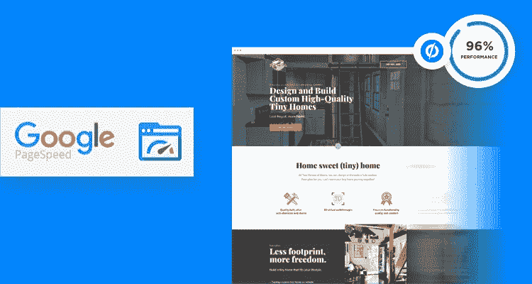
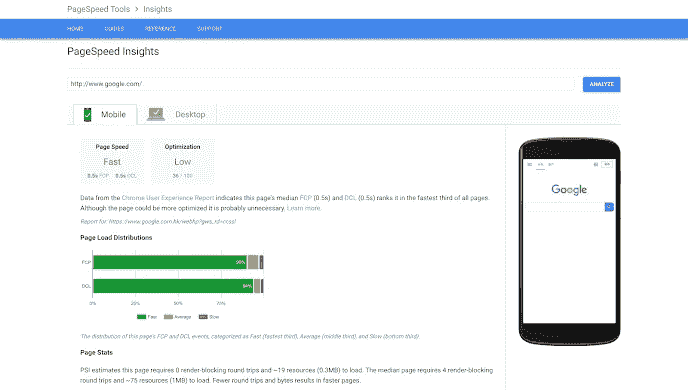
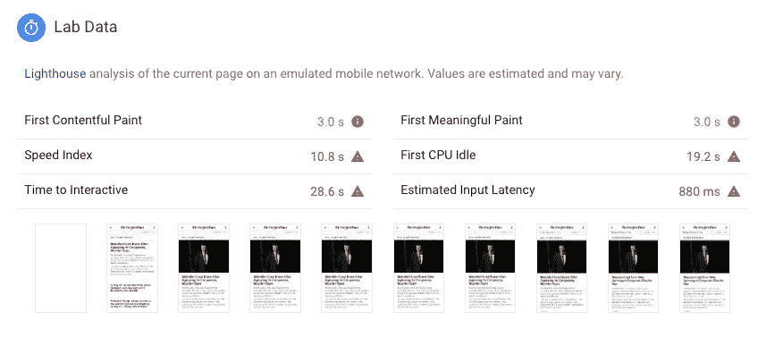
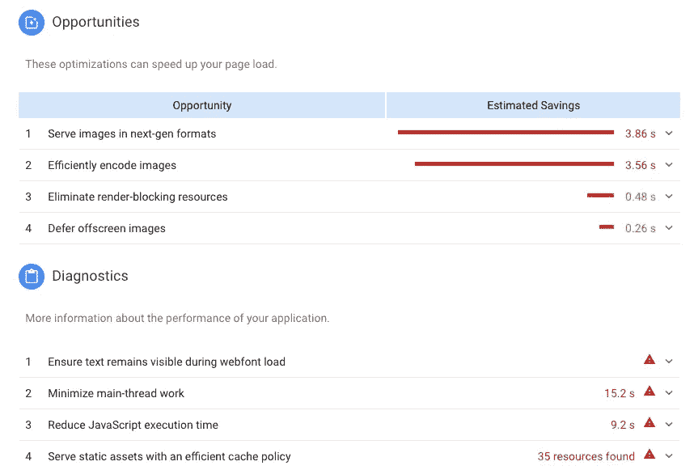
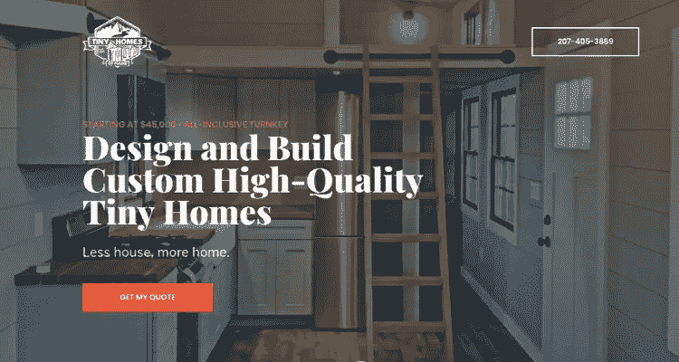
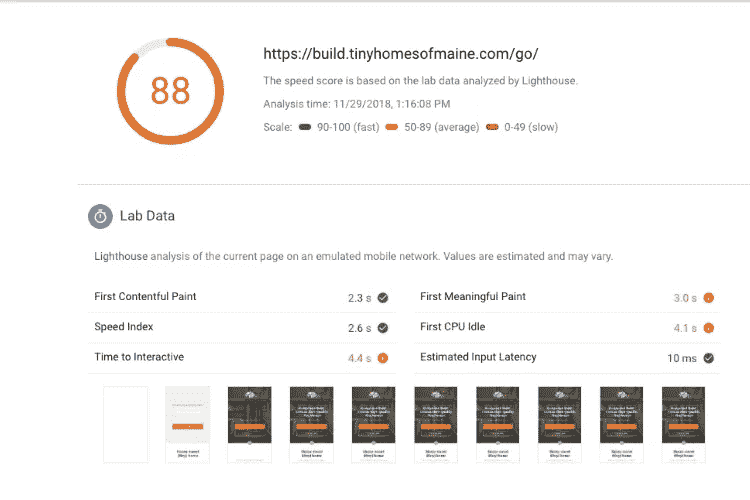
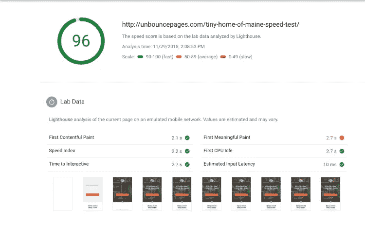
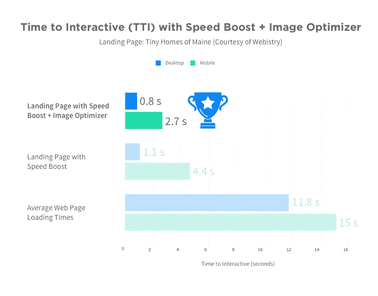
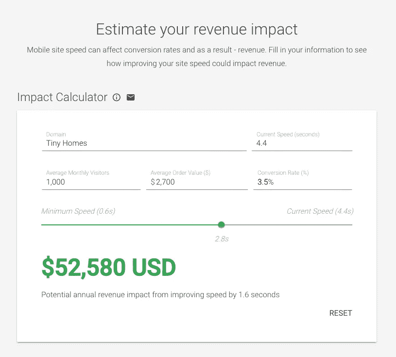

# 是时候重新测试你的页面速度了[谷歌最新更新]

> 原文：<https://medium.com/swlh/its-time-to-retest-your-page-speed-google-s-latest-update-4d8abfc14972>

*由* [*瑞安·恩格利*](https://twitter.com/ryan_engley) *担任，产品发布会上的产品营销副总裁*

早在 10 月，我们第一个宣称 [2019 年将是页面速度](https://unbounce.com/landing-pages/2019-is-the-year-of-page-speed/?utm_medium=referral&utm_source=medium&utm_campaign=blog-post-page-speed-insights&utm_content=manifesto-blog-post)之年。我们已经着眼于市场，让我告诉你:谷歌正在发出严重的信号，这是处理你的缓慢页面的关键时刻。

更快的页面是战略营销的重点。

果然，谷歌又做了一次改变来支持这一预测。11 月初，他们悄悄地推出了迄今为止我们见过的核心性能工具最重要的更新**，宣布了最新版本的 PageSpeed Insights。**

那么这次更新对营销人员和他们的底线意味着什么呢？

如果您已经使用 PageSpeed Insights 测试页面性能，**现在是时候重新测试**！因为你以前的速度分数已经不重要了。好消息是，你将有新的数据在你的指尖，以帮助你加速的方式，实际上对你的前景和潜在的转换。

让我们仔细看看这次更新，并探讨为什么它应该在 2019 年你的页面速度战略中发挥作用。

# “你不能改进你没有测量的东西。”

PageSpeed Insights 无疑是谷歌最受欢迎的衡量网络性能的工具。

你看看下面的截图，就知道为什么了。它提供了一个易于理解的颜色编码评分系统，你不需要工程学位就能理解——红色是坏的，绿色是好的。你的页面要么快，要么一般，要么慢。你越接近完美的 100 分越好。分数还会建议你如何改进。这几乎太容易理解了。

PageSpeed Insights v.4 (October 2019)

**早期版本的 PageSpeed Insights 在报告性能方面存在一些问题**。简单的结果可能会产生误导，专家们很快发现，实施谷歌建议的优化并不一定能带来更好的用户体验。当然，你可能会得到很高的分数，但是你的网页并不总是更快或者你的访问者更积极。别让我开始谈论你的转化率。

正如 Moz 的 Benjamin Estes 解释的那样，“有更聪明的方法来评估和提高网站速度。一个完美的分数并不能保证一个快速的网站。”许多像埃斯蒂斯这样的专家开始转向更可靠的工具——像 [GTMetrix](https://gtmetrix.com/) 、 [Pingdom](https://www.pingdom.com/) ，或者谷歌自己的 light house——来进行更精确的绩效审计。谁会责怪他们呢？

最新版本的 PageSpeed Insights (v.5)通过将重点放在应该放的地方来解决这些问题:**用户体验**。对于营销人员来说，这是一个巨大的飞跃，因为这意味着该工具与转化优化直接相关。它可以帮助您更快地转化为更高的参与度和转化率。

为了获得完整的独家新闻，[点击这里查看谷歌的发布说明](https://developers.google.com/speed/docs/insights/release_notes)，但是有两个变化你应该注意:

## 1.PageSpeed Insights 现在使用灯塔

Lighthouse 非常出色，因为它能让您更准确地了解您的登录页面如何处理实验室和现场数据。实验室数据意味着您可以尽快得到结果，无论您是否看到流量。这给了你一个方法，在你把你的广告指向他们之前，测试和改进你的页面。

一个重要的注意事项是 [Lighthouse 模拟了移动网络中的一个中间层设备(Moto G4)上的页面负载](https://developers.google.com/speed/docs/insights/v5/about)——大约相当于 3G 最快的 25%和 4G 最慢的 25%。所以这是对你在野外可能看到的东西的一个相当可靠的估计。它看起来是这样的:

New lab data from Lighthouse provides a much better picture of what a user experiences.

PageSpeed Insights 背后的灯塔引擎还带来了更多以用户为中心的性能指标，其中两个指标对您的登录页面非常重要:

*   **第一个有意义的画面(FMP)** 是加载第一个有价值的内容所需的时间——通常是折叠上方的英雄镜头或视频。而是“这有用吗？”吸引或失去访客注意力的时刻。即使页面的其余部分稍后加载，第一个页面元素尽快出现也是至关重要的。
*   **互动时间(TTI)** 是访问者第一次与你的页面互动的时刻。这是衡量速度的最佳标准，它决定了访问者是否会愉快地使用你的内容，或者他们是否会因为你的登录页面被笨拙的 JavaScript 或优先级低的代码阻塞而感到恼火和反弹。

## 2.PageSpeed Insights 为您提供更好的机会和诊断

你可以告别像 Ben Estes 这样的专家提出的简短的优化清单了。谷歌已经用新的机会和审计取代了(适度有用的)功能，这将实际上帮助你改善你的访客体验。其中包括新的建议和每个建议的预计节省。

你的优先事项应该更加清晰:

Opportunities and Diagnostics in PageSpeed Insights

# 你的未绑定页面如何堆叠

更快的页面为你赢得更多的流量和更好的参与度。因此，页面速度对你的转化率有很大的影响，甚至可以帮助你以更少的投入赢得更多的广告印象。这就是为什么我们将页面速度作为 2019 年的首要任务。

为了展示 Unbounce 在现实世界中的表现，我们选择测试一个由我们的客户 [Webistry](https://www.webistry.com/) 创建的实际页面，这是一家数字营销机构。他们的“缅因州的小房子”页面就是一个真实的例子。

[Click here](https://unbounce-wpengine.netdna-ssl.com/photos/tiny-homes-of-maine-full.png) for full image.

它有大量的自定义功能，所以它很好地代表了许多客户使用 Unbounce builder 所做的事情。(定制的能力往往是客户当初选择 Unbounce 的原因！)该页面包括用于平滑滚动的定制 Javascript、粘性标题、褪色标题、一些定制 CSS 和一堆各种文件类型的图像。

我们使用 Google PageSpeed Insights v.5 测试了“缅因州的小房子”的两个版本，使用中间结果运行了至少三个测试。**下面的结果关注的是移动评分**:

## 速度提升

首先，我们使用 Unbounce 的 Speed Boost 测试了最初的 Maine Tiny Homes 登录页面,它优化了登录页面的交付，以实现诸如利用浏览器缓存、优先加载可见内容、捆绑 Javascript 等功能。Speed Boost 处理来自 PageSpeed Insights 的技术建议，开发人员通常在幕后处理这些建议。你可以在这里看到测试的总体结果:

Tiny Homes of Maine with Speed Boost

## 速度提升+自动图像优化

接下来，我们重新测试了缅因州的小房子，将我们即将推出的自动图像优化器加入其中。这个新工具会在页面发布时自动优化您的图像。您可以微调您的设置，但我们在这里使用默认值。查看移动结果:

Tiny Homes of Maine with Speed Boost + Auto Image Optimizer

分数从令人尊敬的 88 分跃升到令人难以置信的 96 分，更有意义的是，我们看到互动时间从 4.4 秒提高到 2.7 秒。**这比普通移动网页快 12.3 秒，比谷歌理想的 3 秒加载时间快 0.3 秒。**

在这里，我们分享了桌面和移动设备的交互速度测试时间，并与普通网页进行了比较:

Time to Interactive is the best measure for whether a visitor will engage or bounce. Our average mobile speed is based on [Google’s mobile benchmarks](https://www.thinkwithgoogle.com/marketing-resources/data-measurement/mobile-page-speed-new-industry-benchmarks/), while the desktop average comes from [a study by SEO Chat](http://www.seochat.com/c/a/google-optimization-help/average-page-load-time-of-top-ranking-websites-in-google/).

总的来说，当我们测试时，我们看到速度提升和自动图像优化器在性能上产生了巨大的差异，而没有牺牲视觉吸引力或复杂性。我们选择了一个能很好转换的引人注目的页面，并通过以极快的速度提供它来增加赌注。无论是在手机上还是在桌面上，页面的加载方式都会显著改善访问者的体验。

> 速度提升已经提供给我们所有的客户，自动图像优化即将推出。这意味着你自己的登陆页面现在就可以达到上面的速度。[阅读更多关于我们页面速度计划的信息。](https://unbounce.com/try-amp/?utm_medium=referral&utm_source=medium&utm_campaign=blog-post-page-speed-insights&utm_content=lp-features-page-speed)

但是等一下。**AMP 怎么样？**你可能已经知道 AMP(加速移动)页面，它几乎是即时加载的——比如，不到半秒钟。它们不仅导致疯狂的参与，而且消除了等待甚至缓慢的网络连接。这使得每个人都可以访问您的内容，包括仍然使用 3G 连接的 70%的全球用户，或者在人行横道等待的 70%的行人。

虽然 AMP 的构建可能很复杂，但 Unbounce 的拖放构建器可以让您像创建所有登录页面一样创建 AMP。如果你想亲自尝试一下，你可以[报名参加将于 2019 年 1 月开放的 AMP beta](https://unbounce.com/try-amp/?utm_medium=referral&utm_source=medium&utm_campaign=blog-post-page-speed-insights&utm_content=lp-try-amp) 。

对于上面的速度测试，我们决定不考虑 AMP，因为 AMP 限制了一些自定义功能，并且我们使用的页面需要一些设计上的修改。这不是苹果对苹果。但是我们很乐意在接下来的时间里给你展示更多。

# 页面速度&你的底线

秒是一回事，美元是另一回事。谷歌认识到快速加载时间对你底线的直接影响，这就是为什么他们在 2018 年 2 月发布了[影响计算器](https://www.thinkwithgoogle.com/intl/en-ca/feature/mobile/)。这个工具更好地解释了为什么提供精确的测量如此重要。

让我们作为一个例子，重新看看上面的小家园登录页面。想象一下，这个登陆页面一个月获得 1000 个访问者，转化率为 3.5%(这只是略高于我们的[转化基准报告](https://www.conversionbenchmarkreport.com/)中的房地产行业登陆页面的平均水平)。如果从销售线索到销售的转换率为 5%，每次转换平均价值为 54，000 美元(这是他们登录页面上的中等价格房屋)，那么他们的平均销售线索价值为 2700 美元。

Tiny Homes of Maine in the Impact Calculator

当我们将这些数字输入影响计算器，并将他们的移动页面速度从 4.4 秒提高到 2.8 秒时，如上面的测试所示，这一个页面对收入的影响可能是 52，580 美元。

是的，速度很重要。

如果我们预测加速移动页面(AMP)承诺的接近即时的速度，如果该页面在 1 秒钟内加载，可能会产生超过 179，202 美元的潜在年收入影响。

这就是*一号*登陆页面！

如果你一直在努力改善你的页面加载时间，这个最新版本的 PageSpeed Insights 现在给你一个更有意义的图片，告诉你你在做什么，以及如何变得更快。

**你可能没有考虑过超速行驶是一个战略优先事项，但是当几秒钟可以等同于几万美元时，你需要这样做。**亲自尝试[影响计算器](https://www.thinkwithgoogle.com/intl/en-ca/feature/mobile/)或者联系我们的销售团队，看看取消绑定登录页面能给你带来什么样的收入影响。

*原载于 2018 年 12 月 3 日*[*unbounce.com*](https://unbounce.com/landing-pages/time-to-retest-page-speed/?utm_medium=referral&utm_source=medium&utm_campaign=blog-post-page-speed-insights)*。*

## 这篇文章发表在 [The Startup](https://medium.com/swlh) 上，这是 Medium 最大的创业刊物，拥有+395，714 名读者。

## 在这里订阅接收[我们的头条新闻](http://growthsupply.com/the-startup-newsletter/)。

