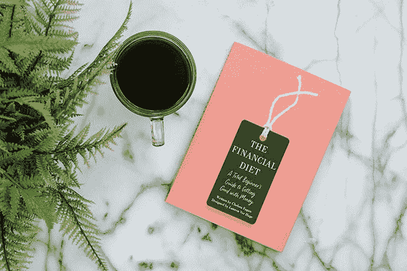
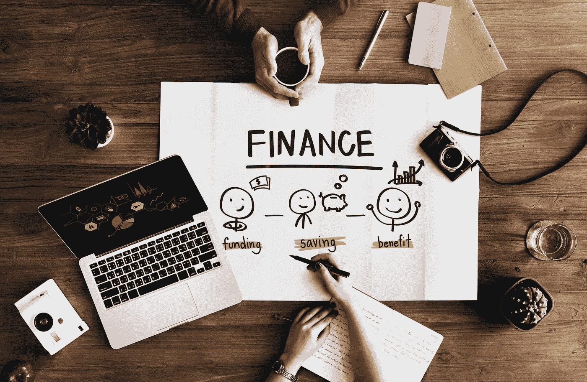

# 是时候让我们的钱发挥作用了

> 原文：<https://medium.com/swlh/its-time-to-start-making-our-money-work-37ce33c769db>

Image by [rawpixel](https://unsplash.com/@rawpixel?utm_source=medium&utm_medium=referral) on [Unsplash](https://unsplash.com?utm_source=medium&utm_medium=referral)

如果你曾经看着你的银行账户像老虎机一样转动，但不知道你的钱在发生什么，请举手。

好吧，也许这有点夸张，但我不可能是唯一一个二十多岁还对我的钱有所不知的人。

## 事实上，对于我们大多数 20 多岁的人来说，我们有很多东西需要了解我们的钱是如何运作的。

Image by [Artem Bali](https://unsplash.com/@belart84?utm_source=medium&utm_medium=referral) on [Unsplash](https://unsplash.com?utm_source=medium&utm_medium=referral)

金钱话题不是每个人都喜欢的，但我们都必须在生活中的某个时刻经历它，坦率地说，在今天这个时代，最好早点开始。

当任何一个 20 多岁的人开始他们的成年旅程时，我们会经历几个阶段:
***阶段 0.5:*** 毕业。
***第一阶段:*** 找工作。
***第二阶段:*** 意识到你有很多债务要还清。
***第三阶段:*** 想清楚如何还清那笔债务，以及为了实现它你必须放弃什么。
***第四阶段:*** 开始清偿债务。
***第五阶段:*** 被未来拯救会谈狂轰滥炸。
***第六阶段:*** 盲目地签署一大堆文件，声称你将通过把钱投资到多个地方来省钱。

作为一个最近完成了我的第六阶段冒险的人，我建议你开始拥有你的钱。就像生活中许多难以理解的事情一样，我们寻求金融专家来帮助我们用我们的钱做一些事情。现在我不是专家，但意识到我不知道我的钱发生了什么让我有些焦虑。

我所知道的是，我想把我的钱放在某个地方，基本上在我退休时以某种方式克隆出足够的金额。见鬼，谁不想在 60 岁的时候去阿拉斯加巡游，感觉自己就像中了彩票一样。好吧，我开玩笑的，我需要安全感来确保我不会依赖任何人。

> 我开始阅读并和人们谈论你餐桌上常见的话题——财务。

Image by [rawpixel](https://unsplash.com/@rawpixel?utm_source=medium&utm_medium=referral) on [Unsplash](https://unsplash.com?utm_source=medium&utm_medium=referral)

如果你是那些不想应对我们经济复杂性的人之一，我建议你给自己找一个财务顾问，把魔力留给他们。

但是如果你和我一样，对你的钱该去哪里，该怎么花很好奇，那就开始记笔记吧。

以下是我作为一个 20 多岁的年轻人在理财方面学到的 5 课。

## 1.了解你的财务状况

虽然我希望个人财务和税收是高中的必修课，但开始教育自己如何处理个人财务永远都不晚。事实上，几个月前，我在我的[把这些书加入你的阅读清单](/swlh/add-these-books-to-your-reading-list-447d3aceedd2)博客中分享了一个很好的资源，关于金融初学者指南。

Google Images

作为初学者，我强烈推荐切尔西·法甘和劳伦·弗·哈格合著的《T2 理财食谱:理财入门指南》。切尔西和劳伦为我们做了一件了不起的工作。从预算到理解投资、协商加薪和做出更好的财务选择，这些女士们将教会你如何明智理财。PS:他们也有博客。

也有许多其他书籍和资源可以帮助你开始自学并建立一个坚实的基础。

了解股票、投资组合、预算、储蓄等。

我很幸运有一个兄弟和朋友，他们在储蓄和投资方面有丰富的知识。所以，如果有什么事，你可以找一些朋友或者当地银行的理财顾问来帮忙。

## 2.做对你有用的事

每个人的财务状况都不一样。你有不同的愿望和需求。对你父母有效的方法，对你可能不适用。对你有家庭和房子的朋友有用的和对你有用的是不同的。不要只看结构化的资产负债表，用一种对你有益的方式管理你的资金。

Image by [rawpixel](https://unsplash.com/@rawpixel?utm_source=medium&utm_medium=referral) on [Unsplash](https://unsplash.com?utm_source=medium&utm_medium=referral)

我一直都明白冒险是不好的，但是见鬼，现在可能是我能够承担最大风险的时候了。随着年龄的增长，我们的责任和依赖也在增加。当风险不太可能严重影响你的依赖时，为什么不尝试冒险呢？

算出你每月的预算是多少，你能存多少钱。然后撒下一张大网，将这笔钱分散到各种投资中。无论是 RRSPs、TFSAs、股票还是投资组合，都要让这些钱增值。我能给你的一个建议是，尽可能多的存钱并投资，将来你会更富有，你会为此感谢你的。

## 3.有理财目标。

该不该存钱？还是投资？还是买单？还是以上都有？这些都是艰难的决定，而且都是非常偶然的。这些也是只有你自己才能回答的问题。花些时间想想你未来想要什么，钱在未来的什么地方/有多重要。

Image by [rawpixel](https://unsplash.com/@rawpixel?utm_source=medium&utm_medium=referral) on [Unsplash](https://unsplash.com?utm_source=medium&utm_medium=referral)

通常，财务顾问会让你做一个小调查，帮助你确定一些基本目标，比如为退休存钱。但在我看来，你应该想得更远。也许你想攒钱度个长假？也许你正在考虑重返校园？也许你想在未来 5 年内买房？短期和长期都要考虑。这些目标将有助于启动你的个人理财计划。

每个人的目标各不相同，但你必须现实一点。这听起来可能不是最令人兴奋的话题，但是要对它充满热情，这样它才不会看起来像是一件苦差事。

## 4.投资你的未来。

投资不是每个人都能接受的。我承认，我不是那种一觉醒来就担心哪只股票下跌、哪只股票上涨的人。但是不要担心，有人可以帮忙。投资是你财务成功和未来安全的关键因素。但这不是每个人都喜欢做的事情。

Image by [rawpixel](https://unsplash.com/@rawpixel?utm_source=medium&utm_medium=referral) on [Unsplash](https://unsplash.com?utm_source=medium&utm_medium=referral)

不要担心，像 Wealthsimple 这样的公司和你的银行可以提供帮助。在你开始投资之前，做一些研究。像 [Investopedia](https://www.investopedia.com/) 和[quest trade](https://www.questrade.com/home)这样的网站是这方面的很好来源。他们甚至有模拟市场，可以从真实市场中获取数据，看看你的投资能否持续。尝试几个星期或几个月，然后你才会对大笔投资感到放心。

投资也以 RRSPs、TFSAs、债券、共同基金等形式出现，为那些希望投资于更稳定的东西的人服务。

充分利用雇主提供的福利，尽可能最大化你的投资。

## 5.留有享受的空间。

在存钱的疯狂和担忧中，我们往往忘记了我们也可以用这些钱来娱乐。假期和难忘的经历或者一辆新的摩托车，都是完全可以接受的短期目标，并且可以花钱去实现。

Image by [Jacek Dylag](https://unsplash.com/@dylu?utm_source=medium&utm_medium=referral) on [Unsplash](https://unsplash.com?utm_source=medium&utm_medium=referral)

当你让你的钱发挥作用的时候，不要忘记享受这个过程，收获一些短期利益:)

关于你的赚钱或储蓄技巧，还有什么其他的建议可以分享吗？评论并分享丰富的知识。

## Anjali Arya 是 RL Solutions 的产品营销人员，也是一名来自加拿大多伦多的新兴媒体博客作者。有什么有趣的分享吗？或者只是好奇她的工作，在 [LinkedIn](https://www.linkedin.com/notifications/) 、 [Medium](/@arya.anjali) 和 [Twitter](https://twitter.com/AnjaliAryaa?lang=en) 上关注她，开始一段对话！

如果你喜欢你所读的，别忘了表达你的爱——鼓掌吧！

## 这篇文章发表在 [The Startup](https://medium.com/swlh) 上，这是 Medium 最大的创业刊物，拥有+ 372，390 名读者。

## 在这里订阅接收[我们的头条新闻](http://growthsupply.com/the-startup-newsletter/)。

