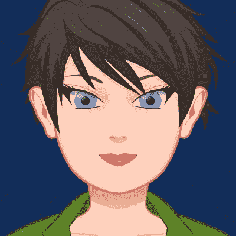
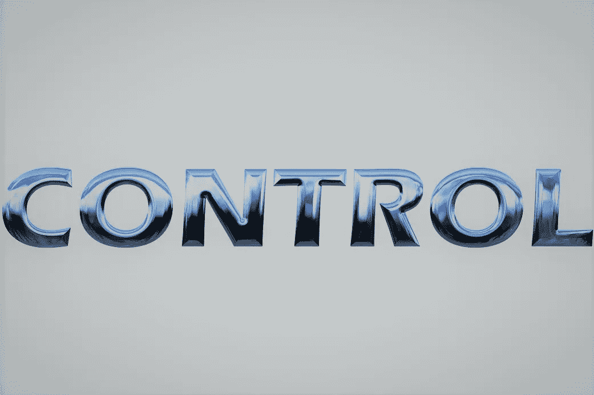

# 两个多星期以来，我几乎每天都在凌晨 3:05 醒来。

> 原文：<https://medium.com/swlh/ive-been-waking-up-at-3-05-a-m-almost-every-morning-now-for-more-than-two-weeks-5fe3a53fe89a>

# 我是说突然清醒。出汗醒了。有时被吓醒。

我从一个词、一个短语、一个场景或一个声音中醒来，这些声音是如此有力、如此充满活力，以至于它抓住了我的注意力。然后我把它写下来。在黑暗中…我希望以后能读到它。

我想这是宇宙在敲我的门。

你看，1 月 1 日，我向我承诺。毫无保留。

现在我被吵醒了。

我的新实践让我在睡觉前和醒来后写日记。每天晚上睡觉前，我都会在日记中写下我希望第二天发生的事情。我也问一个问题。

早上，我拿起我的日志，下载我对任何想要出现的东西的想法。然后我计划那天我想做什么。我认为自己有责任。

我并不是真的自愿加入这个行业的。我从来没有做过终身记者。我从来没有过日记。我完全拒绝写日记，因为我的心理模型是一个十几岁的女孩在追求一个男孩，并把她绝望的想法写在 500 页纸上。诶！

好吧。再见日记，你好日记。

我逐渐意识到日志是一种有用的工具。(在此处插入工具工蒂姆·泰勒的咕噜声。)我现在已经写了 18 天的日志了，早上和晚上都写。

在那段时间里，我收到了 13 条有意义的信息。

事情的这种转变不应该让我感到惊讶，但确实如此。

我相信我正在从源头、从我的灵魂、从意识本身获得信息。现在当我睡觉的时候，我很兴奋，想着下一条信息会是什么。我认真思考我想要的答案应该是什么。我是说真的，我为什么要浪费这么好的机会？当没有任何消息或令人困惑的回复时，我很失望。

其中一些反应非常及时。有些是我仍在试图解开的谜题。看完我的清单，让我知道你的想法。

# **十三个回答**

对我的日志问题的第一个回答是**六个字**，它们对我来说就像魔法一样。我意识到这意味着这是我未来应该写的一本书的标题。

第二个是来自一首[歌曲](https://youtu.be/sAAMZoh-_aI)的一句话。来自**兼职情人**的**歌词**，隐喻性地回答了我在日记中思考的一个问题，关于平衡和我如何才能达到我的目标。我不知道该去哪里消磨时间。我相信这句话暗示了一部分时间我是成功的，而另一部分时间我不是。这让我觉得我需要忠于我的目标。

第三部让我扮演一个穿红色裤子的**化身**，传达的信息是要发挥我化身的所有优势。这让我想知道她有什么样的天赋和技能，我欣赏别人的什么样的天赋和技能并且想要，由于我的信仰，我没有意识到自己有什么样的天赋和技能。

那天下午，我参加了一个培训。通常我不会先举手回答问题。我倾向于坐在教室的后面或旁边。我是一个快乐的内向者。那一天，我不仅选择坐在前排，而且当教练要求一名志愿者时，我在脑海中听到了“使用你的化身”，我举起了手，心甘情愿地承担了这个角色。在 30 个我不认识的人面前，我不得不帮忙放倒一个持枪的人。这是惊人和强大的，我知道如果没有这条信息，没有我的头像，这永远不会发生。

第四个回应是[发令枪](https://youtu.be/SHgP7lgdgQU)的声音——比赛开始时的枪声。它让我心跳加速。那一天，我收到了本杰明·哈迪的挑战，要求我早上 5 点起床，彻底改变我的晨间习惯。我不得不考虑一下。

第五个是视频。我看到角落里有一张**长方形桌子，旁边是一块白板，我站在几个人中间。我没有确定的例子，但我觉得这象征着我在一个新的职位上。**

第六件事是重现去年夏天的一个场景，我的一个朋友选择了一个他非常热爱的职业，突然发现他的儿子对他为获得学位而选修的一些课程不感兴趣。这个消息震惊了我的朋友。我为儿子辩护，说:“不是每个人都能从事自己热爱的工作。”就在那时，我醒来时有一种“那是一派胡言”的感觉这就像一个信仰泡沫破灭了，我看到了它的真相。我们都会做出选择。

第七张是一个银行抢劫案的影像，我发了一张照片给执法部门。我真的知道几天后将要发生的银行抢劫案吗？

八是短语**“挑战假设。”这正是我现在的目标。我不得不重新定义我认为我是谁，我能做什么。**

九岁时，我被邦·乔维的《这是我的生活》中的歌词唤醒。具体来说，**“这是我的人生，机不可失，时不再来。”**我知道这是前一天晚上我的日志问题的答案，*“我是否应该在早上 5 点开始起床练习？”我照做了。*

十号给了我两个选择。我可以驾驶单引擎飞机或双引擎飞机。这个答案回答了我的平衡问题，以及我需要关注两个目标中的哪一个。显然，我会在这两方面都成功，但其中一个可能会让我更快达到目标。

11 岁的时候，我被笑声吵醒，除了哈哈哈或者笑-笑-笑。我知道这与平衡和不把自己看得太重有关。来源要我好好玩！

我被数字 12 的**控制**这个词吵醒。我的信息是，我需要控制我的生活和我的目的地。我选择我所关注的。我选择什么时候起床，运动多少，吃什么。是我，在控制我。

13 岁的我作为一个男人推着医院的病床走向一个看不见的目的地。我们很多人都这样做。当我们看到其他人来了，并把我们的床放在一个巨大的谷仓里时，我们变得心烦意乱。我不知道这个是什么意思。还没有。

这里是最后一个 wow。直到头像信息之后，我才意识到所有这些信息之间的联系。每个人都会做梦，对吧？我们总有一天会被吵醒。但这是一连串的警醒，这是我几小时前提出的问题的清晰答案(大部分)。

本杰明·哈迪(Benjamin Hardy)的 52 周动力计划和我们近 700 人的参与，在努力实现我们的目标的同时，相互支持，相互鼓励，一直是这些奇迹信息背后的动力。

试试写日记。它不适合胆小的人。

对自己和目标做出承诺。

开始新的习惯。

打破旧的思维模式和信仰。

那么也许，只是也许你可以得到你自己问题的答案。

如果这个故事在某种程度上引起了你的共鸣，请点击“鼓掌”按钮，以便其他人能够看到它。

你准备好写日记了吗？

## 这个故事发表在 [The Startup](https://medium.com/swlh) 上，这是 Medium 最大的企业家出版物，拥有 288，884+人。

## 在这里订阅接收[我们的头条新闻](http://growthsupply.com/the-startup-newsletter/)。

