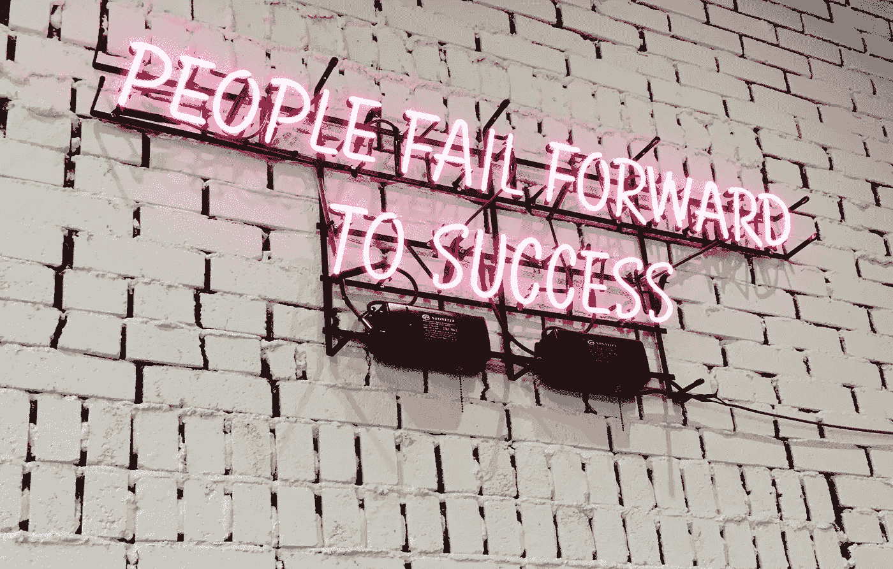

# 每当我在某件事情上失败了，我就开始庆祝，这提高了我的创造力

> 原文：<https://medium.com/swlh/ive-started-celebrating-every-time-i-fail-at-something-and-it-s-improved-my-creativity-cd478799ea87>

## 这让我成为今年更好的自由职业者。

Photo by [Ian Kim](https://unsplash.com/photos/gKs6zNil_Ro?utm_source=unsplash&utm_medium=referral&utm_content=creditCopyText) on [Unsplash](https://unsplash.com/search/photos/failure?utm_source=unsplash&utm_medium=referral&utm_content=creditCopyText)

我在学校是个成绩优异的孩子。也许是我的移民妈妈期望很高，在一个有着相似背景的孩子的教室里，或者也许是因为我的家庭并不富裕，我周围的成年人经常长时间工作…