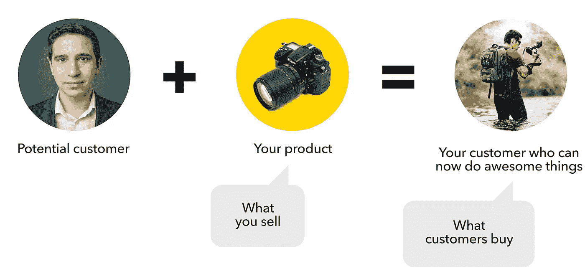

# 工作完成理论帮助你创造更好的产品

> 原文：<https://medium.com/swlh/jobs-to-be-done-theory-helps-you-to-create-better-products-a47f94a56214>

## 带有例子和见解的理论介绍。

如果你知道术语*颠覆性创新*，你应该感谢它的作者:哈佛商学院教授克莱顿·克里斯滕森。克里斯滕森认为，颠覆性创新理论并没有解释如何创造创新产品。多年来，克里斯滕森完善了一个新的理论，即要做的工作，可以总结如下:

> 人们不是简单地购买产品或服务，而是“雇佣”他们在特定情况下取得进步。

## 要完成的工作可以帮助您:

*   带出用户的底层需求；
*   从客户的角度识别竞争对手，尤其是那些不可见的竞争对手；
*   创新产品和服务，解决目前还没有解决方案的问题。

# 人们不买产品；他们购买更好的版本。

与动物不同，我们人类是复杂的系统；我们的选择不能仅仅从功能的角度来解释。例如，当我们饥饿时，我们不仅仅是喂饱自己，我们还会根据各种功能、情感和社会因素做出决定，这些因素会随着环境的变化而变化。

想象一下选择一家餐馆。你会根据是浪漫约会、商务会议还是家庭午餐做出不同的选择:**你总是同一个人**，然而你有**不同的需求和期望**，所以你雇佣帮助你完成工作的产品或服务。

JTBD 区分并分析了决定消费者选择的维度。

*   **主要工作:根据情况变化**
    例如，当你带你的老板去吃午饭以加强关系时。请注意，环境比客户特征、产品属性、新技术或趋势更重要。
*   **功能方面:实用客观需求**
    外出就餐专家准备的食物
*   **个人层面:顾客使用产品的感受**
    对食品和服务质量感到满意和放心
*   **社交维度:顾客在使用产品时如何看待他人**
    你想强化自己老练专业的形象

了解顾客购买“什么”和“为什么”购买之间的区别至关重要。露华浓化妆品公司的创始人查尔斯·雷夫森曾经这样评价他的产品:*在工厂里我们生产化妆品，在商店里我们出售希望。*

我们都渴望改善自己，提高生活质量。我们在网上购物，所以我们不会在交通上浪费一个小时。我们决定学习一门新的语言，以便在旅行时感到更加安全和自由。

> 升级你的用户，而不是你的产品。不要造更好的相机，要造更好的摄影师。凯西·塞拉

Inspired by [Samuel Hulick illustration](https://ux.useronboard.com/never-mix-up-features-with-benefits-ever-again-612115076cc)

# 英雄是顾客，而不是产品

iPhone 7 Plus 是第一款结合了模糊人像背景软件的双摄像头手机，就像单反相机一样。苹果广告不是指技术，它告诉我们如何通过他们的产品成为更好的摄影师。

Become a better photographer

在苹果广告中，故事的主角是用户，而不是产品。如果角色互换，信息就会失去效力，就像这个广告一样。

What happens when the hero of the story is the product

微软没有解释该产品如何改善用户的生活，而是花了 90 秒(我们的时间)来讲述他们的笔记本电脑有多酷。

想象一下第一次约会:你是愿意看到那个整晚都在热情描述自己的人，还是愿意给那个告诉你你们可以一起做多少好事的人第二次约会？

# 如果你知道用户的工作是什么，你就能识别出真正的竞争对手

## 要做的工作不是任务。

*   任务是一种行动或活动(例如拍照)，而 JTBD 只能被描述为消费者的一种进化(成为更好的摄影师)。
*   随着时间的推移，任务变得更加频繁。JTBD 保持不变。

艾伦·克莱门特[很好地解释了区别](https://jtbd.info/does-anyone-actually-want-to-do-jobs-20e717e492c0)，如果你想更深入的话。

现在，想象自己是一名项目经理。你的工作是让每个人了解项目的最新进展。或者更好，你想成为一名优秀的管理者，被公认为优秀的管理者。

如果我们专注于任务，像 Basecamp 这样的项目管理应用有不同的竞争对手，或多或少类似。如果我们将“工作”考虑在内，我们就会明白 Basecamp 也与电子邮件、Slack、站立会议等竞争。就像短途飞行对抗高速列车或视频会议一样。

# 从要做的工作开始创新产品。

## 施乐 PARC 公司:复印机对电脑

在日本人开始生产更便宜的产品之前，施乐一直垄断着复印机市场。公司如何应对这样的威胁？以下是通过分析产品和竞争对手得出的一些典型答案:

*   定价杠杆(降低利润)
*   添加新功能
*   创造更简单的产品

施乐敢于超越。1970 年，他们成立了施乐 PARC 公司(帕洛阿尔托研究中心),远离东海岸总部的影响。施乐 PARC 公司是现代办公场所中许多现代计算元素的发明者和孵化器。

People do not want to have more powerful or cheap photocopiers; they want to communicate more effectively.

如果你想知道为什么你的电脑上有一个苹果的标志而不是施乐的标志，看看这个来自《硅谷海盗》电影的节选。

Why Xerox didn’t become a leader in digital products and services

## 柯达:胶卷与手机

1888 年，柯达发明了一种产品和一种无与伦比的万无一失的服务:顾客拍照，把相机送到柯达，柯达把相机和照片一起送回来。业余摄影由此诞生。

A perfect example of a proto Jobs To Be Done.

1976 年，美国 90%的胶卷和 85%的相机都是柯达的。

Kodak’s monopoly in 1976

1975 年，柯达的员工史蒂文·萨森制造了历史上第一台数码相机。1989 年，萨森制造了第一台数码单反相机，但柯达为了避免蚕食胶卷市场，终止了这个项目。

The prototype of the first digital camera created by a Kodak employee

随着数码相机的出现，柯达的销量开始下滑。智能手机入口打出最后一击。2012 年，柯达宣布破产。

Kodak declared bankruptcy in 2012

# 那么，从哪里开始呢？

永远从人开始。观察、调查和分析人们的需求和行为。顾客“雇佣”和“解雇”的产品讲述了一个关于功能、情感和社会方面的故事。如果你深入分析他们，你会发现客户的奋斗进步。

改变习惯让我们害怕，即使它们很昂贵、很累、没有效果。四种力量推动和吸引顾客远离购买。

推动采用新解决方案的力量:

*   **当前解决方案的问题**
    你要做的:展示当前产品的问题
*   **新产品的吸引力**
    你要做的:展示新产品如何解决问题

改变的对立力量:

*   焦虑和不确定性
    你需要做的是:让消费者放心，改变是迅速而容易的
*   你需要做的:消除与现状的不合理联系

这些苹果商业广告很好地描述了雇佣/解雇一个产品的力量。

# 你想知道更多吗？

我只是开始触及表面。如果你想深入了解 JTBD，我推荐以下资源:

*   [与运气竞争:创新和客户选择的故事](https://www.amazon.com/Competing-Against-Luck-Innovation-Customer/dp/0062435612/)。克莱顿·克里斯滕森的书
*   [克雷顿·克里斯滕森关于 JTBD 的演讲视频](https://www.youtube.com/watch?v=sfGtw2C95Ms)
*   [伟大的产品始于现实问题](https://www.intercom.com/books/jobs-to-be-done)。
    免费的 JTBD 内部通信电子书
*   [要做的工作:从怀疑者到相信者](https://youtu.be/VNTW_9mFM7k)。
    与西安·汤森研究部主任的视频对讲机
*   JTBD 信息。艾伦·克莱门特编辑的媒体频道
*   [JTBD +结果驱动的创新](https://jobs-to-be-done.com/)
    创新咨询公司 Strategyn 创始人托尼·乌尔维克的媒介渠道

## 这篇文章发表在 [The Startup](https://medium.com/swlh) 上，这是 Medium 最大的创业刊物，拥有+400，714 名读者。

## 在此订阅接收[我们的头条新闻](http://growthsupply.com/the-startup-newsletter/)。

