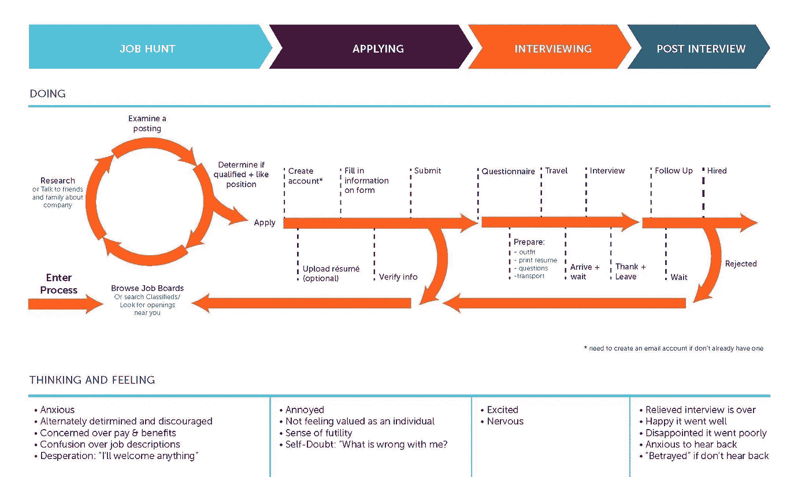

# 要做的工作:将客户需求转化为产品解决方案

> 原文：<https://medium.com/swlh/jobs-to-be-done-turn-customer-needs-into-product-solutions-9e3424a71671>

待完成工作(jobs-to-Done，JTBD)是哈佛大学教授克莱顿·克里斯滕森发明的一种简单方法，它允许公司和团队识别客户行为背后的真正机会。“要做的工作”框架试图将焦点从人们当前的购买行为上移开，而是回避这样一个问题:“人们*真正*想要完成的是什么？”

在确定了客户试图完成的基本任务或“工作”之后，产品设计中的待完成工作框架帮助产品团队和设计师塑造他们的产品以完成该工作。

伟大的想法似乎随处可见。 [Alexa](https://www.amazon.com/b/ref=amb_link_10?_encoding=UTF8&node=16067214011&pf_rd_m=ATVPDKIKX0DER&pf_rd_s=merchandised-search-leftnav&pf_rd_r=3P92VAZTX2DQMANDBJ0A&pf_rd_r=3P92VAZTX2DQMANDBJ0A&pf_rd_t=101&pf_rd_p=68125316-e5f7-413d-be3f-d0ee0c1e4f47&pf_rd_p=68125316-e5f7-413d-be3f-d0ee0c1e4f47&pf_rd_i=9818047011) 正在为普通家庭增加人工智能，[特斯拉](https://www.tesla.com/)正在改变我们与旅行的关系。然而，这些成功的故事是万里挑一的。

待完成工作框架使 UX 设计师能够将客户需求分解为具体的流程步骤。由此产生的“工作地图”提供了一个将客户需求转化为产品解决方案的结构。

This “job map” demonstrates the tasks a job applicant has to go through when applying for a job.

> 超过 50%的新产品没有达到公司的预期。只有 1/100 的新产品能弥补其开发成本。只有三百分之一的新产品对客户行为、产品类别或公司的增长轨迹有重大影响。”—史蒂文·约翰逊在 [*中写道:我们如何走到今天:成就现代世界的六大创新*](https://www.nytimes.com/2014/12/28/books/review/how-we-got-to-now-by-steven-johnson.html) *。*

使用工作完成法，很容易看出人们并不真的需要一个四分之一英寸的钻头，而是一个四分之一英寸的洞。他们不仅买冰淇淋，还买庆祝、联络感情和放纵。这种简单的视角转换打开了对产品客户的新见解和大量隐藏的机会。

待完成工作是一个工具集，可以帮助任何公司提高成功的几率。

(Source: [Tony Ulwick](https://jobs-to-be-done.com/outcome-driven-innovation-odi-is-jobs-to-be-done-theory-in-practice-2944c6ebc40e) pioneer of the Jobs-to-be-Done Theory)

# 提高奶昔销量

克莱顿·克里斯滕森在讲述他为麦当劳做顾问的经历时，对这个概念做了最好的介绍。最初，麦当劳通过市场细分聚集顾客，让他们描述自己理想中的奶昔——*浓奶昔比稀奶昔好喝吗？你喜欢巧克力味的还是水果味的？*尽管如此，根据反馈，研究表明，改造他们的奶昔并没有带来销售额的增加。

克里斯滕森和他的同事花了一些时间观察麦当劳的顾客，试图找出人们购买奶昔的动机，令他们惊讶的是，他们发现近一半的奶昔是在早上 8:30 左右购买的。

他们的研究表明，许多顾客都有类似的经历——漫长而无聊的通勤，以及期待一个饥饿的早晨。他们也总是有一只手空着，经常穿着他们不想弄脏的衣服。

“要做的工作”框架帮助麦当劳认识到，除了简单地提供一杯理想的奶昔，还有更多的事情要为顾客完成。意识到这一点，该公司创造了一种更稠的早餐奶昔，其中含有水果块，保质期更长。**这一新方向有助于提高他们的价值以及对客户的销售。**

那么，奶昔实际上为顾客完成了什么工作呢？纽约咨询师艾伦·克莱门特(Alan Klement)将“要做的工作”描述为“每当消费者打算将现有生活状况转变为更喜欢的生活状况时都会经历的过程，但因为有限制因素阻止她，所以她不能这样做。”奶昔有助于将早晨的通勤变成一种更受欢迎的状态。

有鉴于此，我们可以看到“工作”不仅仅是一种与产品或服务直接相关的情况，而是**一种渴望转变的生活情况**。揭示客户希望完成的“工作”可以提供更诚实的洞察力，以及为公司未来投资创造更大价值的潜力。

# 什么是“要做的工作”不是

1.  “工作”并不是客户对他们希望在新产品中看到什么的明确愿望。亨利·福特说得好:“如果我问人们想要什么，他们会说是更快的马。”顾客通常不可靠，也不知道他们寻求的情感价值。
2.  最终，“作业”不是为解决方案增加价值的功能。专注于增加功能可能会导致误导的产品，而不是基本的生活状况需要转变。

# 什么是“要做的工作”

1.  “工作”是一个人试图完成的任务。
2.  “工作”的特征**与客户类型和场合**不同。
3.  最终，它们**是**可操作的陈述，指导新解决方案的设计。

# 情感工作与职能工作

在努力揭示“工作”时，有两种类型的“工作”需要观察第一是功能性的，第二是情感性的。

“功能性工作”相当简单……它们是消费者试图满足的实际问题。另一方面，“情感工作”与消费者*对产品的感觉*有关，他们相信的是他们使用产品的感觉。

Stephen Wunker、Jessica Wattman 和 David Farber 在他们的书[中引用了著名的 Beats By Dre 耳机的例子。Beats](http://www.innovationmanagement.se/2016/11/10/Jobs-to-be-Done-a-roadmap-for-customer-centered-innovation/) 由音乐偶像德瑞医生共同创立，广告称这是对 M.I.A .法瑞尔·威廉姆斯和格温·史蒂芬妮等音乐人的回应，这些人再也无法忍受他们的粉丝用低质量的耳机听他们的音乐。然而，在音频市场，像[森海塞尔](https://en-us.sennheiser.com/)、[博斯](https://www.bose.com/)和 [JBL](https://www.jbl.com/) 这样的公司为类似的价格范围创造了更高质量的产品，并不难找到关于 Beats 耳机中低端质量音频的评论。

从“功能性工作”的角度来看，Beats 甚至不应该在消费者心目中成为最好的产品。然而，在 ***待完成的工作*** 中，他们只是简单地问了一个问题，“简单地说，一套 Beats 耳机的 300 美元的价格标签就是一张餐厅酷桌的座位费。”

然而，由于 Beats 使用 Dre 的 Beats 雇用了大量运动员和音乐家的图像，酷的满足感(情感工作)使 Beats 成为耳机市场的主要竞争对手。购买 Beats 而非 Bose 的消费者不仅完成了接收高质量音频的“功能性工作”，还完成了在同行中的理想社会形象。

A seat at the cool table. “Emotional jobs” relate to how the consumer *feels* about a product, and what they believe is others’ perception of them using it.

# 待完成工作框架中的“工作”驱动因素

Beats by Dre 的例子很好地解释了消费者购买决策背后的驱动因素。“工作”驱动因素是帮助缩小消费者选择特定产品的原因的工具。这些“工作”驱动因素分为三类:

*   态度
*   背景
*   情况

**态度**是消费者的性格，在同龄人中的形象，以及他们对他人的期望。认为自己是流行文化潮流的消费者更有可能购买 Beats 耳机。Beats 耳机作为流行明星的一种反应而被开发的历史成为了消费者的形象。消费者了解并欣赏最新明星的艺术。

相反，从事与技术相关的工作或尖端行业的消费者可能会选择森海塞尔或 Bose 耳机——不是因为它们不时尚或时髦，而是因为它们展现了一种“知情消费者”的形象他们的同龄人在技术的细微差别上更内行，也更有教养。对这个人来说，Beats 耳机可能意味着缺乏知识，因为它的音频质量较低。这些消费者正在努力满足他们同行的期望。

**背景**是消费者背后的长期背景。消费者的背景包括文化动机、家庭期望和社会经济因素；比如一个想显得新潮，但来自保守家庭的少年，不喜欢嘻哈和流行明星传达的形象。

这位消费者可能仍然会购买 Beats 耳机，但会选择耳塞版本，而不是较大的挂耳式产品。虽然较大的耳挂式耳机是标志性的，但耳塞允许更谨慎地表达个性。这种购买可以帮助他们满足同龄人和家人的期望。

第三个要素，**环境**，更多的是关于影响消费者决策过程的短期因素。例如，如果一个消费者是两个赛季的运动运动员，每天必须训练和练习的直接环境会影响他们的购买行为。考虑到他们的情况，这位消费者可能会选择 Powerbeats 耳塞，这种耳塞经过专门的人体工程学设计，可以保证运动性能，不会从耳朵中掉出。

# 结论

顾客不购买产品，因为产品本身就是目标。人们这样做是为了满足潜在“工作”的需求“工作”是一种渴望改变的生活状态。例如，一名运动员在锻炼中寻找更多动力，可能会购买 Beats 耳机；一名职业人士开始了长达一小时的早晨通勤，在高速公路拥堵之前，他从汽车餐厅买了一杯草莓奶昔。通过观察客户生活中的这些情况，并应用待完成工作框架，产品设计师可以设计出为客户提供长期价值的产品。

待办事项为思考您的业务提供了一个清晰的框架，勾勒出了发现新市场、新产品、新服务的路线图，并有助于创造创新机会，以创新的方式走向成功。

👋🏻**您好！感谢阅读并到达文章结尾。**🙂

我现在可以通过我的 UX 课程 让人们开始他们的 UX 设计师生涯 [**，或者继续在**](http://uxwithmiklos.com/) **[**导师课程**](https://mentorcruise.com/mentor/miklosphilips) 上进行指导。**

跟我一起学习 UX，费用只有蹩脚训练营的一半。获得认证&为高薪工作建立投资组合。7 天免费试用[http://uxwithmiklos.com](http://uxwithmiklos.com)

你也可以在推特上关注我。 ➣

## 这篇文章发表在 [The Startup](https://medium.com/swlh) 上，这是 Medium 最大的创业刊物，拥有+368，954 名读者。

## 在这里订阅接收[我们的头条新闻](http://growthsupply.com/the-startup-newsletter/)。

