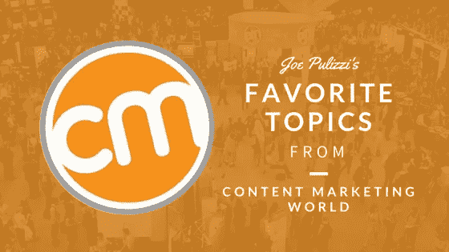
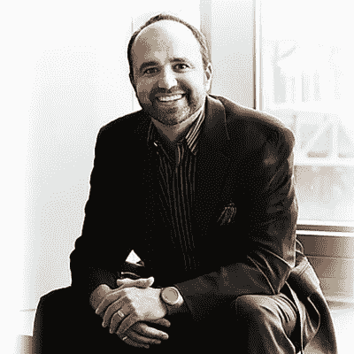

# 乔·普利兹概述内容营销世界

> 原文：<https://medium.com/swlh/joe-pulizzi-recaps-content-marketing-world-a06fc09abcd>

Content Marketing World

Joe 在整个行业被称为内容营销的教父，他的成功很容易看出为什么。

他的公司“内容营销学院”是内容营销领域领先的教育和培训机构。

CMI 还举办了世界上最大的现场内容营销活动:内容营销世界。

今天，Joe 将从 CM World 2017 中总结出所有要点。他谈论热门话题以及如何在内容营销领域茁壮成长。

在下一次身着橙色的 CMI 活动中寻找 Joe。

# 内容营销世界

Joe 在 2011 年推出了第一个内容营销世界。他把自己的期望定得很低，希望大约有 100 人出席。

嗯，600 人参加了这次活动。

今年，来自 50 个国家的 3500 多人参加了 CM World 大会，在[了解有效的内容营销](http://www.magnificent.com/magnificent-stuff/successful-content-marketing)策略。来自世界各地的 200 多名演讲者前来教育人们。

不全是生意。也有很多舞蹈、食物、饮料和社交活动。

# 世卫组织参加了吗？

Joe 说，许多公司都希望在一致的基础上向客户提供有价值的相关内容，但不知道如何执行这项任务。

这就是为什么各行各业的人都来参加 CM World。大多数与会者包括从事博客、播客和印刷媒体工作的人，但任何从事公共关系或传播工作的人都可以从这次活动中受益。许多处于高级职位的营销官员也参加了会议，寻找实施新的[内容营销](http://www.magnificent.com/content-marketing)战略和战术的方法。

观众大多由“实干家”组成，他们希望与自己的观众直接交流，并看到有利可图的行为。

# 所有企业都必须把自己当成媒体公司

乔说，赢得观众的最好方法是把自己想象成一家媒体公司，不管是哪个行业。

无论你的业务是零售、法律、房地产还是其他，你都需要向你的客户提供有价值的相关信息。

乔说，公司应该找到新的途径来赚钱，而不仅仅是销售产品和服务，如付费活动、赞助和网络研讨会。

毕竟，电子公司中最大的媒体公司根本不是媒体公司，而是一家名为 Arrow Electronics 的零售企业:电子元件的亚马逊。

控制权完全掌握在消费者手中。如果公司不创造一致的、有规律的、相关的、有趣的、有价值的内容，客户是不会在意的。你会被忽视。

所有企业都应该像媒体公司一样思考和行动，而不是像媒体公司一样赚钱。

# 建立目标受众并创建相关内容

不管是哪个行业，你都希望建立忠诚度和信任度，这样你的受众就会产生有利可图的行为。

乔说，许多公司在制定内容战略时犯了一个大错误:他们为广大观众创造内容。

如果不缩小受众范围，你将永远无法[创造相关内容](http://www.magnificent.com/magnificent-stuff/how-to-begin-content-marketing)，你的受众也不会关心你。

从弄清楚你的客户面临什么样的问题开始。与客户和您的销售团队交谈。获得这些信息后，您可以创建内容来帮助他们解决这些问题。

一旦你展示了你作为行业领导者的知识和权威，你的观众将更有可能表现出有利可图的行为。

成为一个伟大的讲故事的人。创作能唤起情感并对人们的生活留下深刻影响的内容。Joe 说最好的内容可以帮助人们找到更好的工作或者过上更好的生活。稍微拨动一下心弦！

确保自己与众不同，让自己从竞争对手中脱颖而出。

# 将内容传递给合适的受众

开始时，Joe 建议将 50%的精力和资源用于创建内容，另外 50%用于向目标受众推广内容。在你的内容营销战略中投入[的努力和你的实际内容是至关重要的。](http://www.magnificent.com/magnificent-stuff/why-use-content-marketing-strategy)

当然，某些方法比其他方法更有效。确保公司能够控制他们的受众是很重要的。

# 录像

Joe 看到许多企业涉足视频，但却不够认真。这是一个巨大的错误。

他举了珍妮·多恩的例子。她用最少的预算和一个 YouTube 频道创建了密苏里之星绗缝公司。现在，她的公司是汉密尔顿市最大的雇主，她的频道拥有 20 多万订户。

乔说，许多公司一次上传多个视频，或者没有恰当地吸引观众。他说向特定的观众提供一致的视频是很重要的。

# 社交媒体和技术

有很多很棒的工具可以用于工作流、日历、算法、自动化等等。

虽然这些对开发杠杆作用很有帮助，但 Joe 不建议你的[内容营销策略](http://contentmarketinginstitute.com/)依赖这些方法。

相反，专注于一个需求或挑战，然后找出如何整合技术来帮助你克服挑战。如果你不创造有价值的内容，尖端技术是无关紧要的。

Joe 还提醒依赖社交媒体来吸引你的观众。为什么？你没有控制权:脸书才是，他们想利用你赚钱。为自己的受众付费不是一种可持续的营销策略。

# 订阅者

Joe 说建立(和保持)你的观众的最好方法是建立订户。

让他们订阅多种时事通讯和内容。通过订阅，您可以完全控制您的受众。

但是先不要卖给他们任何东西！首先建立威信和信任。

Joe 一直等到拥有超过 10，000 名订户后，才推出杂志、网络研讨会系列和其他付费活动。

# 内容营销的下一步是什么？

不管你喜不喜欢，企业媒体不会消失。

事实上，由于大公司有投资预算，Joe 预计在未来几年将会看到大量的合并和收购。

他说，这可能会彻底改变[的内容营销格局](https://www.shweiki.com/blog/joe-pulizzi-content-marketing-evangelist/)，每个人都应该为此做好准备。

***乔普利兹刚刚发布了他的第五本书，*杀戮营销*，在*** [***亚马逊***](https://www.amazon.com/Killing-Marketing-Joe-Pulizzi/dp/1260026426/) ***上有售。***

ABOUT JOE PULIZZI

Joe Pulizzi 是领先的内容营销教育和培训机构[内容营销学院](http://contentmarketinginstitute.com/)的创始人，该学院包括世界上最大的面对面内容营销活动[内容营销世界](http://contentmarketingworld.com/)。乔是来自内容委员会的 2014 年约翰·考德威尔终身成就奖的[获得者。乔的第四本书](http://thecontentcouncil.org/Publishers/The-Content-Council-Honors-Industry-Trailblazer-And-CMI-Founder-Joe-Pulizzi) [*内容公司*](http://contentmarketinginstitute.com/content-inc/) 刚刚发布。他的第三本书 [*史诗内容营销*](http://epiccontentmarketing.com/) 被《财富》杂志评为“[2013 年](http://money.cnn.com/gallery/leadership/2013/10/31/best-business-books.fortune/3.html)必读的五本商业书籍”之一。如果你见到乔本人，他会穿橙色的衣服。乔·普利兹

Magnificent Marketing Agency — Austin, TX

## 这个故事发表在 [The Startup](https://medium.com/swlh) 上，这是 Medium 最大的创业刊物，拥有 333，253+人关注。

## 在这里订阅接收[我们的头条新闻](http://growthsupply.com/the-startup-newsletter/)。

