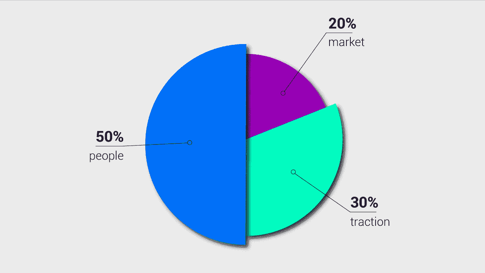

# 约翰·范·米尔(Johan van Mil)认为，创业公司的创始人是黑客、潮人还是骗子

> 原文：<https://medium.com/swlh/johan-van-mil-weighs-in-on-which-startup-founder-is-the-hacker-the-hipster-or-the-hustler-4cf97915e0a2>

© Jolien Evaert | Story Chief

> ***“我总是在市场、SaaS 和数据公司中寻找最优秀、最聪明的初创公司创始人。我在一个创始人身上寻找的是雄心、精力和真正的执行技巧。”——约翰·范·米尔，匹克资本*** 的联合创始人兼管理合伙人

[约翰·范·米尔](https://twitter.com/johanvanmil?lang=en)是一名*参议员*。

一个什么？

简而言之，他是一名连续创业者，后来成为投资者——来自荷兰。

以下是更多关于约翰的数据:

*   他身高刚刚超过 6 英尺。
*   他有两个漂亮的孩子
*   他创办了 12 家公司。
*   他写了  [**1 本书(Ondernemen doe je！**](https://www.bol.com/nl/p/business-bibliotheek-management-ondernemen-doe-je/1001004002382767/?suggestionType=typedsearch&bltgh=hxN16TFZ-Q9xn2twElNEZg.1.3.ProductTitle))**。**
*   他在阿姆斯特丹自由大学的硕士项目中教授应用经济学和企业家精神长达 4 年。
*   目前投资于 **15 家创业公司**(继 **3 家近期退出**上市公司)，总基金规模**€1800 万。**

关于最后一点，当我们说“他”时，我们指的是他和他在 [Peak Capital](https://peak.capital/) 的联合创始人，这是一家荷兰风险投资公司。他们投资快速增长的市场、SaaS 和数据初创公司。

他们也提供一些很酷的推特行为。

因此，Johan 是上个月在阿姆斯特丹 tnw 2018 沥青塔举行的**marketing 2020**vertical 的众多摇滚明星评委之一。

[故事主管](https://storychief.io/)和其他**颠覆性的 SaaS 初创公司**一起，有幸接受了约翰的提问。他的问题是非传统的，这是有道理的，因为他不是一般的普通投资者。

但是现在轮到我们问他一些问题了。

## Q1:让我们倒回去一点，回到 1990 年，回到 19 岁的约翰·范·米尔。你在哪里，在做什么？

实际上，我在比利时安特卫普大学学习。

毕业后，我在几家企业工作，直到我意识到拥有自己的公司对我来说更有意思——无论是在财务上还是职业生涯上。在我学习期间，我已经开了几家公司。

## Q2:你从连续创业者到投资人的思维过程是怎样的？

其实很多人来*我*。

他们问我愿不愿意投资他们的公司，作为一个亲力亲为的投资者，帮助他们取得成功。

2007 年，我问自己，“我已经有 7 家创业公司了，那么我能做些什么来帮助其他创业者呢？”

我决定，我宁愿选择帮助他人的道路，并将其与建立风险投资基金结合起来。因此，我和一些碰巧也是企业家的好朋友一起，创立了**顶峰资本**。

我们不仅继续投资资金，还对快速成长的科技初创公司提供实际支持。

## Q3:好的。你已经不止一次提到这种“亲自动手”的方法了。你的投资组合中有 15 家公司，你如何做到这一点？能详细说说吗？

是的，嗯，举个例子……我现在正在去一家创业公司的路上。

我们每两周与我们投资组合中的每家公司会面一次，有时一周一次。如果他们已经开始运行，一切都很顺利，比如说 [Catawiki](https://www.catawiki.com/) ，那么我们的参与就少了。

这是一个问我们自己的问题，“我们如何才能加快这家公司的发展，让他们更加成功？”

**创业公司需要做出正确的决定:**

*   关于他们团队的建设，他们的产品，他们的市场。
*   他们需要在正确的国家。
*   他们需要停止做不重要的事情。

## Q4:对。所以。有产品，也有产品背后的人。当你决定是否投资某个创业公司时，你能给我们一个“产品对人”的百分比吗？

人更重要。

[当我们考察一项潜在投资时，我们使用一个评分系统](https://peak.capital/focus/)，如下所示:

© Jolien Evaert | Story Chief

*   50%:管理公司的人
*   20%:市场
*   30%:牵引力

> ***“产品可以变化。市场会变。但改变创始团队是非常困难的。”***

## 问题 5:当你看到创始团队时，你会问自己什么？

完成了吗？

他们是否具备经营一家成功的 SaaS 公司的所有技能？

他们有黑客、潮人和骗子吗？

## q6:{笑}什么？你得解释一下 H 级创始人的神圣三位一体。

当然可以。

我们不投资单一创始人的创业公司。至少有两个创始人，但我们更喜欢 3 个创始人的创业团队。原因如下…

需要有一个:

*   黑客:他们的重点是开发和构建产品。
*   **潮人:**他们关注的都是客户视角和用户界面/前端(UI/UX)。
*   **Hustler:** 他们很有个性，他们真的很想做创业公司的代言人。

© Jolien Evaert | Story Chief

如今，每个人都可以创办公司，但不是每个人都能真正长时间、每天拼命工作，并保持执行力。

> ***“他们实施解决方案的速度如何？”***

基于他们的角色，创始人应该有一个焦点。

一天只有 24 小时。

> ***“那些时间都集中在哪里？”***

它可能是寻找最适合的市场或者寻找最好的开发者。

很难建立一个成功的科技公司，因为总是有太多的想法被提出来。但从投资者的角度来看，我们希望创始人对我们投资的产品给予 10000%的关注。

他们不应该涉足多个创业公司。

## 这很公平。那么，不完整的创始团队呢？他们可以外包开发吗？

这要看公司所处的阶段。

如果你有两个没有任何技术专长的骗子，那么你需要外界的帮助来打造你的产品。

但是一旦你意识到你的产品适合市场，你就应该找一个首席技术官来雇佣内部技术人员。否则你的速度将会减慢，如果你在那个时候外包出去，一切都会变得更加困难。

现在，当你扩大规模和国际化，那么你可能会外包小型独立项目。

因此，在早期阶段或扩大阶段，你应该外包。

我们不投资没有自己技术的公司。创业公司必须在内部开发产品。

## 峰值资本的投资标准似乎非常明确。但是在投资标准之外，您在#TNW2018 的营销 2020 推介活动中提出了一个特殊的行为问题。

## 你问我们的首席执行官兼联合创始人，“是什么让你夜不能寐？”请问你为什么选择这样的问题？

是的。我问过了。

嗯，我这个问题的目的是想看看一个创始人的脑袋在哪里。他们的焦点在哪里，是否在正确的地方。

这可以追溯到创始团队，以及他们是否利用他们的 24 小时来关注需要做什么来执行。

## 那么我会问你同样的问题。是什么让你夜不能寐？

{笑}

我想…有时候，是我年幼的孩子。

{笑}

当然，我是在开玩笑，但是任何读到这篇文章的父母都会喜欢的。

但是，回到你的问题。我认为让我夜不能寐的主要事情是为我们投资的正确的公司找到正确的人。

创始团队下面的一层至关重要——负责营销或客户成功或业务其他关键部分的人员。

真正理解需要雇用比自己更好的人担任这些角色的创始人——这些是会成功的创始人。

很明显，创始人在经营公司。我们没有决定谁应该被雇用，但我们可以帮助他们评估不同的选择。我们甚至可能参加关键角色的最后几轮面试。

## Q10。如果你不介意，我想问你一些更私人的问题。你提到了你的孩子。请多告诉我一些关于他们的事情，以及你的工作生活平衡是怎样的。

我有两个孩子——我 8 岁的儿子朱利安和 6 岁的利夫。她的名字是比利时名字，李维。

现在，我的工作生活平衡得很好。这也是我成为全职投资人的原因之一。

曾经有一段时间我看不到我的孩子。我们过去住在阿姆斯特丹的市中心。现在我们在阿姆斯特丹郊外一个更加宁静的乡村地区。这里没有交通堵塞，极大地改善了工作与生活的平衡。

## 问题 11:你对那些自己也有小孩的创业者有什么建议吗？

科技创业公司的创始人不得不夜以继日地投入他们的时间，清晨和深夜是常态。

在一天结束时，他们可能会有一些休息，但很少在白天。

我会告诉这些创业者:

1.  住在你工作的地方附近(如果可以的话)。
2.  在家工作(如果可以的话)。
3.  不要在通勤上花费太多，或者在火车上编码等等。
4.  雇佣比你更优秀的人，这样你就可以把空闲的脑力花在如何改善公司上，而不是花在日常事务上。
5.  当建立你的团队时，不要只看薪水，而是要发现员工带来的价值。
6.  在你开始创业之前或开始盈利之后，找一个好的配偶，生孩子。{ Laughs }当然，那是个玩笑。

## 玩笑归玩笑

约翰·范·米尔有相当多的故事要讲，而且他有几天的个性。

尽管他的简历令人印象深刻，但作为一名*众议员，*他出人意料地非常平易近人*。*

尤其是当一个人从他的推特时间线上看到这样的推文时:

我是说，谁会不认同呢？[故事长](https://storychief.io/)可以。

你是一家早期创业公司，希望成为你所在领域的思想领袖吗？

故事长为你准备了一个计划。

## 这篇文章发表在 [The Startup](https://medium.com/swlh) 上，这是 Medium 最大的创业刊物，拥有 343，876+人关注。

## 在这里订阅接收[我们的头条新闻](http://growthsupply.com/the-startup-newsletter/)。

