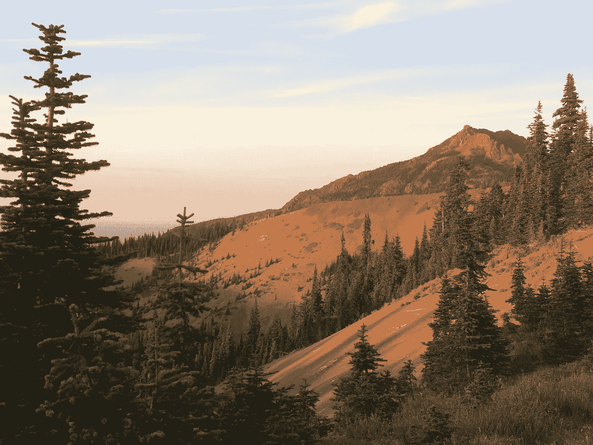
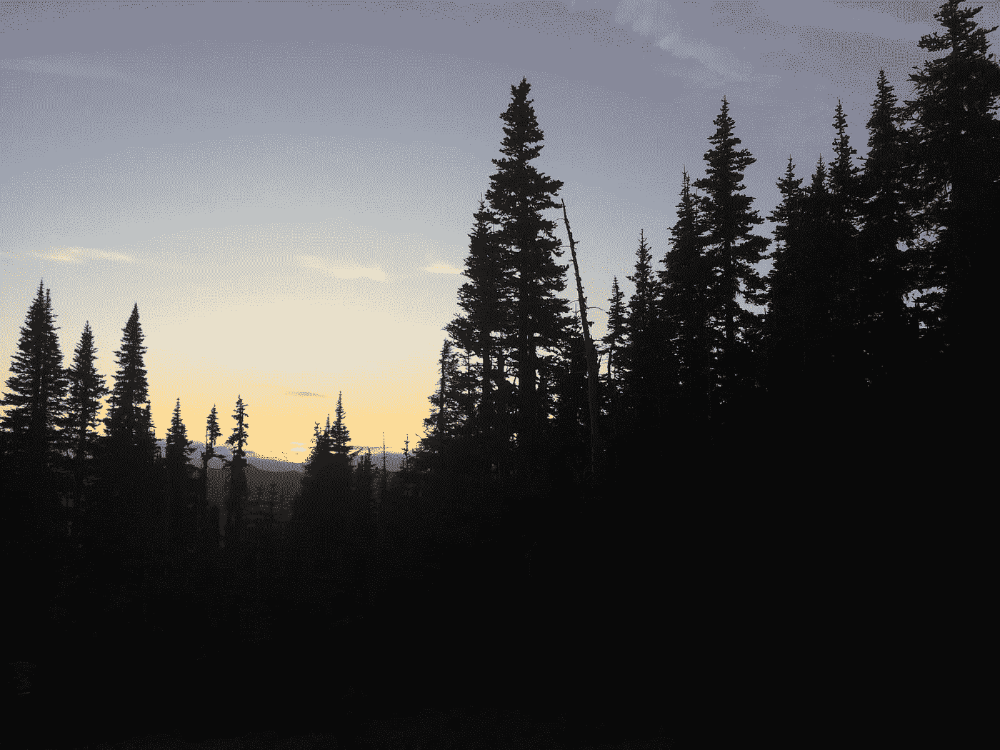

# 登山之旅——我自由职业的第一年过得怎么样

> 原文：<https://medium.com/swlh/journey-to-the-mountain-how-my-first-year-in-freelancing-went-53aaf18b653b>

Hurricane Ridge, WA

这张照片是在飓风山脊的顶部拍摄的。

为了访问这个网站，你必须从西雅图乘渡船或者从奥林匹亚向北到安吉利斯港。然后，你必须支付一笔费用，在一条狭窄弯曲的路上开始一个小时的旅程。走到这条路的尽头，你会发现一个小型停车场、游客中心和白雪皑皑的奥林匹克山脉的锯齿状山峰。如果你在身后的小山上走一小段路，普吉特湾就在你和远处的温哥华岛之间。

站在两棵松树之间，在拍摄这张照片的过程中，我意识到——不管接下来发生了什么——我是自愿来到这个地方的。我已经一路写到了山顶。

# 到达那里是一段漫长的旅程。

我在一种相当悲惨的状态下开始了 2017 年。我觉得漫无目的。我在努力完成一部我知道不会赚一分钱的电影。在过去的几个月里，我一直在为并不存在的问题担忧，并试图帮助那些我无法帮助的人。我的大部分时间都花在为最低工资烹饪鸡肉上，晚上则花在攻读学位上。

我花了大半辈子的时间认为自己注定要成为一名编剧。我硬盘上的几个推测脚本草稿就是不幸的证明。但是随着年龄的增长，我越来越意识到我的欲望与电影制作艺术无关，而是与讲故事的艺术有关。

**我喜欢讲故事**。整个高中时期，我都在灵媒中间跳来跳去，拼命想找到一条创作的道路。我尝试写博客。我写诗，画漫画。我创作音乐，并最终从事编剧工作。

**我选择了我发现最成功的媒介。我找到了一个能让我投入创作热情的项目。我能够和几十个人一起工作，学到了很多关于电影制作的东西。但问题是，我已经在 2016 年春天完成了这个项目的工作。我是一个失业的讲故事的人——在等待项目完成的数年和寻找其他人将我的故事交给他们之间进退两难。**

编剧最大的挫折是你没有创作出一个完整的项目。你正在创建一个蓝图。没有金融家和电影制作人，你的故事在页面上本质上是没有价值的。

这就是自由职业的用武之地。

今年春天，我决定看看是否能通过在线写作获得收入。我把精力集中在创造性写作上，并着手内容工厂的工作。

那…是个错误。

我很快了解到，内容工厂是一场通往底层的竞赛，而不是通往成功的途径。我面临着全球范围的竞争，被迫以远低于我最低工资的工资水平竞争。出于沮丧，我接受了一份将电子书改编成电影剧本的工作。这项任务花了我一周的时间，而我最后的薪水还不到在厨房工作一天的时间。

**通过这件事，我知道了营销的重要性**。我四处宣传我的能力。我建立了一个网站，学会了如何向顾客收费以及收取多少费用。经过几个月的寻找，我找到了一个潜在客户。三个星期和几个咨询会议之后，我已经为自己订好了夏天剩下的时间。

# 所以，我辞职了。

辞去工作去追寻梦想的感觉很奇妙，但事实是，我几乎没有冒任何个人风险。我在做兼职，从法律上讲，我挣的钱不能少于我已经挣的钱。我和那家公司友好地分手了，并且知道如果我需要额外的收入，有三个地方可以雇用我或者重新雇用我。但最重要的是，我有一个强大的支持系统，我的生活费用通过其他方式支付。

我决定 2017 年的剩余时间将致力于观察这项伟大的实验是如何进行的。我学会了如何与客户交谈。我确保上交了要求的每周状态报告，并且知道如何操作我的发票软件。

整个夏天，我都意识到了最后期限的重要性(和坏处)。当我想写的时候，我开始写得少一些，当我不得不写的时候，我开始写得多一些。我明白了这份工作与天赋没有多大关系。

成为一名成功的自由职业者并不意味着你有天赋。**意思是你工作，你努力工作。**

这意味着当别人想去吃饭或去集市时，他们会拒绝。这意味着令人作呕地通知我的家人，无论何时有人想叫外卖或搭便车，我都不能随叫随到。

那个夏天，我写了数量惊人的材料——其中大部分没有署名。但我不介意。这不是信用的问题。这是关于成就。

我已经成功地为自己工作了。我讲了一个故事，我是为了钱才这么做的。*我还能想要什么？*

为了庆祝，我预算了足够的钱去度个小假。随着未来几个月转向寻找新客户，我计划用这笔钱做些有趣的事情来回顾过去。但我没想到会发生这样的事。

网上的一个闪购交易将飞往波特兰的机票价格降低了一半，这让我有机会将我的长假计划变成一次越野旅行。太平洋西北部多年来一直是我的旅游目的地，所以我不能错过这个机会——不管预算有多紧张。

我坐的是能想象到的最便宜的经济舱。我在中途停留了半天，在一个我都不记得的机场昏倒了。

我一到波特兰，旅程就转向了北方。第二天我租了一辆车，顶着夕阳开车去了一个我知道我想去的地方。

在日落前的最后一个小时，我把车停在了飓风岭游客中心。摄影师梦寐以求的机会。

我自己不是摄影师，但我还是设法抓拍了一两张照片。

Not pictured — the incredible smell.

对于没有真正离开美国东南部的人来说，这种经历是超凡脱俗的。空气中弥漫着松木和海水的味道。找不到湿气。这是我第一次看到雪山和太平洋海岸线，它没有让我失望。

但这并不是超凡脱俗的景象。这就是我所做的。我来到这个地方是因为我的职业道德和我的言论。这不正是任何一个讲故事的人想要的吗？

我没有任何建议给任何希望有类似经历的人。我每天都在学习如何为自己工作，而我的银行账户却没有足够的钱来获得赞美或崇拜。很多比我更有才华、更成功的人都有关于这个主题的好文章。

我能提供的只有我的经验。我知道的是:

*   **成功会上瘾**。完成你设定的目标是我所知道的最高境界。这种成功将来自有条不紊的、专注的工作。
*   **但你不会在短期内总是成功。短期内充满了压力、财务担忧和错失的机会。成功可能不像你想象的那样。直到今天，我还没有从自己的编剧身上赚到一分钱。自由职业者就不一样了。**
*   成功是自我定义的，如果你用金钱符号来定义它，你会非常失望。所以很多我喜欢的东西都是从传统的失败中诞生的。比起别人的有偿工作，我更满足于朋友的免费工作。

唐·赫兹菲尔德的《明天的世界》有关于活在当下的精选词汇。这些是我写在日记首页的话，每当我准备工作时，它们都会问候我:

> 活得好，活得广。你还活着，现在还活着。现在是所有死者羡慕的对象。

我已经说过我是如何在 12 月开始 2018[的。我这样做是因为我不想再等一个月去开始新的令人兴奋的事情。不得不等着找到新客户和新项目。这可能就是为什么 2017 年的回顾展提前了几周。因为我没有 2018。](/swlh/why-i-started-2018-one-month-early-51f9d09437b8)

我现在有了。

## 这篇文章发表在 [The Startup](https://medium.com/swlh) 上，这是 Medium 最大的创业刊物，拥有 275，057+人关注。

## 在这里订阅接收[我们的头条新闻](http://growthsupply.com/the-startup-newsletter/)。

