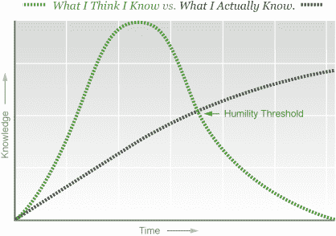
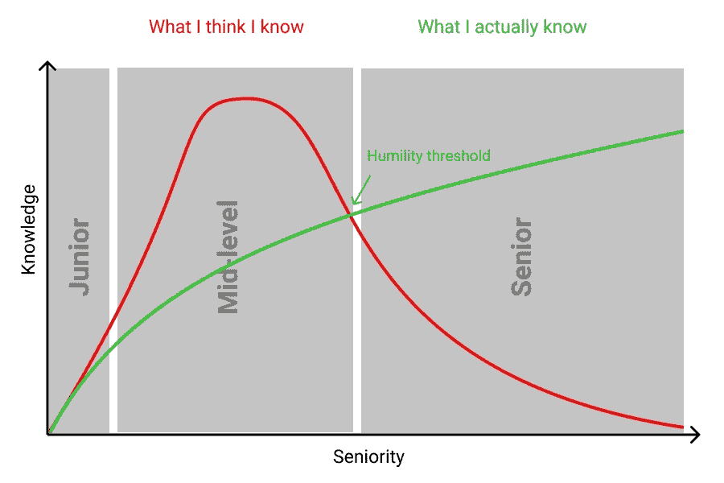

# 初级开发人员:你不再是初级了

> 原文：<https://medium.com/swlh/junior-developers-youre-not-a-junior-anymore-2f6240e88a5b>

Photo by [Annie Spratt](https://unsplash.com/@anniespratt?utm_source=medium&utm_medium=referral) on [Unsplash](https://unsplash.com?utm_source=medium&utm_medium=referral)

**本文的底线:**绝大多数公司用“初级”头衔来降低你的工资，绝对没有别的。

如果出现以下情况，你就自动不是大三学生:

*   你是公司里唯一的开发人员
*   你是你正在做的项目中唯一的开发者
*   一个更资深的开发人员不会给你太多指导

实际上，初级开发人员的工作时间不应该超过 6 个月。如果你知道如何使用 git 和部署项目，**你就不是初级开发人员**。

# 初级、中级和高级之间的区别

围绕这一点有很多争论。什么让你成为学长？

*   你必须主宰从 FORTRAN 到 Kotlin 的所有编程语言吗？
*   你必须留长胡子吗？
*   你的合同必须写明你的资历吗？
*   你必须有至少 20 件来自开发者大会的 t 恤吗？

现实:**这是成熟和知识的结合**。

让我们来定义成熟:

> 在心理学中，**成熟**是以恰当的方式应对环境的能力。

你确实可以记住每一种编程语言和机器学习算法。但是你的成熟程度会对你的资历产生很大的影响。这种情况与邓宁-克鲁格效应密切相关。

图片取自[此处](https://gadgetopia.com/post/6819)。

# 不同的层次。

每个级别如何看待世界(工作中)的小分解。

## 年少的

1.  初级开发人员缺乏知识，不确定要做什么决定，并且太容易受经理的影响(尤其是当经理没有技术知识时)。

## 中级

1.  中级开发人员将 100%确定他上周读到的绝对是最佳选择，我们现在必须重写一切。这里的技术知识通常非常高，但是尽管他们看起来像高绩效者，但他们往往会产生巨大的技术债务，而不是以业务为中心。

## 年长的

1.  高级开发人员意识到自己不知道的东西有多少，在做出决定之前会收集业务各层的反馈，甚至可能重新定义问题。

**大多数人一生都处于中等水平**，因为在那一点上你对自己的能力非常有把握(通常情况下，你的技术能力确实非常高)，但你处在一个**技术泡沫中**，与业务的其他部分太过隔绝。例如，不是所有的问题都应该用代码来解决。这是一个高级开发人员都知道的事情。

以上面的图表为例，我画出了不同层次的起点和终点。

你认为你知道的越少，你从公司不同层面收集到的有助于你决策的反馈就越多。你不要假设太多，而是要确保事情本来的样子。

如果你的技术知识很高，当你意识到还有很多你不知道的东西——来自业务的其他部分——你就已经开始从中级向高级过渡了。**这就是为什么** [**冒名顶替综合症**](https://en.wikipedia.org/wiki/Impostor_syndrome) **会比以往打击更大。**

# 不学习

我听到最多、个人感受最深的抱怨是:

> 我停止了学习。

在许多公司，不进步是很容易的。

我知道有些人在这样的地方工作，如果他们在那里呆了 3 年，他们不会增加 3 年的经验，因为他们所做的只是把前 6 个月重复 6 次。这家公司所做的只是增加了他们的感知知识，而不是实际知识。

**永远是小三，永远工资低，永远无聊，永远不学习。**

如果你觉得你的工作需要改变，从你自己开始:

*   如果觉得技术知识不够，那就去学吧！问问你自己，你觉得你缺少什么，然后去学习！要么问同事，要么拿起一本书。(说真的，阅读 [JavaScript Allongé](https://leanpub.com/javascriptallongesix/read) 真是太棒了)
*   如果你的团队或你工作的地方有重复出现的问题，找到问题的根源。建议做官方的[验尸](https://en.wikipedia.org/wiki/Postmortem_documentation)，或者自己做(对于初学者来说)。
*   学会销售和谈判——不是那种低级的推销员——你一生都需要这个，从约会到谈判升职。
*   学会沟通和自信

为了成功地谈判，你需要足够自信地离开，**让你的技能足够好，这样你就可以很快在其他地方找到工作**，永远不要再以低于你价值的工资工作。

你可以在一个无风险的环境中训练这一点，去参加面试，在面试中谈判你的起薪，我**在你的第一份工作中从 40，000 美元涨到 70，000 美元真的很难，但是在你的第二份工作中，通过一次好的面试谈判，起薪就可以达到 70，000 美元**。

如果面试顺利，公司想要你，你可以肯定你的技术技能也很好，下一步就是和你的老板谈判，或者离开。

## 笔记

指导很容易出错，花 2 分钟的半吊子代码评审不是指导。

我知道，你进入软件行业可能是因为你不喜欢交流。如果你不学会如何做，你的职业生涯将很快停滞不前。一个好的沟通者不需要很高的技术技能就能达到高级水平，想象一下，有了良好的沟通和技术技能，你能走多远！

## 这个故事发表在[的创业](https://medium.com/swlh)上，这是 Medium 最大的创业刊物，有 324，834+人关注。

## 订阅接收[我们的头条新闻](http://growthsupply.com/the-startup-newsletter/)。

