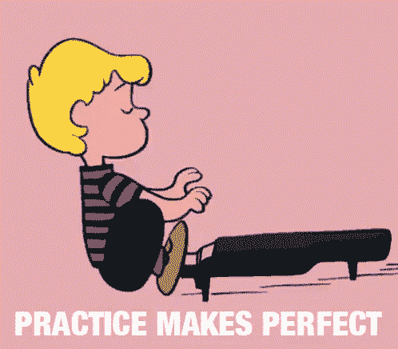

# 请注意..

> 原文：<https://medium.com/swlh/just-pay-attention-3f0ceedbe6cc>

如今，正念是个时髦词，你会在新闻、社交媒体、电视等媒体上听到。许多人如运动员、政治家和科学家都在练习正念，大多数人说他们的生活现在好了很多，他们做出了更好的决定，变得更有效率。

但是:

*   什么是正念？
*   它是如何工作的？
*   它对生活的影响有科学证据吗？
*   如何掌握正念？

在这篇文章中，我们将尝试回答这些问题。

让我们开始吧。

## 什么是正念？

正念意味着大脑完全专注于正在发生的事情，你正在做的事情，你正在穿越的空间。换句话说，正念就是在当下关注外部世界。这与专注于我们头脑中正在发生的事情，并开始创造过程相反，这个主题在我们之前的文章[中有所涉及。](/@notesrecorder_79999/are-smartphones-the-new-creativity-scapegoat-6edd94d4ad04)

## **科学怎么说？**

根据迈阿密大学心理学副教授 Amishi Jha 的说法，注意力是大脑的领导者，因为它将大脑的资源重新导向我们所关注的东西。如果不注意，人们可能会错过关键信息，例如法官没有注意到一个重要的证明，或者外科医生没有专注于一个敏感的操作，即使只有几秒钟。那些短暂的“注意力不集中”可能会对人们的生活产生巨大的影响。

马萨诸塞大学医学中心的微生物学博士乔恩·卡巴特-津恩发现，在练习正念(集中注意力)的过程中，大脑会产生一种激活状态，超时集中注意力会成为一种习惯，而不是一种有意识、有预谋的行为。这是神经可塑性的基本原理。

公平地说，一些心理学家、神经科学家和冥想专家对正念持怀疑态度。他们怀疑正念过度推销益处的主要原因是经济激励，而不是对健康的担忧。[临床心理学家、墨尔本大学心理科学研究员 Nicholas Van Dam](https://www.nicholastvandam.com/) 指出，仅在美国，正念冥想和训练就是超过 11 亿美元的产业。“我们的报告并不意味着正念冥想对某些事情没有帮助，”范达姆说。"但是科学的严谨性还不足以做出这些重大的声明."

## **如何掌握正念？**

## 外卖食品

我们能达成一致的是，无论我们是否有一份高要求技能的工作，集中注意力总是生活中需要的好技能。和任何技能一样，掌握它需要练习，下面是掌握正念的练习清单:

*   写一份详细的日志，让你的注意力集中在你正在做的事情上。
*   检测和控制你的情绪。
*   吃饭不被打扰，所以不看书，不看视频，不说话等。
*   花点时间关注你的呼吸。
*   写下每天的目标。
*   保持工作和家庭的整洁，只关注重要的事情。
*   把让你分心的事情列一个清单，试着摆脱它们。
*   休息一会儿。

我们很确定还有很多其他的练习可以帮助你在生活中集中注意力。请随意分享你的评论和掌握正念的最佳技巧。

## 注意:

这篇文章是由[笔记记录者](http://noterecorder.com)带给你的，美好生活的想法。

## 这篇文章发表在 [The Startup](https://medium.com/swlh) 上，这是 Medium 最大的创业刊物，有 331，853+人关注。

## 在这里订阅接收[我们的头条新闻](http://growthsupply.com/the-startup-newsletter/)。

