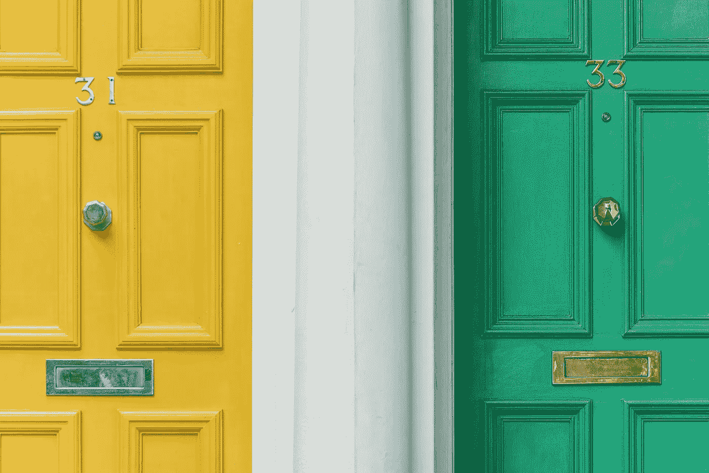

# 随便挑点什么——它会改变你的生活

> 原文：<https://medium.com/swlh/just-pick-something-it-will-change-your-life-7030523ba19>

## 不要担心完美的选择。它不存在。

Photo by [Christian Stahl](https://unsplash.com/photos/8S96OpxSlvg?utm_source=unsplash&utm_medium=referral&utm_content=creditCopyText) on [Unsplash](https://unsplash.com/search/photos/green-door?utm_source=unsplash&utm_medium=referral&utm_content=creditCopyText)

我的表弟住在一栋迷人的老房子里。

它后面有一个很大的玻璃区域。她在后面养了很多植物。她的猫一天大部分时间都在这个温室里，在盆栽无花果树旁晒太阳。

在靠近玻璃区域天花板的一个角落，她得到了大量的冷凝物。她不确定玻璃之间是否有小裂缝，或者其他问题。

她看了很多 YouTube 视频，想看看自己是否能弄清楚到底发生了什么。

她和邻居谈了这件事。一位年长的绅士。我肯定他喜欢这次谈话，但他没有任何明智的建议。

她请了几个修理工来估价。一个她喜欢的，但是更贵的。另一个不太贵，有经验。但她没有和他“联系”。第三个人年轻又没有经验。但是最便宜的。

她不确定自己是否能解决这个问题。或者其中一个修理工能做这件事。或者其他人会不会更好。

这种情况已经持续了六个月。与此同时，凝结面积越来越大。现在它已经开始滴在地板上了。她仍然经常大声地想知道，这是因为漏水还是其他什么原因。

开始时是个小问题，现在变得越来越大了。

原因？她不能决定雇佣谁或者做什么。

直到她找到完美的选择。她根本不会做任何选择。

听起来熟悉吗？

## 做决定有什么可怕的？

很多决定在我们的脑海里感觉很庞大。谁是合适的修理工？或者，我的网站应该用什么字体？

这些决定没有一个是生死攸关的。

但是我们不想做出“错误”的选择。将导致两种情况之一(或两者)的选择:

> 1)我们会因为做了错误的决定而自责
> 
> 2)其他人会评判我们的选择，从而评判我们

所以我们根本没有选择。问题越来越严重。不然机会就错过了。

然后小的决定开始在我们的脑海中备份。像一堆越来越大的乐高积木，五颜六色，棱角分明。其中一些合二为一。一些单独的。

我们越是拖延做决定。一堆小决定越堆越大，直到它开始溢出。那我们甚至不知道从哪里开始。所以我们无法在这堆东西中取得任何进展。我们完全不知所措了。

但是我们忘记了我们拥有的控制力比我们想象的要多。

# 我们可以选择不自责

担心自己的负面想法的有趣之处在于。我们可以选择不去想它们。

等等，什么？

正如我的一位老师曾经说过的那样，*你的大脑就像一个蹒跚学步的孩子拿着一把刀在房子里跑来跑去*。你相信它是安全的并且总是做出好的选择吗？

你的大脑经常告诉你要远离可怕的东西。但它分辨不出别人意见的不适。或者一只老虎在丛林里追你。两者都让你心跳加速，口干舌燥。两者都让你想逃离。

有时候你需要重新定位你自己的大脑。

这意味着提醒你自己。做出选择。然后站在它后面。做你自己的拥护者，反对那个拿着刀的小孩。提醒你的大脑，无论决定做出后发生了什么:

根据你当时所掌握的信息，你做出了最好的选择。

这并不意味着你应该在没有任何想法或意见的情况下做每一个决定。决定在接下来的一个小时内从美国搬到泰国，因为你很冷，而泰国有很棒的海滩。

但是如果你仔细考虑过这个决定。做了一些研究。你有一些信息。足够继续下去了。足够做出选择，看看接下来会发生什么。

那么你就有足够的信息来做决定。

## 我们也可以选择不把别人的意见内化到我们的决定中

我们自己的大脑可能就像一个拿着刀的蹒跚学步的孩子。但是其他人的意见并不总是最好的，甚至也不总是准确的。你周围的人对任何事情都有很多看法。如果你给他们一个机会。

为什么给他们这个机会？

还是那句话，要对自己有信心。要知道你做出这个决定是有充分理由的。并且相信这就足够了。

如果有人不同意你的观点，就像对待你年迈的叔叔尤金一样对待他们。当他在感恩节找你谈话，再一次告诉你他在 20 世纪 50 年代的军队生活时，这对他来说是一个重要的故事。他喜欢告诉你这件事。这并不意味着它对你很重要。点头微笑。点头微笑。

## 那么，我们如何做决定呢？

通常，**我们内心深处知道自己想要什么**。我想我表妹知道她需要雇佣三个修理工中的一个。而不是她没有联系的那个。所以，她只需要在更贵的男人和不贵的男人之间做出选择。

如果她愿意，她可以在不到一个小时内做出决定。在快速查看了她的银行对账单后。

所以下次你要做决定的时候。问问你自己，如果没有其他人知道或有意见。或者，如果你能做让你最开心的事。并且可以给自己一些空间，让自己相信你正在做最好的选择。

你会选择什么？

那就这么做。

并致力于此。

是的，有些事情可能不会像你预期的那样结束。但无论你做什么决定，这都是事实。即使拥有世界上所有的信息。**你仍然不能完全控制结果。**

继续做那些小决定。一遍又一遍。放弃所有那些小的选择。

过一段时间，你大脑中的那堆乐高积木会变得越来越小。

它会在你的头脑中为更大的想法、更大的机会和更大的目标留下更多的空间。

那些更大的决定会改变你的生活。

你是否觉得自己想完成更多工作，但又不确定是什么阻碍了你？参加这个小测验来找出:【https://www.debknobelman.com/quiz】T2

## 这篇文章发表在[的《创业](https://medium.com/swlh)，这是 Medium 最大的创业刊物，拥有+386，966 名读者。

## 在这里订阅接收[我们的头条新闻](http://growthsupply.com/the-startup-newsletter/)。

