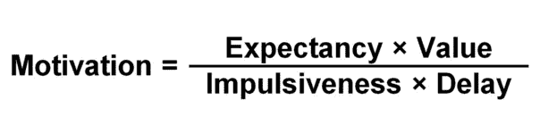
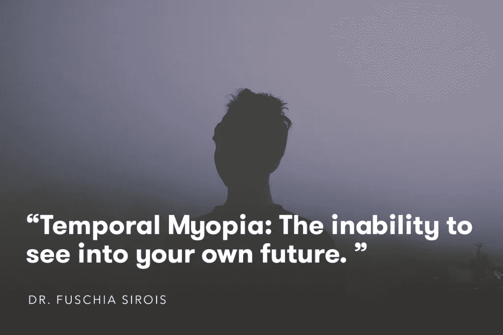
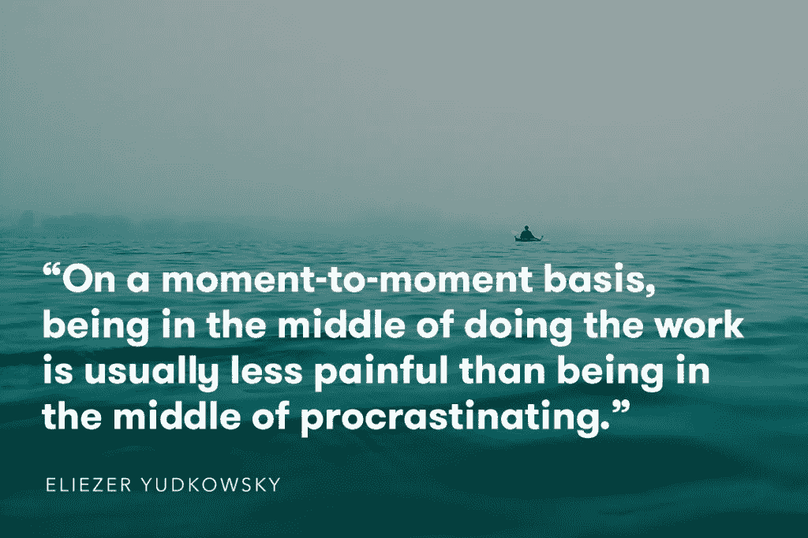
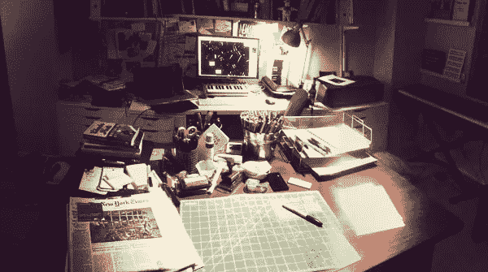

# 开始吧。

> 原文：<https://medium.com/swlh/just-start-913da8779a5a>

## "我希望我有勇气活出真实的自己。"

Annie Spratt on Unsplash: [https://unsplash.com/@anniespratt](https://unsplash.com/@anniespratt)

当护士邦妮·威尔(Bonnie Ware)在病人生命的最后 12 周花费数年时间照顾他们时，[发表了她听到的最常见的遗憾](http://www.inspirationandchai.com/Regrets-of-the-Dying.html)，**在清单上名列第一。**

> “当人们意识到他们的生命即将结束，并清楚地回顾过去时，很容易看到有多少梦想没有实现。大多数人甚至连一半的梦想都没有实现，到死都知道这是因为他们做出了或没有做出的选择。”

# 每天我们都选择如何度过我们仅有的几个小时

然而，尽管不断有警告，我们经常成为拖延症的受害者，甚至害怕刚刚开始。

每一天，我的待办事项清单都提醒着我所有还没有开始的其他项目。我告诉自己的事情最重要。我似乎总是没有时间开始的激情项目。当我有时间的时候。那个熟悉的朋友——恐惧——来敲门了。

对我自己，以及 95%的美国人来说，他们承认自己是拖延症的受害者，甚至是完全逃避我们生活中想要做的事情，“时间管理”只能做到这一步。

当谈到审视*为什么*我们未能开始时，有更大的情感和心理原因在起作用。

# 看到并帮助未来的你

拖延症不仅仅是我们把事情推迟到以后。这是有目的地把重要的工作放在一边，知道将来会有负面的后果。

我们不仅仅是健忘或自满。我们专注于短期的快乐，以长期的快乐为代价，这是在故意伤害自己。

几乎所有的研究都认为拖延会导致更高的抑郁、焦虑和更差的幸福感。

在我们的职业生活中，这可能会带来可怕的后果。在我们新的工作方式中，随着自主性的增加，我们可以随心所欲地工作，您的话就是您的声誉。没有好的理由错过最后期限，真的不是好的理由。

卡尔加里大学的组织行为学教授 Piers Steel 博士提出了一个简单的公式来确定我们为什么做出某些选择。

分解一下，**动机**是对一系列行动的驱动力或偏好，或者经济学家所说的*效用*。在等式的顶端，**期望**是你的选择产生结果的几率，而**价值**是指该结果可能带来的回报。

本质上，**冲动**是你对延迟的敏感度(你有多容易分心)，而**延迟**是你要等多久才能得到回报。

所以，我们所有的选择都归结于对好结果的期望和一项任务可能花费我们多长时间。

但是，当我们对我们所做的事情的潜在价值的看法被扭曲时，会发生什么呢？

[最近对慢性拖延症患者的研究](http://link.springer.com/article/10.1007/s10865-015-9629-2)揭示了英国谢菲尔德大学心理学教授 Fuschia Sirois 博士所说的*暂时性近视:*无法预见自己的未来。

我们都有一种将我们的思想传送到未来的方式，无论是通过计划和设定目标，还是积极的肯定。

但是对于拖延者来说，这种愿景是模糊的。它更加抽象和非个人化，拖延者经常在他们是谁和他们将成为谁之间感觉到情感上的脱节。

另一个障碍是行为经济学家所说的*时间不一致性——人脑倾向于将眼前的回报看得比未来的回报更重。*

我们开始任何任务的动机取决于我们看到它的价值，然而我们更看重当前正在发生的事情，而不是未来会发生什么，并通过在情感上切断我们与未来自我的联系来证明这一决定的合理性。

这就是为什么你可能会在睡觉时承诺要让事情变得更好，醒来后却陷入同样的旧习惯。

呈现给你:1。未来的你:0。

# 日复一日的激励就像在糖果店学习节食一样

[https://unsplash.com/@clemono2](https://unsplash.com/@clemono2)

然而，导致我们缺乏动力的不仅仅是内部斗争。我们生活的世界是动机有毒的。

在斯蒂尔博士的研究中，他将我们的日常生活等同于试图在糖果店节食，然后被指责发胖。我们一次又一次地被赶向消费场所。

消费胜过创造。

每天，产品都是为了迫使你使用它们而制造的。 [Nir Eyal 的*Hooked*](http://www.nirandfar.com/)——一个制造产品的基本操作指南，迎合我们的冲动，促使我们一次又一次地回到我们可能‘不应该’使用的东西——已经成为商业世界的一个主要内容(Nir 不主张强迫人们做不健康的行为，但正如我最喜欢的漫画叔叔所说，权力越大，责任越大)。

你的企业的生存依赖于回头客，所以难怪公司会放弃它，变得“有粘性”。他们需要你的关注，而且他们知道如何得到你的关注。

这不是什么新鲜事。

古希腊哲学家如苏格拉底和亚里士多德创造了一个词来描述这种行为: *Akrasia* 。

> *“失智:违背你更好的判断的状态。”*

简而言之，失智症是看不到长期价值，屈服于眼前的满足。比如看电视，而不是阅读一本书或者做一个你想做的项目。或者叫外卖而不是给自己做一顿健康的饭。

成功需要努力。长时间的专注，没有回报的承诺。然而，我们周围的世界以及它对我们大脑的影响，让我们太容易屈服，摘下低垂的果实。

# 养成刚开始的习惯

那么，我们如何突破所有这些似乎不可逾越的对我们不利的力量呢？简单来说，我们全部忽略，直接开始。

用[作家兼理论家埃利泽·尤德考斯基](http://lesswrong.com/lw/3kv/working_hurts_less_than_procrastinating_we_fear/)的话说:

“刚刚开始”这个阶段是很难克服的。然而，一旦我们这样做了，势头接管。我们看到我们正在做的工作的直接结果，而不是寻找方法来避免它或延迟我们的满足感，我们寻找方法来完成。

虽然拖延已经开始的工作有一些常见的“治疗方法”，例如将较大的目标分成简短的、可操作的项目(“我将在周二上午 11 点写一个小时的论文”，而不是“我将在周二写论文”)，[定期休息](http://www.wsj.com/articles/SB10001424052748704538404574541590534797908)，奖励自己完成子目标以及整个项目，那么克服刚刚开始的恐惧呢？

有什么方法可以战胜拖延症，甚至预见它的到来并调整方向？

# 把小事放在心上(因为它会累积起来)

[https://unsplash.com/@scottwebb](https://unsplash.com/@scottwebb)

当我们考虑开始一个新项目时，通常是巨大的里程碑——伟大的想法——让我们慢了下来。

我们经常忘记一些小的方面——当我们考虑开始的时候错过的小部分。

当你让小损失累积起来时，比如当你想早点开始工作时睡懒觉，或者让自己容易分心，你就朝着嵌入小损失的过程努力。但他们不会就此罢休。

在 [*拖延和服从*](http://socsci2.ucsd.edu/~aronatas/project/academic/akerlof%20on%20procrastination.pdf)*中，乔治·阿克洛夫教授写道，拖延是由于我们错误地忽略其成本和收益而导致判断反复错误的最佳例子:*

> *在这种情况下，每一个判断错误都会造成小的损失，但随着时间的推移，这些错误累积起来会造成大的损失，最终会给决策者带来相当大的遗憾*

*有一种心理过程叫做[蔡加尼克效应](http://www.psychwiki.com/wiki/Zeigarnik_Effect)，当你接近完成一项任务时，这种效应就会出现，把你推向终点线，就像你从一堆僵尸中跑出来一样。你会觉得不做完就停不下来。*

*我们都曾在某个时刻感受过这种感觉，无论是读到一本书的最后一章还是一篇文章的最后一页，一旦跨过了那个门槛，继续前进就变得更容易了。*

*那么为什么不把自己的过程从小亏转为小赚呢？*

*海明威总是在句子中间停下来，这样当他第二天继续工作时，他可以从他停下来的地方继续，有效地迫使自己进入“必须完成”模式。*

# *使用承诺装置*

*刚开始是一场心理战。*

*我们有时必须把它变成某种物质的东西，然后才能取得胜利。*

*做到这一点的一个方法是实施一个承诺装置——一些让你几乎不可能继续消极行为的策略。*

*对于《T2 圣母院的驼背》的作者维克多·雨果来说，这意味着将他所有的衣服锁在衣柜里，这样他就不能出去社交或娱乐，而只能被迫写作。*

*对于《银河系漫游指南*的作者 Douglas adams 来说，他被连续几周锁在酒店房间里(他的出版商和编辑显然经常这样做，而他没有太多抱怨(还有，为什么总是作家需要奇怪的策略来迫使他们工作？)).**

# *创造合适的环境开始*

*回顾 Steel 博士的动机方程式，杀死我们动机的一个主要因素是冲动。现在看看你的周围。有多少事情可能会让你分心？*

**

*Austin Kleon’s ‘analog’ desk space*

*我们的欲望战胜了我们，创造一个隔绝的工作空间通常是战胜它们最简单的方法。正如我父亲常说的“眼不见，心不烦”。*

*作家兼艺术家奥斯汀·克莱恩(Austin Kleon)建立了两个不同的工作区，周围都是帮助他起步的东西:一个放有纸张、铅笔和美术用品的模拟办公桌，一个放有电脑、midi 控制器和平板电脑的数字办公桌。*

*建立系统和流程，目标不是“创造完美”，而只是创造。*

*这可能包括[整理你的工作空间](https://www.google.ca/url?sa=t&rct=j&q=&esrc=s&source=web&cd=1&ved=0ahUKEwiV8MzQ297KAhXG7R4KHTNFAlIQFggbMAA&url=http%3A%2F%2Fblog.crew.co%2Fhow-clutter-effects-you-and-what-you-can-do-about-it%2F&usg=AFQjCNEbxp5eOvKjCizsHM2vsQ-6RGJXpQ&bvm=bv.113370389,d.dmo)或者[设定小的、容易实现的每日目标](http://blog.crew.co/the-1-trick-i-use-to-build-every-habit/)(比如承诺每天早上写作 10 分钟)。*

*无论你用什么方法(有很多方法可供选择)，目标总是让你的思维处于“刚刚开始”的模式，而不是“必须完成”的模式。*

# *不要担心自己是否完美*

**

*[https://unsplash.com/@petrussousa](https://unsplash.com/@petrussousa)*

*高中的时候，因为不肯交项目，我差点美术课不及格。他们技术上已经完成了。在我看来，他们还没有*完美。**

*最终，对交不合格作业的愤怒和恐惧让我甚至不想开始做。这是工作中常见的障碍。我们害怕未知，而不是盲目地去做，花更多的时间去计划。*

*在右脑的**中，贝蒂·爱德华兹讨论了我们在孩童时期是如何自由地绘画和创作的，但在青春期前后，我们大多数人都停止了:***

> ***“对于许多成年人来说，青春期的开始似乎标志着艺术发展在绘画技巧方面的突然结束。作为孩子，他们面临着一场艺术危机，这是他们对周围世界日益复杂的感知和他们目前的艺术技能水平之间的冲突。”***

***这场危机不仅仅局限于孩子们的艺术努力。作为成年人，当面对新的任务或目标时，我们当前的技能水平通常与我们希望最终目标是什么样子的愿景不相关。***

***想想你是否曾经想要建立一个网站，或者创作一本书。面前的艰巨任务无疑给你的想法蒙上了一层阴影。我们感受到的不是实验的兴奋，而是自我怀疑和恐惧。最终目标，我们想要创造的完美形象令人窒息。***

***正如作家兼营销大师 Seth Godin 描述的那样:***

> ***“我们告诉人们，通往卡内基音乐厅的道路是由实践、实践、实践铺成的。但是练习是准备的另一个词。我不是说要做好准备。准备和准备好不一样。准备好是一种情感选择，一种将某物投入世界的决定……悖论是显而易见的:想法越重要，我们就越不能做好准备。因此，我们担心这个世界，或者说我们的市场，还没有为这一飞跃做好准备……无论我们走到哪里，大门似乎都是关闭的，而不是敞开的。”***

***克服完美的瘫痪给了你尝试的机会。去探索，不受你在自己头脑中如何定义事物的限制。***

***开始工作的恐惧往往比实际工作的痛苦要少得多。***

***然而，我们的大脑会欺骗我们，让我们认为事实恰恰相反。一旦我们植入了这些信念，就很难打破它们。***

***但是最伟大的成就不会在没有开始的时候出现。***

***如果我们希望[创造的东西多于我们消耗的东西](http://blog.crew.co/its-not-what-you-consume-its-how/)，我们需要每天都养成这些习惯。***

***当你回首往事的时候，你想记起那些你想做却从未开始的事情，或者那些你尝试并做出属于自己的东西的时候吗？***

***开始吧。每一天。***

***启动然后重启。***

***放下你的恐惧，重新连接你如此渴望的未来愿景。***

****嘿！我是乔里。屡获殊荣的作家、编辑和内容策略师。如果你想一起工作，可以在* [*的博客*](http://blog.rescuetime.com) *或* [*上查看更多类似的帖子。*](http://jorymackay.com/)***