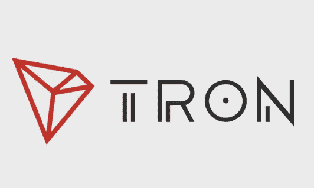

# 贾斯汀·孙的《创:过去、现在和未来的价格分析》

> 原文：<https://medium.com/swlh/justin-suns-tron-the-past-present-and-future-price-analysis-a9fdf3a1fd0c>

Source: Google images

# 了解 [TRON](https://tron.network/index?lng=en)

Justin sun 的 TRON 是一个分散的区块链平台，支持面向全球互联网、媒体和娱乐市场的高吞吐量智能合同。Tron 作为一个优秀的社交媒体平台，允许用户自由交流思想、观点、媒体，而不受任何中间人的干扰。