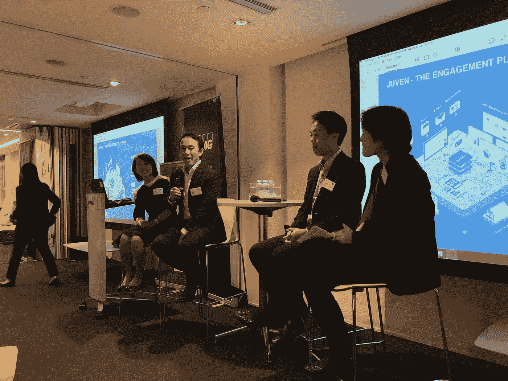
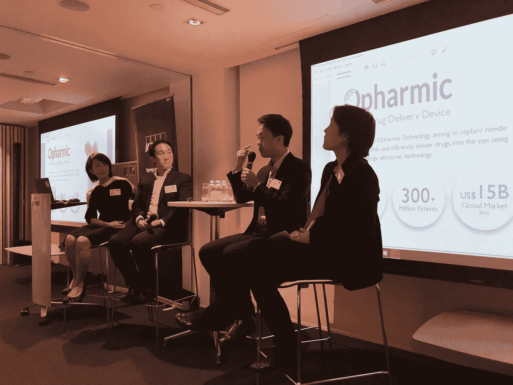
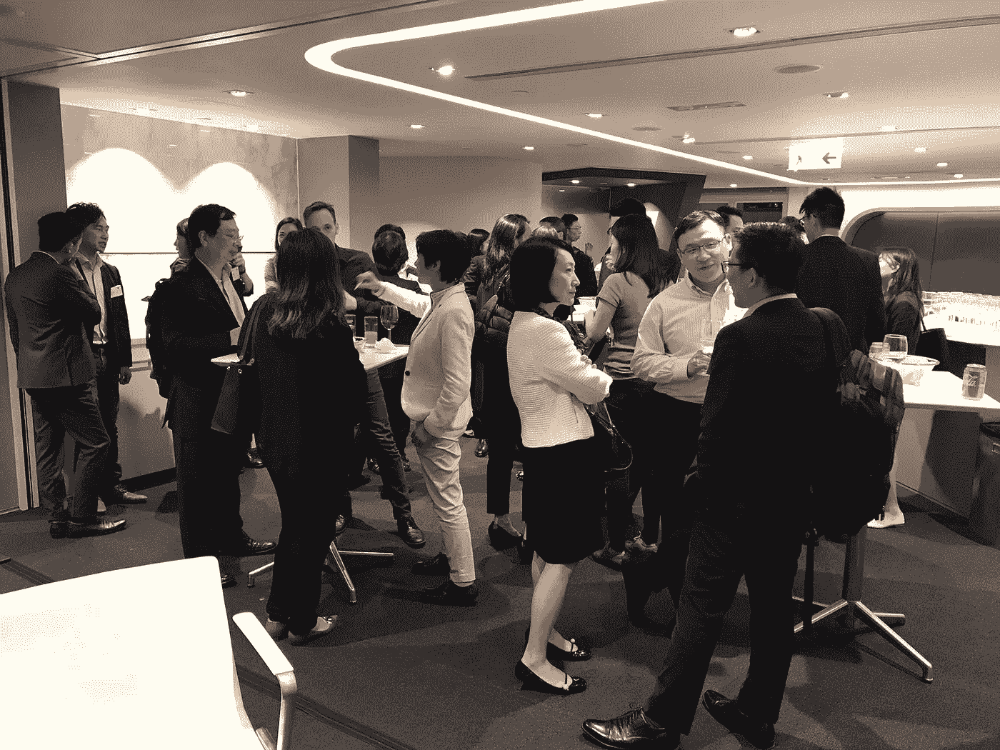

# Juven 来自牛津剑桥-毕马威系列的创业洞察

> 原文：<https://medium.com/swlh/juvens-startup-insights-from-oxbridge-kpmg-series-1a9d8d271cc2>

## Juven 首席执行官 Edmond 分享了他对香港创业的见解

10 月 29 日星期一， [Juven](https://juven.co/?utm_source=medium&utm_medium=blog) 出席了一个讲座和小组讨论，这是由牛津剑桥校友香港分会联合主办的牛津剑桥毕马威系列活动的一部分。

Juven CEO Edmond

讲座围绕着一项名为“通过创业改变香港”的毕马威-阿里巴巴联合研究展开，该研究由阿里巴巴香港企业家基金执行董事 Cindy Chow 女士和毕马威香港新经济和生命科学主管 Irene Chu 女士主持。Juven 的首席执行官 Edmond 和另一位年轻企业家应邀担任专题演讲人

根据这项研究，香港有抱负的企业家，他们有强烈的目标感。他们认识到，创业通过发展新思想、保持社会活力、解决社会问题以及创造新机会，对社会和经济做出了巨大贡献。此外，该研究表明，人们成为企业家的动机通常是开发新技术，进入服务不足的市场，推动社区的发展，而较少考虑金钱因素和个人职业议程。

## 朱文

Edmond 的分享侧重于建立团队、寻找人才和资金的挑战。他的经验是，投资者不仅希望投资好的想法，也希望投资优秀的人才——能够[执行](/@juven/juven-x-wantedly-recruitment-seminar-34299385e1ba)的人才。

Edmond 还为那些创业者或潜在创业者分享了一些想法，“创业就是要承担风险，要有标准。但是当我们年轻的时候，我们没有被教导通过失败来学习。我们被教导要从成功中学习。而且在商业中，没有规则，没有标准，不像我们受教育的环境。”

埃德蒙的建议是，人们参加许多不同的活动，并获得帮助，以学习如何建立一个企业。谈论你的想法并观察听众或潜在投资者的反应也是有帮助的。如果它是一个好的，通过创建一个原型开始进一步工作。

Langston Suen — [Opharmic Technology](https://www.hkstp.org/en/directory-list/Details/opharmic-technology-hk-limited)

## 光学技术

来自 [Opharmic Technology](https://www.hkstp.org/en/directory-list/Details/opharmic-technology-hk-limited) 的 Langston Suen 分享了他自己领导一家生物医药创业公司的经历。Opharmic 的目标是创造一种新的方法，不使用针头就能明智而有效地将药物输送到眼部。

兰斯顿认为，生物技术和医疗行业的人才库肯定也存在短缺，因为他们经常被束缚在学术环境中。

There was a good turnout at the event

生物技术和生物医学行业与大多数其他科技行业截然不同，因为它们需要比其他科技公司更长的时间才能看到劳动成果，因为它们必须遵守政府或法律法规，例如医院或实验室，以及不同用户的要求。

获得资金是不同的，因为他们有加速器和孵化器，在生物技术的特定领域指导他们。兰斯顿接受教育的环境意味着他将接触到已经对生物技术领域感兴趣的潜在投资者。这意味着，与大多数创业公司不同，他们不必为了获得资金而会见很多人。与没有特定兴趣的投资者相比，他们的投资者已经对这些事情感兴趣，这使得流程更加简化。

回报也需要更长时间才能看到。投资者有选择地投资于生物技术产业，因为通往利润的跑道可能比其他产业更长。尽管如此，生物技术的跑道仍然比医疗药物短 3-5 年，而后者可能需要 10 年或更长时间。但这些和其他行业相比还是长了。

Participants at the event mingle after the talk

在即将发布的博客文章中，我们将更深入地探讨毕马威-阿里巴巴研究中讨论的香港商业生态。

> [Juven](https://juven.co/?utm_source=medium&utm_medium=blog) 开发了完整的参与软件，使各种慈善机构、公司、协会和俱乐部能够建立、参与和发展社区。我们认为，组织应该能够使用美观、直观和可靠的工具来创造更大的影响力。

## 这篇文章发表在[《创业](https://medium.com/swlh)》上，这是 Medium 最大的创业刊物，有+400，714 人关注。

## 订阅接收[我们的头条新闻](http://growthsupply.com/the-startup-newsletter/)。

