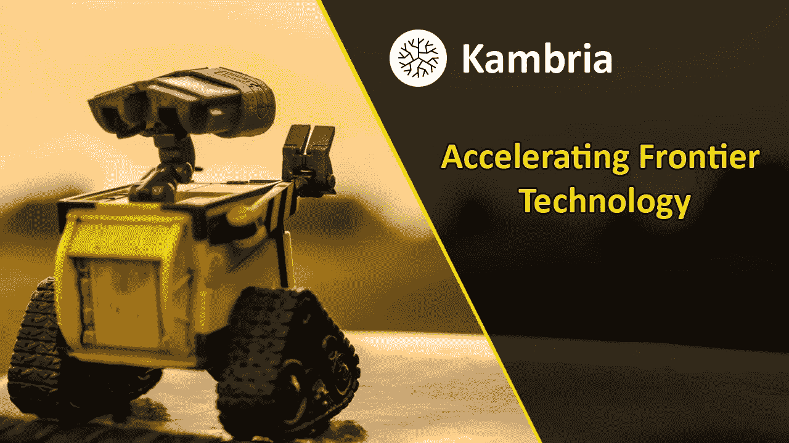
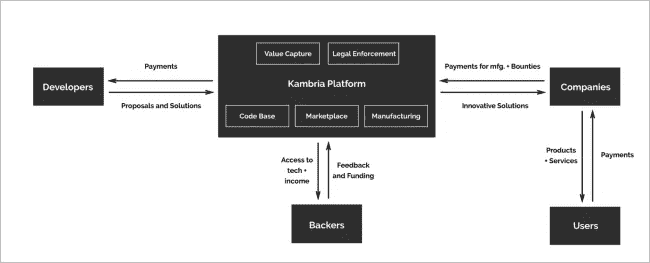
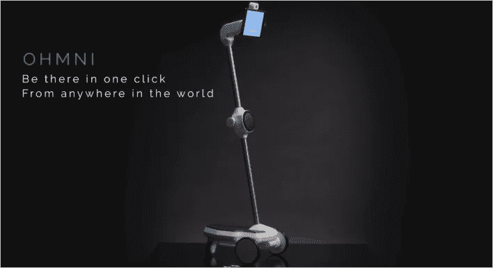
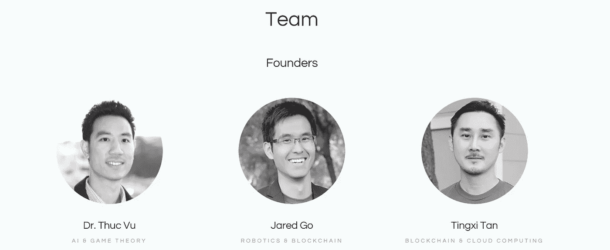
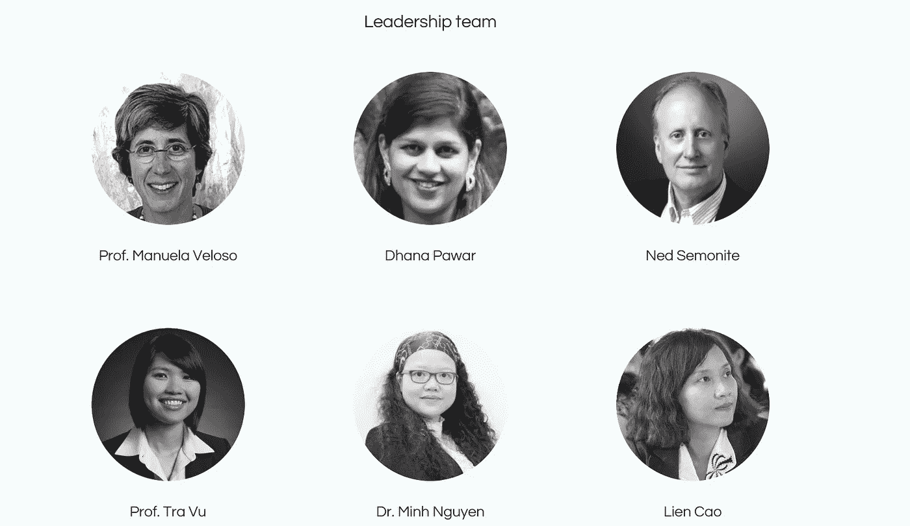
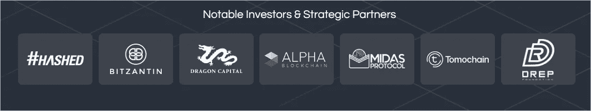

# 坎布里亚——通过推出一个开放的创新人工智能和机器人平台来创建一个新的范例

> 原文：<https://medium.com/swlh/kambria-creating-a-new-paradigm-by-launching-an-open-innovation-ai-and-robotics-platform-39cc0980dc25>

人工智能和机器人经济正在快速增长。自从 2002 年第一批真空机器人在消费电子产品商店上架以来，消费机器人产业已经出现了指数增长。2016 年，消费机器人[的全球销售额达到 38 亿美元](https://www.tractica.com/research/consumer-robotics/)，预计 2022 年总市值将增长至 138 亿美元。

虽然机器人玩具、吸尘器和割草机器人最初被视为噱头产品，但我们看到该行业正在走向成熟。随着人工智能(AI)的实施，有时是以机器学习(ML)的形式，机器人现在正在成为:可靠的[教育设备](https://www.richardvanhooijdonk.com/en/blog/robots-education-are-here-and-they-arent-going-anywhere/)、[医疗助理](https://medicalfuturist.com/robotics-healthcare)，甚至是老年人的[伴侣](https://www.engadget.com/2017/08/29/robot-caregivers-are-saving-the-elderly-from-lives-of-loneliness/)。

它的成功也带来了一些挑战。今天的创新模式，就像人工智能和机器人产业一样，面临着浪费和低效。许多大学研究项目没有得到充分利用，而其中一些项目在进一步开发后可能会产生真正的影响。类似地，破产的创业公司可能会有一个很酷的发明随着项目一起消失。应对这些挑战的答案是提供一个开放的创新平台，让制造商、开发商、公司和支持者在一个基于社区的生态系统中共同努力。Kambria 是一个为人工智能和机器人行业建立开放创新平台的项目。

## **坎布里亚是什么？**

Kambria 由机器人公司 OhmniLabs 背后的团队创建，正在为前沿技术建立第一个开放创新区块链平台。该平台将类似于 Linux 和 Android，增加了软件和硬件组件。

坎布里亚将支持和激励在研发(R&D)、制造和先进技术商业化方面的合作。他们的目标是在区块链技术和秘密经济激励系统的帮助下解决当前的行业问题。

Kambria architecture and utility token model

区块链和加密货币非常适合坎布里亚生态系统，因为它们提供了执行处罚和奖励平台用户的能力。坎布里亚或坎布里亚国际(官方)正在基于以太坊 ERC-20 标准推出自己的令牌，称为 KAT。KAT 令牌是主要的令牌，将用于支付平台访问、奖励参与以及将激励与整个生态系统中的所有利益相关者相结合。

坎布里亚国际的使命宣言:

“Kambria 希望加快创新进程，实现更快、更便宜、更容易的技术开发和采用”。

## **OhmniLabs**

自 2015 年成立以来，OhmniLabs 团队设计、创造并制造了 Ohmni 远程呈现机器人。这种远程呈现机器人被称为 Ohmni，与其他远程呈现机器人相比，价格非常有竞争力。远程呈现机器人是一种机器人，当你自己在另一个位置时，它可以立即让你出现在一个位置。远程呈现机器人非常适合无法上课但想跟上课程进度的学生使用。
作为 Pepper、Turtlebot、艾博和 Nao 的竞争对手，Ohmni 的目标是以最少的钱为买家提供最高质量的远程呈现机器人。他们通过简化迭代设计和使用 3d 打印制造机器人来实现这一目标。

## **坎布里亚的主要支柱**

坎布里亚平台由 5 个支柱组成:

-K-DNA 代码库:该平台的基础是坎布里亚代码库或 K-DNA。代码库包含建造机器人所需的所有信息、软件、固件、硬件和人工智能。

-制造业联盟(KMA):K-DNA 将得到制造业联盟的支持，该联盟允许人们在 K-DNA 的帮助下原型化和制造机器人。

-创新(奖金)市场:在创新市场中，制造商可以提供机器人零件来换取奖金。或者，感兴趣的各方可以发起一项基于奖金令牌的众筹活动，开发者可以根据他们的需求制造一个机器人。

-法律保护:社区将共同保护违反证明(PoV)标准的创新平台。除了法律保护之外，还将出台一项公平使用政策，其中包括针对社区成员的条款和条件。

-价值获取:该功能将使用 KAT 令牌为平台带来价值，以便可以保证寿命，并且项目不依赖于捐赠。各种价值点将被创造出来。例如，当机器人被制造时，在价值点发生之后，费用将被强制执行，并且收集的 KAT 令牌将被支付给制造商(最大部分)和进入社区保留地(小部分)。

## **团队和投资人**

[**博士**](https://www.linkedin.com/in/thucvu/) **(联合创始人)**、拥有斯坦福大学获得的计算机科学博士学位。他的工作主要涉及人工智能、博弈论、锦标赛设计和多智能体系统的研究。Thuc 是一位连续创业者，并联合创立了:Evolet Inc .、Katango(被谷歌收购)、Tappy(被 Weeby.co 收购)、VietSeed 基金会和 OhmniLabs。

[**贾里德·戈**](https://www.linkedin.com/in/jaredgo/) **(联合创始人)，**拥有卡内基梅隆大学计算机科学学士学位。Jared 在区块链、人工智能、实时图形、虚拟现实、机械工程和电气工程方面拥有丰富的经验。他担任 Hobnob 的首席技术官超过 10 年，也是 OhmniLabs 的联合创始人。

****【联合创始人】**，拥有卡尔加里大学计算机科学硕士学位。汀溪拥有云计算、网络基础设施和分布式系统设计的经验。曾在红瓜做过云顾问；在 Hobnob Inc .担任软件工程师和工程总监；并共同创立了 Ohmnilabs。**

**除了三位联合创始人，Kambria 的网站还提到了以下六位领导团队成员。下面我还提供了每个成员 LinkedIn 个人资料的链接。**

****

**曼努埃拉·贝洛索教授 (人工智能和机器人学)**

**达纳·帕瓦尔(营销)**

**内德·塞莫尼特**

**Tra Vu 教授(金融)**

**阮明博士(研究)**

**[连战曹](https://www.linkedin.com/in/caolien/)(越南作战)**

## ****投资者****

****

**一些业内最著名的投资者已经表示了他们对坎布里亚的支持。#Hashed 是一家总部位于韩国的顶级风险投资公司，投资了 Icon、Bluzelle、TomoChain 和 Aelf 等项目。投资坎布里亚的其他专业投资者和行业巨头包括 [Bitzantin](http://bitzantin.com/?utm_source=hypernum.com) 、[龙资本](https://www.dragoncapital.com/?utm_source=hypernum.com)和 [Alpha 区块链](https://www.alpha-blockchain.co/?utm_source=hypernum.com)。**

## ****结束语****

**坎布里亚最好的事情之一是，他们与他人分享他们的机器人知识，以改善整个机器人行业。机器人和人工智能行业的发展对团队来说很重要，他们分享知识和智慧的意图令人钦佩。由于 Kambria 的联合创始人最初在 OhmniLabs 的开发中遇到了问题，并且缺乏社区支持系统，他们现在正在通过 Kambria 解决这个问题，以确保机器人和人工智能行业的其他项目能够更快地向前发展。坎布里亚是我关注的一个项目。我将作为他们社区的一员关注它。**

****坎布里亚社交媒体**网站:[https://kambria.io/](https://kambria.io/)

白皮书:[https://bit.ly/2y7eckC](https://bit.ly/2y7eckC)

电报(ENG):[https://t.me/kambriaofficial](https://t.me/kambriaofficial)

电报公告频道:[https://t.me/kambria](https://t.me/kambria)

推特:[https://twitter.com/KambriaNetwork](https://twitter.com/KambriaNetwork)

媒体:[https://medium.com/kambria-network](https://medium.com/kambria-network)

邮箱:】这只是我个人对坎布里亚项目的看法。你应该总是做自己的研究。

订阅我的频道: [Medium](/@cultcrypto) ， [Twitter](https://twitter.com/CryptoShowdown) 和 [Steemit](https://steemit.com/@cryptoshowdown) 如果你喜欢我的文章并想了解区块链、加密货币项目和新闻。也可以看我在 [LinkedIn](https://www.linkedin.com/in/donjohanson/) 上的文章。

如果你对本文有任何疑问，请在下方评论区评论。掌声也欢迎，谢谢！

**秘密对决****

****

## **这篇文章发表在 [The Startup](https://medium.com/swlh) 上，这是 Medium 最大的创业刊物，拥有+ 375，985 名读者。**

## **订阅接收[我们的头条新闻在这里](http://growthsupply.com/the-startup-newsletter/)。**

****