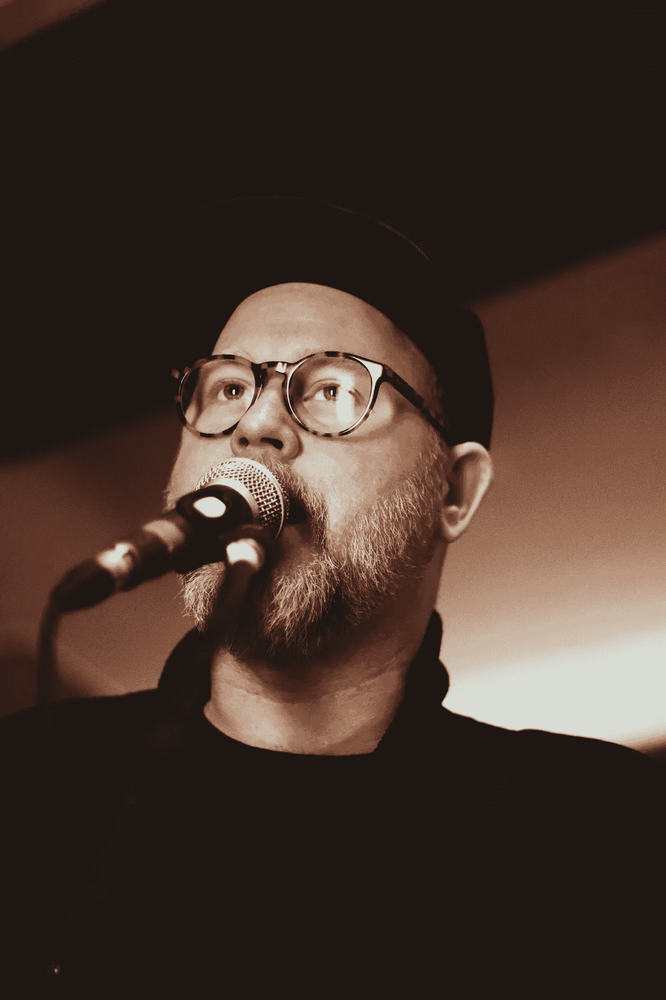

# 消除你的恐惧，开始实现你的梦想

> 原文：<https://medium.com/swlh/kick-your-fears-to-the-curb-and-start-achieving-your-dreams-b39bc68e51c1>

## 做让我害怕的事如何改变了我的生活

Photo by Charlie Woodward via Unsplash

我第一次演讲是一场灾难。

很多事情都出错了。

首先，我为自己准备了材料，但我没有为我的听众准备。仅仅了解一些东西是不够的。如果你要谈论它，你必须让它变得有趣。

**第二，这是一项我并不真正感兴趣的必修课作业。**其实直到今天，我都不能告诉你那是什么课。我确实记得那是在什么样的建筑里，房间看起来出奇的暗。

你记得最多的是情绪上令人不安的事情。

**第三，我不相信我能做好演讲，所以我没有做。你总是以你想象的方式表现。**

# 我的第二次演讲

我的第一次演讲和第二次演讲相隔了几年。

这就是不同之处。

第一次演讲是针对一个年级的。第二个演讲是给我的。

在第二次演讲之前，发生了一件事，它让我的思维发生了转变，我再也没有回头看。

你说是什么？

为了就业安置课程，我不得不读了金克拉的[见顶](https://amzn.to/2IklINm)。

我的老师给我们布置了这本书的自我形象部分。读完前几页后，我兴奋不已，一直读到最后一页。

所以到第二次演讲时，我已经准备好了。

我参加了演讲会。第一个演讲要求你谈谈你自己。哈！这很简单。现在我来挑选三个关于我生活的有趣的花絮，这些花絮让我走到了这一步。

> 真正的胜利是当我发现我对演讲的所有恐惧——墙围着我，把我压垮，害怕得在众人面前心脏病发作，领带上沾着芥末——都是神话。恐惧卖给了我一张商品清单，而我一生都在为此付款。

# 消除恐惧

我第一次成功的演讲让我肾上腺素激增，这是我从未经历过的。

我立刻想到，“我应该多做些这样的事情。”

我做到了。

科学家说我们生来只有两种恐惧——对跌倒的恐惧和对噪音的恐惧。

我们从生活中学到的其他一切。

什么非理性的恐惧让你变得残疾？是什么让你无法与世界分享你的天才？你能做些什么来打破非理性恐惧对你的不可逾越的束缚？

你可以这么做。

> 做让你害怕的事。

每年夏天，我父母都会向家人和朋友开放他们的游泳池。百分之五十的时间都在阴凉处，所以总是很冷。有两种方法可以进去:

当冰冷的水一寸一寸地触摸你裸露的皮肤时，爬进来，颤抖吧。

投入其中，将痛苦的转变缩短到几秒钟。

我通常选择后者。

生命太短暂，不能花一个小时去游泳。

当我们悄悄进来时，我们互相嘲笑。

当我们发现凉水真的有多提神时，我们欢呼起来。

> 今天冲破你的恐惧。你会更加享受生活。你会感到神清气爽。你会发现以前看起来那么可怕的事情其实并没有那么糟糕。

*喜欢你刚刚读到的吗？尽情鼓掌。把这个分享给你的朋友。今天出去做一些让你害怕的事情。它可能会打开大门，让人们认真对待你，把你当成作家、艺术家、企业家，或者任何你真正想成为的人！*

## 这篇文章发表在《T4》杂志《创业》(The Startup)上，这是 Medium 最大的创业刊物，有 323，238 人关注。

## 在这里订阅接收[我们的头条新闻](http://growthsupply.com/the-startup-newsletter/)。

