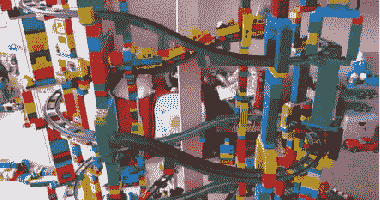
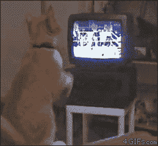

# 杀了你的宝贝

> 原文：<https://medium.com/swlh/kill-your-darlings-ac3f8a00920b>

## 爱上创意，而不是产品

我大学第一天的第一个老师是凯利·杨格尔。我还记得他教的第一课:“杀了你的宝贝。”显然这是一个常见的书面说法，但我直到那时才听说过。

你开始写的东西并不总是你写的东西。有时你开始真的喜欢你写的东西，即使它让你离创作的核心意图越来越远。在这些情况下，你必须成熟到“**杀死你的心肝宝贝。**

对于软件来说，也是如此— **你着手构建的并不总是你构建的**。有时你开始真正喜欢你创作中的这些小方面，它们并不服务于你开始时的大构想。

They built it wrong.

我从创业社区的领导者那里听到的最常见的一条建议是，[“不要把时间浪费在你不应该做的事情上。”](http://evhead.com/2007/11/why-do-we-work-on-things-that-dont.asp)这是同样的观点，但我更喜欢《杀死你的心肝宝贝》,因为:

1.  *听起来很酷*
2.  *它说明了问题的实际来源。*

**当你爱上任何东西，都很难看出其中的瑕疵。**如果你爱上了隐藏在应用程序第三个最少访问菜单中的个人资料图片缩略图的设计，承认你在浪费时间可能真的很难。我知道我个人读到过“不要把时间浪费在我不应该做的事情上”，我坚定地同意了，然后退出了 Twitter，继续做一些无用的事情。

Build the wrong stuff, break your own heart.

## &$*#我怎么知道要杀什么？

为了提高我现在称之为**亲爱的谋杀率(DMR)** 我开始了一项练习，每天早上开始工作前我都重复这项练习。这是一系列的问题:

1.  我为什么要创办这家公司？
2.  我今天要做什么？
3.  我花 100%的时间做问题 2 会让我更接近完成问题 1 吗？

**如果问题 3 的答案是否定的，那么*问题 2 的答案就是无用的。***

诚实地回答问题 3 最难的部分是，它要求你承认你浪费了时间或者至少有坏主意。我们大多数人都害怕失败。味道很糟糕。

但是 [**就像一个拳击手，任何人都可以挥拳**](/@momunt/what-boxing-has-taught-me-about-business-4fef5641d0c9) **。**很少有人能躲闪。更少有人能咬紧牙关承受打击。继续前进。

我们都需要学会承认，当我们追求的努力并没有达到更大的目标时。

**你喜欢自己最初的想法。产品必须服务于这个目的。如果没有，就杀了它。**

像往常一样，你可以在 team@momunt.com 找到我

*发表于* **创业、旅游癖和生活黑客**

-