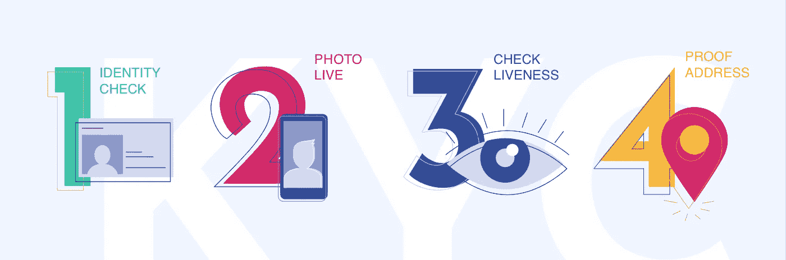

# 知道如何了解你的客户

> 原文：<https://medium.com/swlh/know-how-to-know-your-customers-825047c79b7>

新技术正在改变用户体验的世界。用户不需要去分行开立银行账户、开始投资或兑换加密货币等。想想吧！银行允许用户在不见面的情况下开立账户。现代 IT 解决方案将使我们能够在几个步骤中识别和验证个性，这些步骤可以通过客户的智能手机轻松快速地完成。

作为产品负责人，我参与了两个开创性的金融科技项目。在这些项目中，我第一次见到了 KYC(了解你的客户/消费者)的技术实现。当我开始研究这一程序时，我对 KYC 在公共和私营部门，尤其是在金融机构和政府实体中的使用深感惊讶。

我想从产品所有者的角度向您描述 KYC 实施的过程，并指出在定义数字产品的产品需求时需要了解的内容。程序本身取决于实现的范围，这就是为什么我想把重点放在 B2C 体验上。

首先，您需要确定两个不同的技术术语，因为服务提供商通常会将它们分开:

1.  **KYC(了解你的客户/消费者)** —是企业验证其客户身份并评估业务关系中非法意图的潜在风险的过程。任何被认定为政治公众人物(PEP)的人都要接受强化尽职调查程序。PEP 是指履行受托公共职能或担任公职的任何人，以及与其关系密切的任何人。
2.  **AML(反洗钱)** —打击洗钱和恐怖融资。在许多司法管辖区，政府法规要求金融机构，包括银行、证券交易商和货币服务企业，建立这样的计划。为了做到这一点，他们检查交易习惯，识别可疑交易(或活动)，并在可疑交易发生时通知当局。

KYC/反洗钱程序的第一步是分析用户的个人信息——真实的个人信息和文件照片，并检查所有这些信息是否属于同一个人。

在 KYC 过程中验证您的用户的可能方法:

1.  **身份验证** —从身份证件中识别数据(使用人工智能、计算机视觉、光学字符识别、自然语言处理)并检查其是否真实并属于用户。
2.  **现场照片** —用户需要按照该过程规定的要求以特定方式进行实时自拍(即拿着一张手写当前日期或身份证件的纸)，以检查此人是否真实存在。用户无法从设备(相机胶卷或照片库)上传此照片。只接受实时照片。而且对画面质量还有其他要求:某一个人，光线好，清晰。
3.  **活跃度验证**——要求用户拍摄一段现场视频，并做一些随机动作——说一些话、左右移动他/她的头、移动眼睛等。退出的地方，灯光明亮，视频中只有一个人是需要条件的。
4.  **居住证明** —用户需要发送实际的账单(电话/电/煤气账单等)来验证该地方存在并且用户确实居住在那里。一些 KYC 提供商有一个特殊的商业地址列表，不能用于注册。

开始了解 KYC/反洗钱流程的基础知识后，您可以开始与您的客户一起定义 KYC 的要求。下面我提供了一个问题列表，可以帮助你决定如何开发你的应用程序的 UI/UX。客户/顾客和公司律师必须提供这个问题的答案。你需要确定法规要求。所以，问题是:

1.  **KYC 对你的产品意味着什么？**这个问题的答案取决于您的产品所在市场或您的客户管辖区的监管体系。要求可能受到文件清单的限制(例如，仅护照、身份证和驾驶执照)。
2.  **该产品是在 b2c 中销售还是也在商业中销售？**了解产品是否将开始与业务合作非常重要。在这种情况下，你需要做好 KYB 的准备(了解你的业务)。它有另一个检查列表，我们需要记住，当我们为 KYC 选择提供商时，不是每个人都分析和实施 KYB 程序。
3.  **检查性格时有哪些临界点？**对于某些产品，检查文件是否真实已经绰绰有余。反之亦然，当你的产品涉及高利润和高风险时，你需要彻底检查这个人是否可信。在这种情况下，反洗钱和风险评估是重中之重。
4.  业务的目标国家是哪些？这个问题对于用户界面和提供商选择至关重要。您需要检查在这些特定司法管辖区中用于识别身份的文件的法律要求，它们看起来像什么。除此之外，您需要定义您将要支持的文档的版本(一些国家有纸质文档和用于用户识别的塑料卡)。然后你可以检查一下你的 app 的 UI 是否支持(有些文档两边都有重要信息)。
5.  **你想为不同的司法管辖区设置不同的身份检查系统吗？**对于高风险国家，您可能需要更严格的身份检查要求。
6.  **验证过程的非功能需求是什么？**验证时检查设备位置，UX 流程简单，用户动作少等。
7.  **您是打算只处理移动解决方案，还是只处理具有相同功能的网络应用？**同样，这也是与 UX 和提供商相关的战略问题。

一旦你收到这个问题的答案，你可以在用户界面/UX 工作，并为产品创建线框。我不是在谈论最终的设计，因为您的 KYC 提供商可以更改您的 UI(特定的 SDK 或 API 需求)。有一个国际 KYC 提供商的列表，他们有不同的解决方案和可能性。总的来说，您需要向 KYC 提供商询问的下一个问题列表是:

1.  **提供商可以处理哪些文件？**这个问题的答案必须与您的监管要求和战略计划相关联。
2.  **提供商如何检查用户的身份？**有两个基本选项:检查文件是否真实可信(检查文件上的全息图、校验和)以及检查用户在政府数据库(征信机构、政府来源等)中的输入属性。).这两种方式对产品来说都是可以接受的。
3.  **提供商支持哪些国家？**此处您需要检查供应商是否有自己的资源或使用其他子供应商。
4.  **提供商是通过自有资源还是有合作伙伴来执行 KYC 和反洗钱流程？**通常情况下，这类用户验证需要两家公司合作。他们通常有共同的集成，并帮助客户享受最佳的用户体验。
5.  **提供商是否有手机 SDK**(原生 IOS/Android，混合——React Native，Cordova，Xamarin) **？** SDK 可以提高您应用的 UX，帮助用户从第一次尝试就通过验证。例如，SDK 可以集成 OCR 来解析文档中的数据，检查照片质量。这些附加功能是在用户发送照片进行主要检查之前验证用户的照片。一般来说，如果你的提供商有 SDK，多问问它的所有功能。
6.  **SDK 里可以定制什么？**棘手的问题。SDK UI 会破坏你华丽的设计。找出可以更改的内容——按钮的颜色/大小、背景、文本，或者用户在活动检查时需要朗读的一些自定义文本。另一个很好的问题是，提供商广告是否可以删除(或者你的应用程序中会有“Powered by …”标签)。
7.  **提供商是否有针对移动和网络应用的 API？**在我们的案例中，我们的 UX 和业务需求与 SDK 解决方案不兼容。我们通过 SDK 进行了两次验证，通过 API 进行了一次验证，以保存 UX。
8.  **API 和 SDK 可以一起用于移动应用程序吗？对于 KYC 供应商来说，这是另一个棘手的问题。因为通常的答案可能是——不。所以，你需要使用一个或另一个。**
9.  **SDK 支持哪些设备？**检查 SDK 是否能在您的应用支持的所有设备上正常工作。
10.  **提供商是否有试运行/测试环境？当你需要在积极开发阶段支付所有的测试检查时，这不是一个有趣的情况。**
11.  **提供商是否拥有完整的 SDK 和 API 文档？**此外，测试环境中的 API 是否与生产环境中的相同？因为答案是——不。当你的开发人员切换到生产模式，KYC 停止工作时，他们会大吃一惊。
12.  **一般来说，检查后可能的决定是什么？只能有一个二元答案——通过/失败。你永远不会知道为什么用户没有通过 KYC 检查。此外，用户友好的选项是当你有一个明确的答案是什么不符合验证要求(照片不清晰，视频没有声音，身份证无效等)**

打了几次电话给 KYC/反洗钱提供商后，您会发现每个公司的回答都不一样，因为他们的产品并不符合您的要求。

**现在稍微介绍一下** [**Dashdevs 的经历**](http://www.dashdevs.com) **:**

数字银行的开发过程始于基准分析和高保真线框的创建。在早期阶段获得对产品的全面了解是至关重要的。KYC 部分的主要业务需求是通过让用户执行更少的操作来简化 KYC 流程，但保留对应用程序的所有检查。这个设计非常适合这个。但现实是不同的。KYC 提供商没有用于移动应用的 API，并且 SDK 不可定制。我们需要在我们这边创建变通办法来拯救产品。

希望这篇文章能帮助你从产品所有者的角度更好地理解 KYC 过程。

## 这篇文章发表在 [The Startup](https://medium.com/swlh) 上，这是 Medium 最大的创业刊物，有+400，914 人关注。

## 订阅接收[我们的头条](http://growthsupply.com/the-startup-newsletter/)。

